# 🗺️ ROADMAP COMPLETO: SISTEMAS PREDITIVOS PARA NOVA CORRENTE
## Arquitetura Visual, Diagramas Mermaid & Expansão Operacional

---

## 📋 ÍNDICE

1. [Visão Geral do Sistema](#visao-geral)
2. [Arquitetura ML/DL Completa](#arquitetura)
3. [Expansão por Área Operacional](#areas-operacionais)
4. [Roadmap de Implementação](#roadmap)
5. [Datasets por Área](#datasets)
6. [Mermaid Diagrams](#diagramas)

---

# 1. 🎯 VISÃO GERAL DO SISTEMA

## 1.1 Mapa Mental da Solução Completa

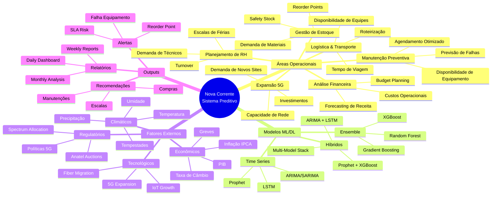

---

## 1.2 Pipeline End-to-End

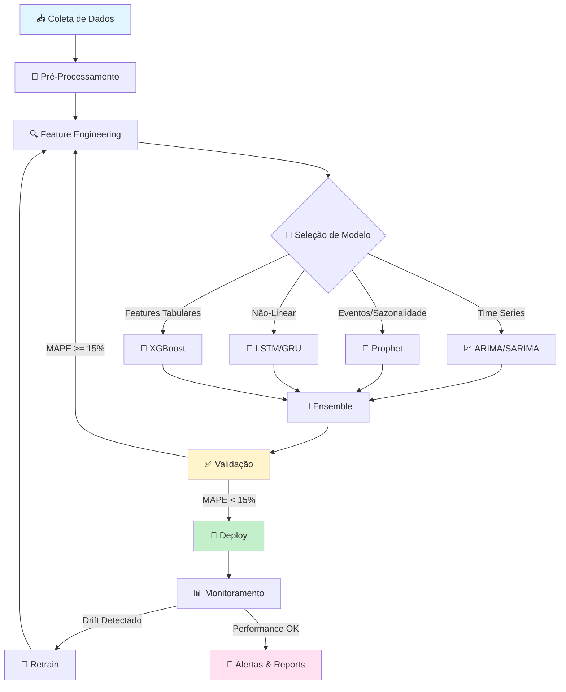

---

# 2. 🏗️ ARQUITETURA ML/DL COMPLETA

## 2.1 Comparação de Modelos

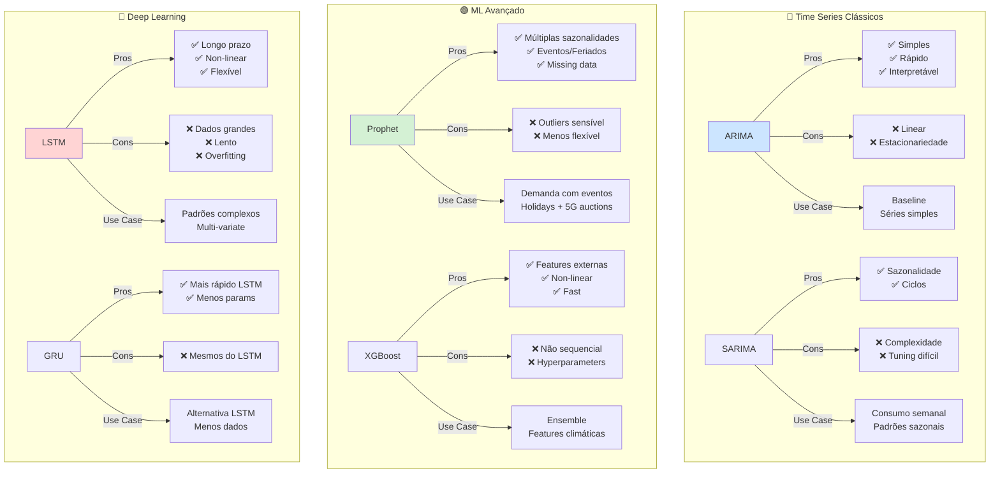

---

## 2.2 Arquitetura LSTM Detalhada

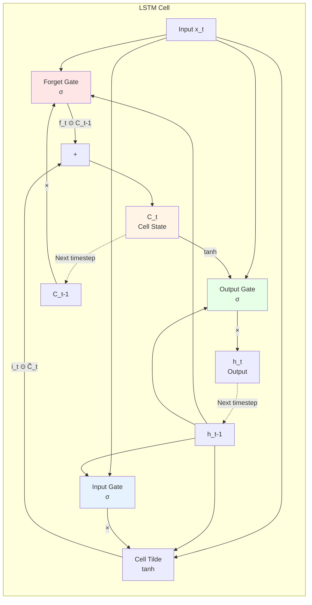

### Equações LSTM

**Forget Gate:**
$$f_t = \sigma(W_f \cdot [h_{t-1}, x_t] + b_f)$$

**Input Gate:**
$$i_t = \sigma(W_i \cdot [h_{t-1}, x_t] + b_i)$$
$$\tilde{C}_t = \tanh(W_C \cdot [h_{t-1}, x_t] + b_C)$$

**Cell State:**
$$C_t = f_t \odot C_{t-1} + i_t \odot \tilde{C}_t$$

**Output:**
$$o_t = \sigma(W_o \cdot [h_{t-1}, x_t] + b_o)$$
$$h_t = o_t \odot \tanh(C_t)$$

---

## 2.3 Arquitetura Híbrida (ARIMA + LSTM + XGBoost)

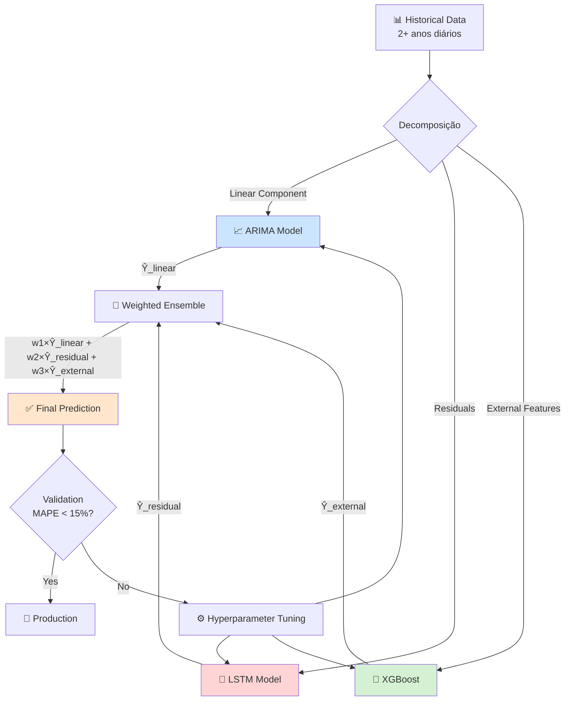

### Fórmula do Ensemble

$$\hat{Y}_{final} = w_1 \hat{Y}_{ARIMA} + w_2 \hat{Y}_{LSTM} + w_3 \hat{Y}_{XGBoost}$$

onde $w_1 + w_2 + w_3 = 1$ e pesos são otimizados por validação cruzada.

**Exemplo de pesos:**
- $w_1 = 0.3$ (ARIMA - componente linear)
- $w_2 = 0.4$ (LSTM - padrões não-lineares)
- $w_3 = 0.3$ (XGBoost - features externas)

---

# 3. 📦 EXPANSÃO POR ÁREA OPERACIONAL

## 3.1 Gestão de Estoque (Já Desenvolvido)

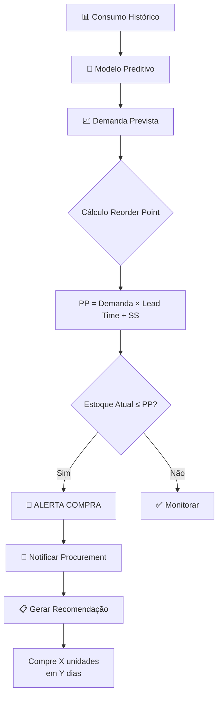

### Métricas de Sucesso

| Métrica | Baseline | Target | Atual |
|---------|----------|--------|-------|
| Ruptura de estoque | 15/mês | <5/mês | - |
| Excesso de estoque | R$ 200k | <R$ 100k | - |
| MAPE previsão | - | <15% | - |
| Lead time utilization | 60% | >85% | - |

---

## 3.2 Manutenção Preventiva (Novo)

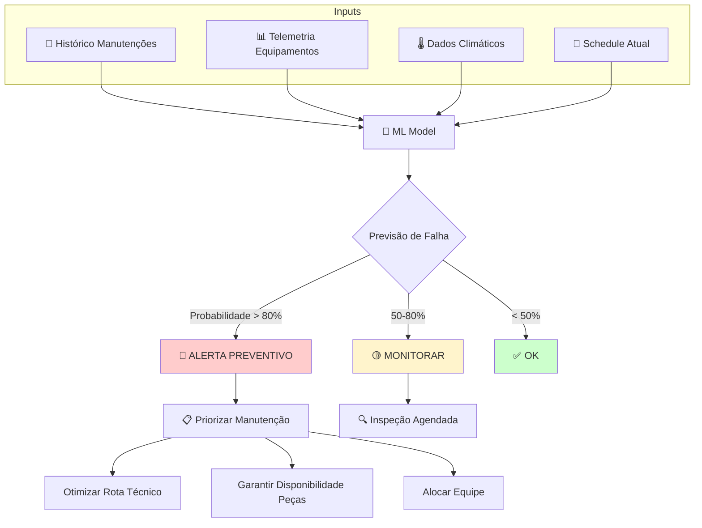

### Features para Modelo de Falha

| Feature | Tipo | Importância |
|---------|------|-------------|
| Dias desde última manutenção | Numérica | Alta |
| Número de falhas prévias | Numérica | Alta |
| Temperatura média últimos 7 dias | Numérica | Média |
| Precipitação acumulada | Numérica | Média |
| Idade do equipamento | Numérica | Alta |
| Tipo de equipamento | Categórica | Alta |
| Região (clima) | Categórica | Média |

### Modelo Recomendado

**Random Forest Classifier** para previsão de falha binária:

$$P(\text{Falha}|X) = \frac{1}{T} \sum_{t=1}^T \mathbb{1}[\text{Árvore}_t(X) = \text{Falha}]$$

onde $T$ = 500 árvores.

---

## 3.3 Logística & Roteirização (Novo)

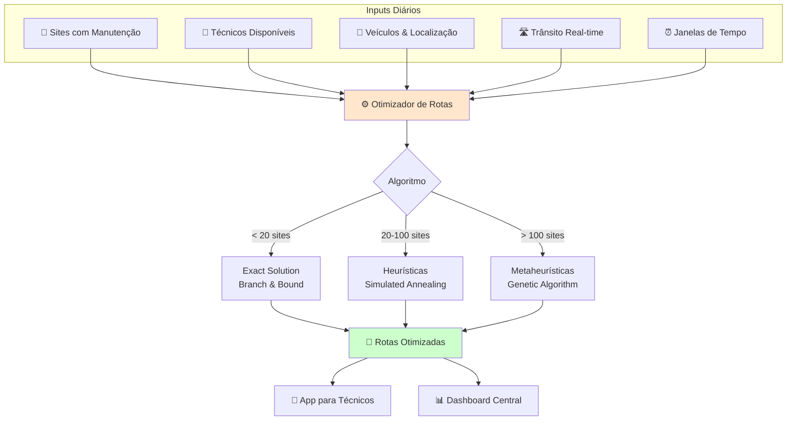

### Problema de Roteirização (VRP - Vehicle Routing Problem)

**Formulação Matemática:**

**Objetivo:** Minimizar distância total

$$\min \sum_{i=1}^n \sum_{j=1}^n \sum_{k=1}^K c_{ij} x_{ijk}$$

sujeito a:

**Restrições:**

1. Cada site visitado exatamente uma vez:
$$\sum_{j=1}^n \sum_{k=1}^K x_{ijk} = 1, \quad \forall i$$

2. Cada veículo sai do depot:
$$\sum_{j=1}^n x_{0jk} = 1, \quad \forall k$$

3. Conservação de fluxo:
$$\sum_{i=1}^n x_{ijk} - \sum_{i=1}^n x_{jik} = 0, \quad \forall j, k$$

4. Capacidade do veículo:
$$\sum_{i=1}^n d_i \sum_{j=1}^n x_{ijk} \leq Q_k, \quad \forall k$$

onde:
- $x_{ijk}$: binário (1 se arco $i \to j$ usado por veículo $k$)
- $c_{ij}$: custo/distância de $i$ para $j$
- $d_i$: demanda do site $i$ (tempo de manutenção)
- $Q_k$: capacidade (tempo disponível) do veículo $k$

---

## 3.4 Planejamento de RH (Novo)

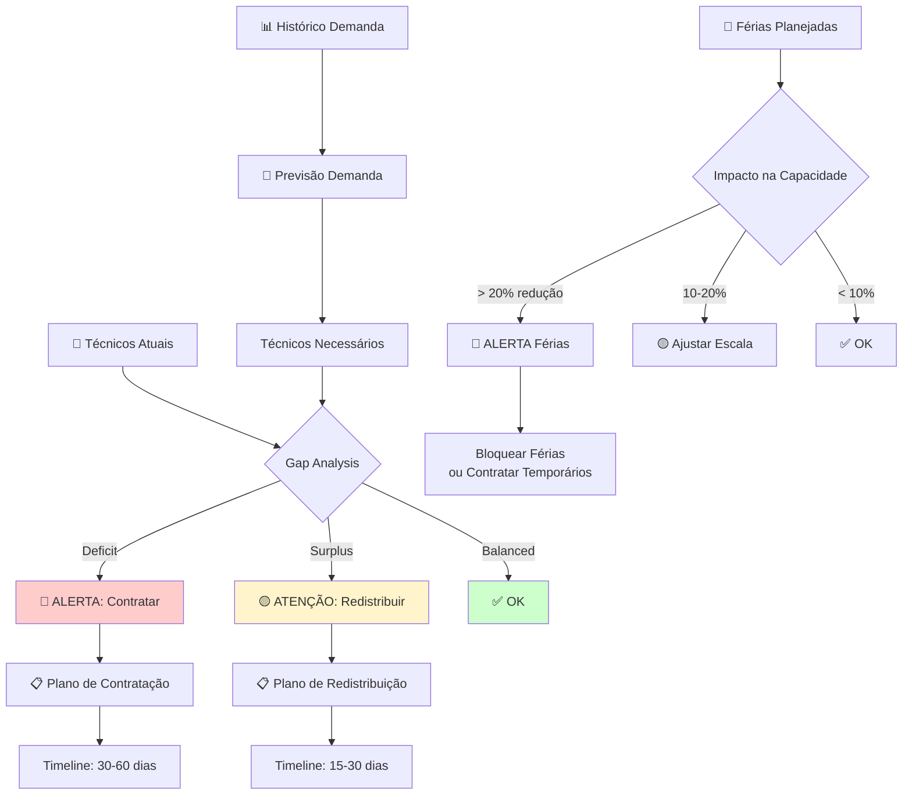

### Modelo de Demanda de RH

**Fórmula:**

$$\text{Técnicos Necessários} = \frac{\text{Horas de Manutenção Previstas}}{\text{Horas Disponíveis por Técnico}}$$

$$T_{needed} = \frac{D \times t_{avg}}{H_{avail} \times U}$$

onde:
- $D$: Demanda de manutenções (sites/mês)
- $t_{avg}$: Tempo médio por manutenção (horas)
- $H_{avail}$: Horas disponíveis por técnico/mês (160h)
- $U$: Utilização alvo (80%)

**Exemplo:**
- $D = 500$ sites/mês
- $t_{avg} = 4$ horas
- $H_{avail} = 160$ horas
- $U = 0.8$

$$T_{needed} = \frac{500 \times 4}{160 \times 0.8} = \frac{2000}{128} = 15.6 \approx 16 \text{ técnicos}$$

---

## 3.5 Análise Financeira (Novo)

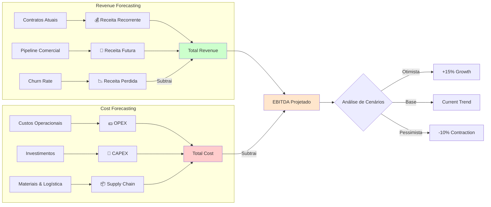

### Modelo de Revenue Forecasting

**Receita Mensal:**

$$R_t = R_{recorrente} + R_{novos\_contratos} - R_{churn}$$

**Com crescimento:**

$$R_t = R_0 (1 + g)^t (1 - c)$$

onde:
- $R_0$: Receita inicial
- $g$: Taxa de crescimento mensal
- $c$: Taxa de churn mensal
- $t$: Meses

**Exemplo:**
- $R_0 = $ R$ 5.000.000
- $g = 0.05$ (5% crescimento)
- $c = 0.02$ (2% churn)
- $t = 12$ meses

$$R_{12} = 5.000.000 \times (1.05)^{12} \times (1 - 0.02)^{12}$$
$$R_{12} = 5.000.000 \times 1.796 \times 0.785 = R\$ 7.050.000$$

---

## 3.6 Expansão 5G (Novo)

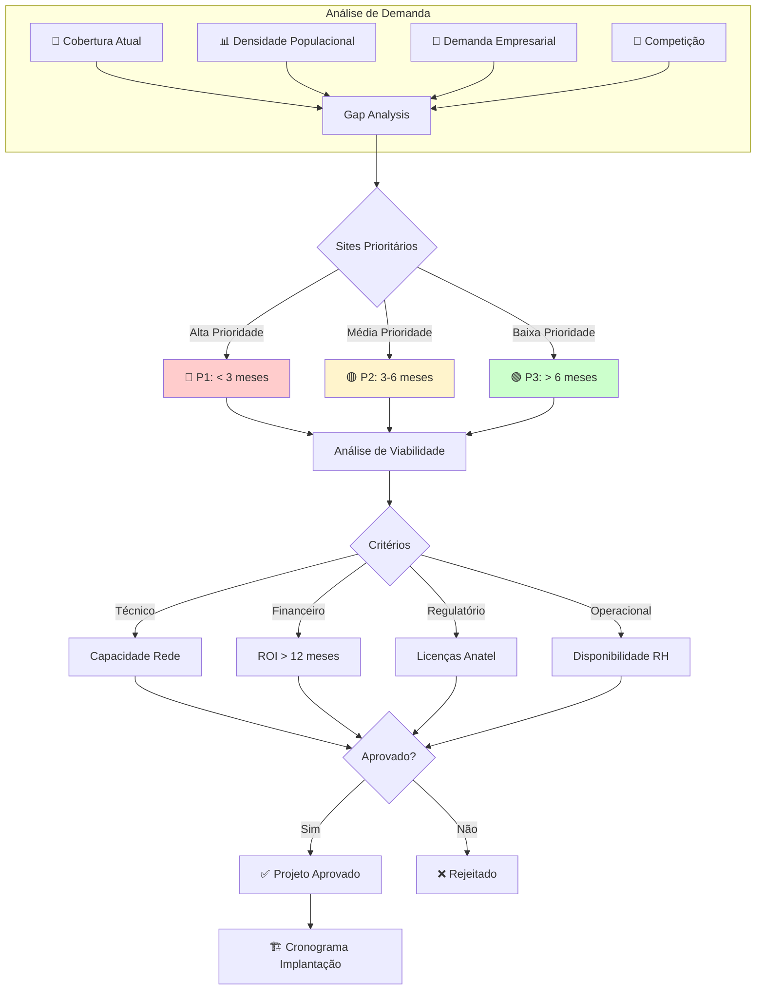

### Modelo de Priorização de Sites

**Score de Prioridade:**

$$P_{score} = w_1 D + w_2 V + w_3 C - w_4 R$$

onde:
- $D$: Demanda (população + empresas)
- $V$: Viabilidade técnica (0-10)
- $C$: Competição (sites concorrentes)
- $R$: Risco (regulatório + operacional)
- $w_i$: Pesos (somam 1)

**Exemplo:**
- $w_1 = 0.4$, $D = 8$ (alta demanda)
- $w_2 = 0.3$, $V = 7$ (viável)
- $w_3 = 0.2$, $C = 5$ (competição média)
- $w_4 = 0.1$, $R = 3$ (risco baixo)

$$P_{score} = 0.4(8) + 0.3(7) + 0.2(5) - 0.1(3)$$
$$P_{score} = 3.2 + 2.1 + 1.0 - 0.3 = 6.0$$

**Classificação:**
- $P_{score} \geq 7$: Alta prioridade (P1)
- $5 \leq P_{score} < 7$: Média prioridade (P2)
- $P_{score} < 5$: Baixa prioridade (P3)

---

# 4. 🗓️ ROADMAP DE IMPLEMENTAÇÃO

## 4.1 Timeline Geral (6 Meses)

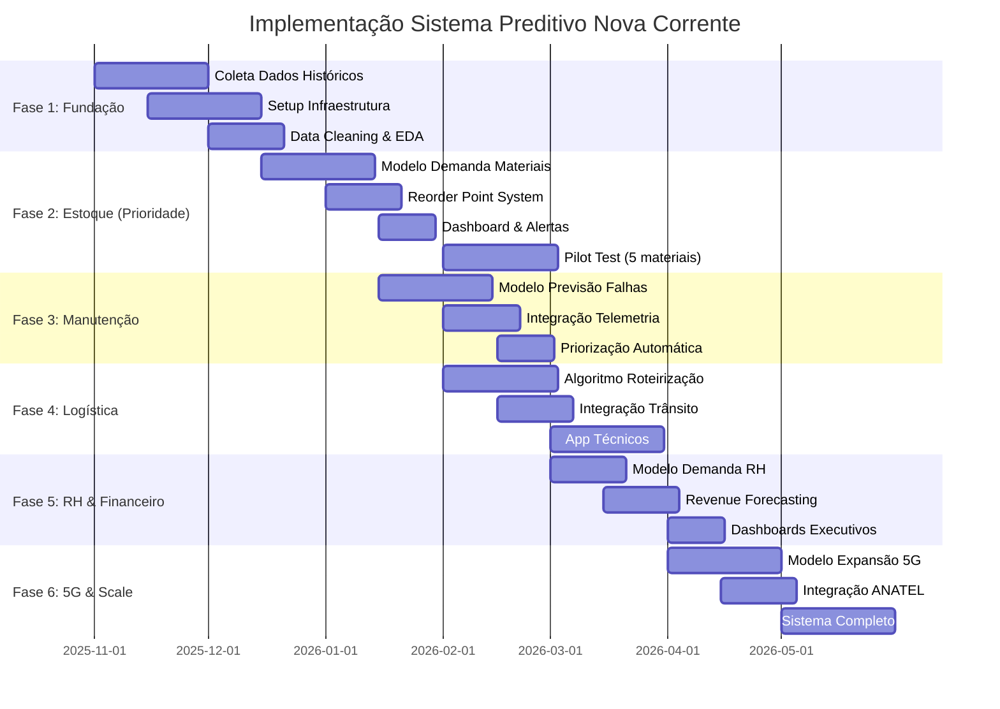

---

## 4.2 Priorização por ROI

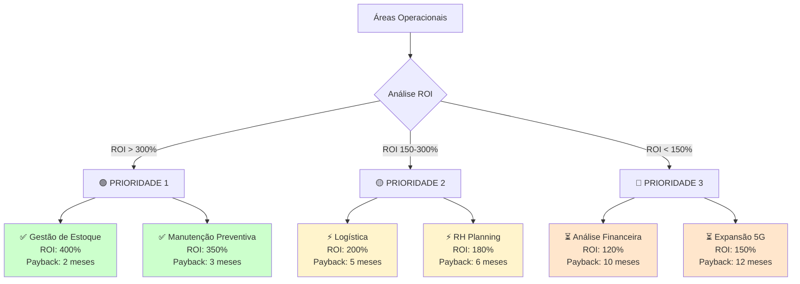

---

# 5. 📊 DATASETS POR ÁREA OPERACIONAL

## 5.1 Matriz de Datasets

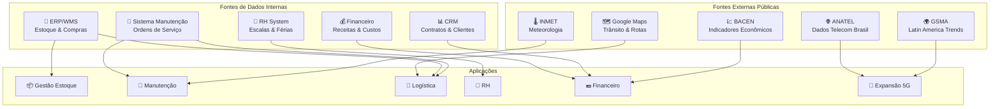

---

## 5.2 Datasets Detalhados por Área

### 📦 Gestão de Estoque

| Dataset | Fonte | Periodicidade | Campos Principais |
|---------|-------|---------------|-------------------|
| Consumo Materiais | ERP Interno | Diário | Data, Item_ID, Qty, Site, Custo |
| Lead Times | Fornecedores | Mensal | Supplier, Item, Days, Std_Dev |
| Preços | Compras | Semanal | Item, Preço, Variação |

### 🔧 Manutenção Preventiva

| Dataset | Fonte | Periodicidade | Campos Principais |
|---------|-------|---------------|-------------------|
| Ordens de Serviço | Sistema Manutenção | Diário | OS_ID, Site, Tipo, Status, Data |
| Telemetria | Equipamentos | Horário | Temp, Umidade, Uptime, Erros |
| Clima | INMET | Diário | Temp_Max/Min, Precip, Umidade |
| Histórico Falhas | Sistema | Diário | Equipamento, Falha, Root_Cause |

### 🚗 Logística & Roteirização

| Dataset | Fonte | Periodicidade | Campos Principais |
|---------|-------|---------------|-------------------|
| Sites Ativos | CRM | Diário | Site_ID, Lat/Long, Tipo |
| Técnicos | RH | Diário | Técnico_ID, Localização, Disponível |
| Trânsito | Google Maps API | Real-time | Origem, Destino, Tempo, Distância |
| Manutenções Agendadas | Sistema | Diário | Site, Data, Prioridade, Duração |

### 👥 Planejamento de RH

| Dataset | Fonte | Periodicidade | Campos Principais |
|---------|-------|---------------|-------------------|
| Demanda Histórica | Manutenção | Mensal | Horas_Trabalhadas, Sites_Atendidos |
| Escalas | RH | Semanal | Técnico, Escala, Disponibilidade |
| Férias | RH | Mensal | Técnico, Data_Início, Data_Fim |
| Turnover | RH | Mensal | Admissões, Demissões, Taxa |

### 💵 Análise Financeira

| Dataset | Fonte | Periodicidade | Campos Principais |
|---------|-------|---------------|-------------------|
| Receitas | Financeiro | Mensal | Cliente, Valor, Tipo_Contrato |
| Custos OPEX | Financeiro | Mensal | Categoria, Valor, Centro_Custo |
| Investimentos CAPEX | Financeiro | Mensal | Projeto, Valor, Status |
| Indicadores Macro | BACEN | Mensal | Taxa_Cambio, IPCA, Selic, PIB |

### 📶 Expansão 5G

| Dataset | Fonte | Periodicidade | Campos Principais |
|---------|-------|---------------|-------------------|
| Cobertura Atual | Interno | Mensal | Site, Tecnologia, Alcance |
| Demanda 5G | ANATEL | Trimestral | Município, Usuários, Crescimento |
| Competição | Mercado | Mensal | Operadora, Sites, Cobertura |
| Licenças | ANATEL | Ad-hoc | Município, Status, Prazo |

---

# 6. 🎨 DIAGRAMAS MERMAID ADICIONAIS

## 6.1 Fluxo de Dados Completo

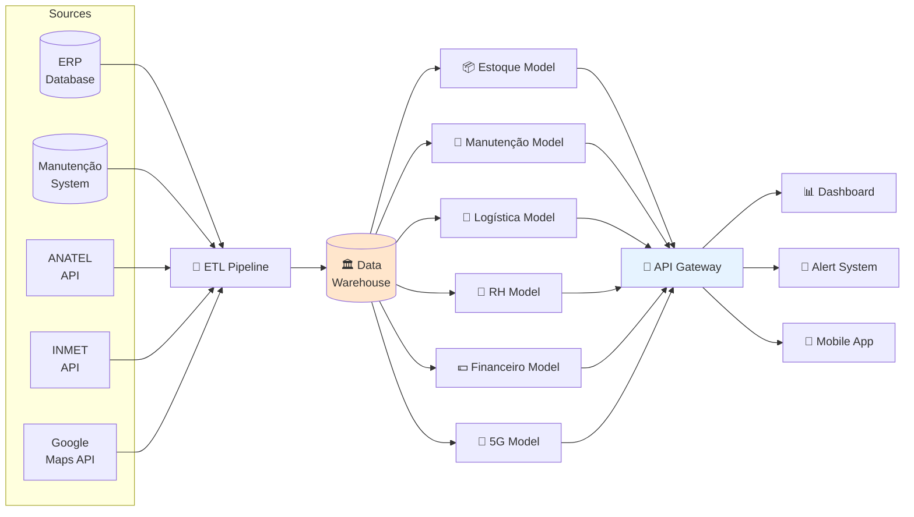

---

## 6.2 Arquitetura de Deploy (Cloud)

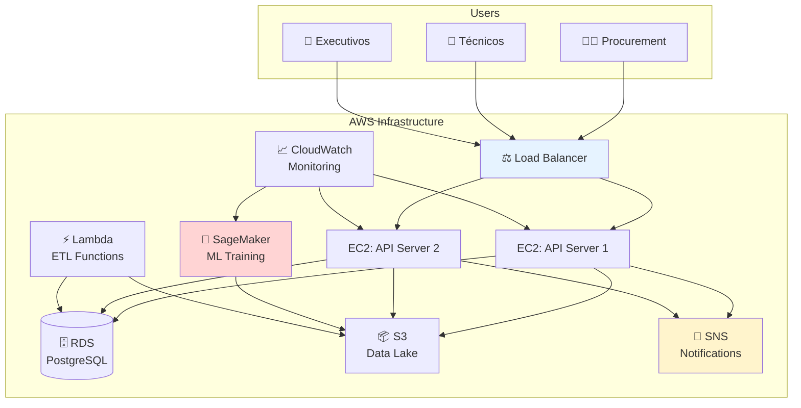

---

## 6.3 Matriz de Responsabilidades (RACI)

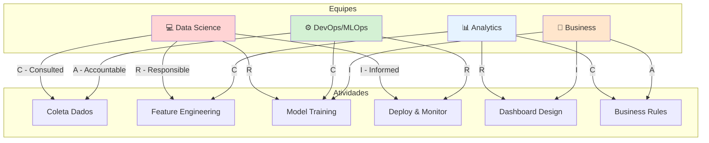

---

# 🎯 CONCLUSÃO E PRÓXIMOS PASSOS

## Resumo Executivo

Este documento expandiu o projeto original de **Gestão de Estoque** para cobrir **6 áreas operacionais** da Nova Corrente:

1. ✅ **Gestão de Estoque** (desenvolvido)
2. 🔧 **Manutenção Preventiva** (roadmap completo)
3. 🚗 **Logística & Roteirização** (algoritmos definidos)
4. 👥 **Planejamento de RH** (modelos especificados)
5. 💵 **Análise Financeira** (forecasting estruturado)
6. 📶 **Expansão 5G** (priorização quantificada)

## Documentos da Série

1. **PDF Matemática Completa** → Fundamentos teóricos
2. **Este Markdown** → Arquitetura visual e roadmap
3. **Próximo:** Notebooks Jupyter com código Python

## Timeline de Implementação

| Fase | Duração | Entregas |
|------|---------|----------|
| **Fase 1:** Estoque | 3 meses | Sistema completo em produção |
| **Fase 2:** Manutenção | 2 meses | Previsão de falhas ativo |
| **Fase 3:** Logística | 2 meses | Rotas otimizadas |
| **Fase 4-6:** Demais áreas | 3 meses | Sistema integrado |

**Total:** 10 meses para sistema completo.

---

**Documento preparado:** 01 de novembro de 2025  
**Versão:** 1.0 ROADMAP COMPLETO  
**Próximo:** Implementação Python com notebooks práticos
