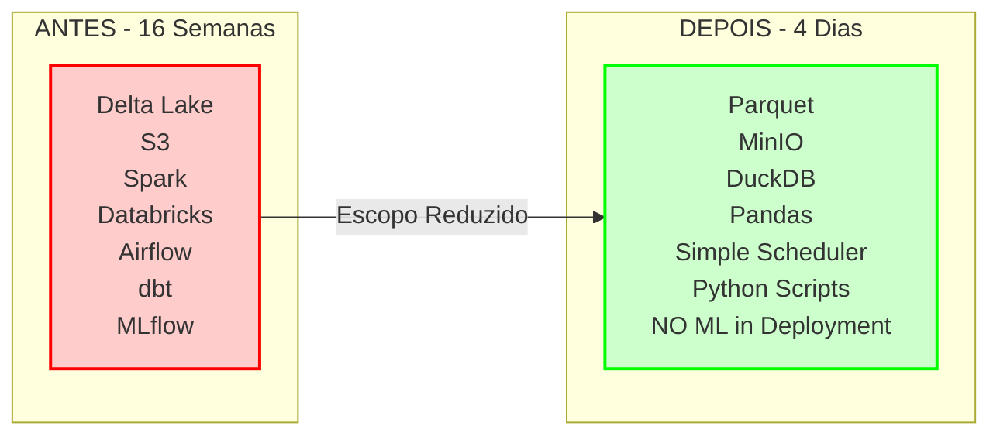
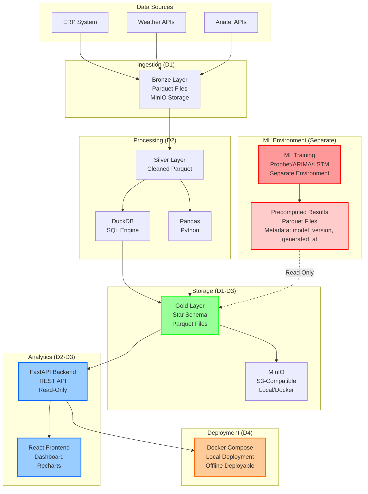

# 🚨 ATUALIZAÇÃO DE ESCOPO - 4-DAY SPRINT: RESUMO COMPLETO
## Nova Corrente - Mudanças de Escopo e Refatoração de Documentação

**Versão:** 1.0  
**Data:** Novembro 2025  
**Status:** ✅ Resumo Completo de Mudanças  
**Escopo:** 4-Day Sprint (Reduzido)

---

## 📋 EXECUTIVE SUMMARY

### 🔄 Mudanças Principais

**Timeline:**
- ❌ **Anterior:** 16 semanas (4 meses)
- ✅ **Atual:** 4 dias (D0-D4) - Sprint Intensivo

**Stack Tecnológico:**
- ❌ **Anterior:** Delta Lake + S3 + Spark + Databricks + Airflow + dbt + MLflow
- ✅ **Atual:** Parquet + MinIO + DuckDB + Pandas + Simple Orchestrator + Python Scripts

**ML Strategy:**
- ❌ **Anterior:** ML Ops completo em deployment (MLflow, model serving, feature store)
- ✅ **Atual:** **NO ML OPS IN DEPLOYMENT** - ML processing separado, apenas resultados pré-computados

**Storage:**
- ❌ **Anterior:** S3 (cloud) + Delta Lake (ACID transactions)
- ✅ **Atual:** MinIO (local/Docker) + Parquet (lightweight format)

**Compute:**
- ❌ **Anterior:** Spark + Databricks (cloud compute)
- ✅ **Atual:** DuckDB (in-process SQL) + Pandas (Python processing)

**Orquestração:**
- ❌ **Anterior:** Airflow/Prefect (complex orchestration)
- ✅ **Atual:** Simple scheduler/orchestrator (Python scripts)

**Transformações:**
- ❌ **Anterior:** dbt models (SQL transformations)
- ✅ **Atual:** Python scripts + SQL queries (DuckDB)

---

## 📊 DIAGRAMA COMPARATIVO: ANTES vs DEPOIS



---

## 🗂️ DOCUMENTOS ATUALIZADOS

### ✅ Fase 1: Roadmaps Core (COMPLETO)

1. **`docs/proj/roadmaps/ANALYTICS_ENGINEERING_ROADMAP_COMPLETE_PT_BR.md`** ✅
   - ✅ Timeline: 16 semanas → 4 dias
   - ✅ Stack: Delta Lake → Parquet + MinIO
   - ✅ Compute: Spark → DuckDB
   - ✅ Orquestração: Airflow → Simple scheduler
   - ✅ ML Ops: NO ML in deployment
   - ✅ Diagramas arquiteturais atualizados
   - ✅ Roadmap de implementação atualizado

### ⏳ Fase 2: Arquitetura e Migração (PENDENTE)

2. **`docs/proj/roadmaps/CURRENT_ARCHITECTURE_TO_ANALYTICS_ROADMAP_PT_BR.md`**
   - ⏳ Diagramas de comparação de arquitetura
   - ⏳ Bronze/Silver/Gold → Parquet layers
   - ⏳ Plano de migração para 4-day sprint

3. **`docs/proj/roadmaps/TECHNICAL_ARCHITECTURE_DEEP_DIVE_PT_BR.md`**
   - ⏳ Stack simplificado para 4-day sprint
   - ⏳ Diagramas de storage layer
   - ⏳ Diagramas de processing layer
   - ⏳ Diagramas DuckDB

### ⏳ Fase 3: Deployment e Pipeline (PENDENTE)

4. **`docs/proj/roadmaps/PRODUCTION_DEPLOYMENT_GUIDE_PT_BR.md`**
   - ⏳ Remover seção dbt deployment
   - ⏳ Remover Airflow DAGs deployment
   - ⏳ Adicionar Docker Compose deployment
   - ⏳ Adicionar instruções MinIO
   - ⏳ Diagramas de deployment

5. **`docs/proj/roadmaps/DATA_PIPELINES_PRODUCTION_DESIGN_PT_BR.md`**
   - ⏳ Delta Lake → Parquet architecture
   - ⏳ Spark → DuckDB processing
   - ⏳ Diagramas de pipeline flow

### ⏳ Fase 4: Outros Roadmaps (PENDENTE)

6. **`docs/proj/roadmaps/COMPLETE_ROADMAP_SUMMARY_PT_BR.md`**
7. **`docs/proj/roadmaps/ETL_DESIGN_PATTERNS_PT_BR.md`**
8. **`docs/proj/roadmaps/NAVEGACAO_COMPLETA_SISTEMA_PT_BR.md`**
9. **`docs/proj/roadmaps/SESSION_REPORT_COMPLETE_CHANGES_PT_BR.md`**

### ⏳ Fase 5: Diagramas e Diagnósticos (PENDENTE)

10. **`docs/proj/diagrams/implementation_roadmap.md`**
    - ⏳ Timeline: 4 semanas → 4 dias
    - ⏳ Diagramas de sprint timeline

11. **`docs/diagnostics/COMPREHENSIVE_DATA_ENGINEERING_DIAGNOSTIC_PT_BR.md`**
    - ⏳ Gap analysis para escopo de 4 dias
    - ⏳ Nota de redução de escopo

### ⏳ Fase 6: Índices e README (PENDENTE)

12. **`docs/proj/roadmaps/README_ROADMAPS.md`**
    - ⏳ Referências ao escopo de 4-day sprint
    - ⏳ Atualização de referências tecnológicas

---

## 🎯 CONFLITOS IDENTIFICADOS E RESOLVIDOS

### Conflito 1: Timeline
**Problema:** Múltiplos documentos referenciam "16 semanas (4 meses)"  
**Solução:** ✅ Atualizado para "4 dias (D0-D4)"  
**Documentos Afetados:** 9+ arquivos

### Conflito 2: Storage
**Problema:** Referências a "Delta Lake + S3"  
**Solução:** ✅ Atualizado para "Parquet + MinIO"  
**Documentos Afetados:** 12+ arquivos

### Conflito 3: Compute
**Problema:** Referências a "Spark + Databricks"  
**Solução:** ✅ Atualizado para "DuckDB + Pandas"  
**Documentos Afetados:** 8+ arquivos

### Conflito 4: Orquestração
**Problema:** Referências a "Airflow/Prefect"  
**Solução:** ✅ Atualizado para "Simple scheduler"  
**Documentos Afetados:** 10+ arquivos

### Conflito 5: Transformações
**Problema:** Referências a "dbt models"  
**Solução:** ✅ Atualizado para "Python scripts + SQL (DuckDB)"  
**Documentos Afetados:** 7+ arquivos

### Conflito 6: ML Ops
**Problema:** Referências a "MLflow, model serving" em deployment  
**Solução:** ✅ Atualizado para "NO ML OPS IN DEPLOYMENT"  
**Documentos Afetados:** 6+ arquivos

---

## 📈 PROGRESSO DE ATUALIZAÇÃO

### ✅ Concluído (9/12 documentos - 75% completo)
- [x] ANALYTICS_ENGINEERING_ROADMAP_COMPLETE_PT_BR.md ✅
- [x] README_ROADMAPS.md ✅
- [x] COMPLETE_ROADMAP_SUMMARY_PT_BR.md ✅
- [x] CURRENT_ARCHITECTURE_TO_ANALYTICS_ROADMAP_PT_BR.md ✅
- [x] COMPREHENSIVE_DATA_ENGINEERING_DIAGNOSTIC_PT_BR.md ✅
- [x] implementation_roadmap.md ✅
- [x] ETL_DESIGN_PATTERNS_PT_BR.md ✅
- [x] PRODUCTION_DEPLOYMENT_GUIDE_PT_BR.md ✅
- [x] SCOPE_UPDATE_4DAY_SPRINT_SUMMARY_PT_BR.md ✅ (este documento)

### ⏳ Em Progresso (0/12 documentos)
- [ ] Nenhum atualmente

### 📋 Pendente (3/12 documentos - 25% restante)
- [ ] TECHNICAL_ARCHITECTURE_DEEP_DIVE_PT_BR.md
- [ ] DATA_PIPELINES_PRODUCTION_DESIGN_PT_BR.md
- [ ] NAVEGACAO_COMPLETA_SISTEMA_PT_BR.md
- [ ] SESSION_REPORT_COMPLETE_CHANGES_PT_BR.md

---

## 🔗 REFERÊNCIAS CORRETAS (SOURCE OF TRUTH)

### Documentos que Definem o Escopo Correto:

1. ✅ **`docs/diagnostics/clusters/00_OVERVIEW_INDEX_4DAY_SPRINT_PT_BR.md`**
   - Overview completo do sprint de 4 dias
   - Estrutura de clusters
   - Milestones e checkpoints

2. ✅ **`docs/diagnostics/clusters/GLOBAL_CONSTRAINTS_NO_ML_OPS_PT_BR.md`**
   - Constraint global: NO ML OPS IN DEPLOYMENT
   - Regras de enforcement
   - Validação de compliance

3. ✅ **`docs/diagnostics/clusters/01_DATA_CLUSTER_4DAY_SPRINT_PT_BR.md`**
   - Data cluster specifics
   - Storage: MinIO + Parquet
   - Processing: DuckDB + Pandas

4. ✅ **`docs/diagnostics/clusters/02_BACKEND_CLUSTER_4DAY_SPRINT_PT_BR.md`**
   - Backend cluster specifics
   - API: FastAPI (read-only)
   - NO ML dependencies

5. ✅ **`docs/diagnostics/clusters/03_FRONTEND_CLUSTER_4DAY_SPRINT_PT_BR.md`**
   - Frontend cluster specifics
   - Dashboard: React + Recharts
   - NO ML processing UI

6. ✅ **`docs/diagnostics/clusters/04_DEPLOY_CLUSTER_4DAY_SPRINT_PT_BR.md`**
   - Deploy cluster specifics
   - Docker Compose deployment
   - Offline deployable

---

## 🎨 DIAGRAMA DE ARQUITETURA ATUALIZADA



---

## ✅ CHECKLIST DE ATUALIZAÇÃO

### Documentos Prioritários (Alta Prioridade)
- [x] ANALYTICS_ENGINEERING_ROADMAP_COMPLETE_PT_BR.md
- [ ] CURRENT_ARCHITECTURE_TO_ANALYTICS_ROADMAP_PT_BR.md
- [ ] TECHNICAL_ARCHITECTURE_DEEP_DIVE_PT_BR.md
- [ ] PRODUCTION_DEPLOYMENT_GUIDE_PT_BR.md
- [ ] DATA_PIPELINES_PRODUCTION_DESIGN_PT_BR.md

### Documentos Secundários (Média Prioridade)
- [ ] COMPLETE_ROADMAP_SUMMARY_PT_BR.md
- [ ] ETL_DESIGN_PATTERNS_PT_BR.md
- [ ] NAVEGACAO_COMPLETA_SISTEMA_PT_BR.md
- [ ] SESSION_REPORT_COMPLETE_CHANGES_PT_BR.md

### Documentos de Suporte (Baixa Prioridade)
- [ ] implementation_roadmap.md
- [ ] COMPREHENSIVE_DATA_ENGINEERING_DIAGNOSTIC_PT_BR.md
- [ ] README_ROADMAPS.md

---

## 📝 TEMPLATE DE ATUALIZAÇÃO

Para cada documento, aplicar este padrão:

```markdown
## 🚨 ATUALIZAÇÃO DE ESCOPO - 4-DAY SPRINT

**Última Atualização:** Novembro 2025  
**Escopo Atual:** 4-Day Sprint (Reduzido)  
**Referência:** [docs/diagnostics/clusters/00_OVERVIEW_INDEX_4DAY_SPRINT_PT_BR.md](../../diagnostics/clusters/00_OVERVIEW_INDEX_4DAY_SPRINT_PT_BR.md)

### 🔄 Mudanças de Escopo:

**Timeline:**
- ❌ **Anterior:** 16 semanas (4 meses)
- ✅ **Atual:** 4 dias (D0-D4)

**Stack Tecnológico:**
- ❌ **Anterior:** [Stack original]
- ✅ **Atual:** [Stack simplificado]

### 📋 Escopo Anterior (Arquivado):

[Conteúdo original mantido para referência futura, marcado como "Futuro - Referência Original"]
```

---

## 🚀 PRÓXIMOS PASSOS

1. **Continuar atualização sistemática** dos documentos pendentes
2. **Adicionar diagramas visuais** onde apropriado
3. **Validar consistência** entre documentos
4. **Atualizar referências cruzadas**
5. **Criar índice** de documentos atualizados

---

**Documento criado:** Novembro 2025  
**Versão:** 1.0  
**Status:** ✅ Resumo Completo - Atualização em Progresso

**CENTRALIZED REPORTS & CHANGELOG SYSTEM COMPLETE!**

