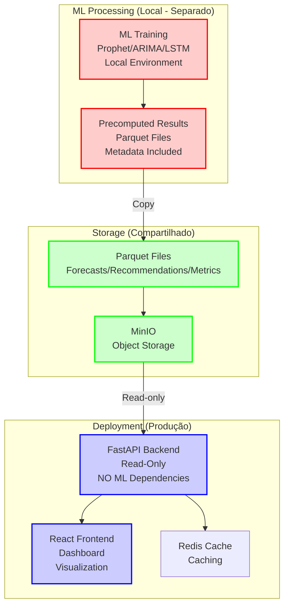
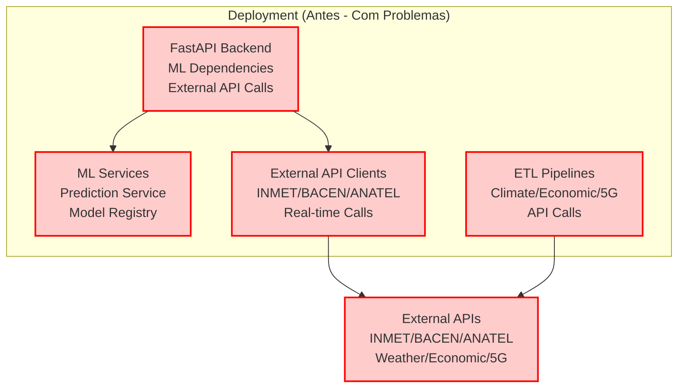

# 📊 DIAGRAMA DE ARQUITETURA SIMPLIFICADA
## Nova Corrente - Visualização da Arquitetura Simplificada

**Versão:** 1.0  
**Data:** Novembro 2025  
**Status:** ✅ Diagramas Completos - Arquitetura Simplificada  
**Objetivo:** Visualizar a arquitetura simplificada sem ML e sem APIs externas

---

## 📋 ÍNDICE

1. [Arquitetura Simplificada - Visão Geral](#arquitetura-visao-geral)
2. [Diagrama de Componentes](#diagrama-componentes)
3. [Diagrama de Fluxo de Dados](#diagrama-fluxo)
4. [Diagrama de Deployment](#diagrama-deployment)
5. [Comparação: Antes vs. Depois](#comparacao-visual)

---

<a name="arquitetura-visao-geral"></a>

## 1. 🏗️ ARQUITETURA SIMPLIFICADA - VISÃO GERAL

### 1.1 Princípios da Arquitetura Simplificada

**Princípios:**
1. ✅ **Read-Only:** Apenas leitura de dados pré-computados
2. ✅ **Offline:** Funciona completamente offline
3. ✅ **Zero ML:** Sem ML dependencies em produção
4. ✅ **Zero APIs:** Sem APIs externas em tempo real
5. ✅ **Simples:** Complexidade reduzida ao mínimo

---

### 1.2 Camadas da Arquitetura

```
┌─────────────────────────────────────────────────────────┐
│              ML PROCESSING (LOCAL - SEPARADO)           │
│  ┌──────────────────────────────────────────────────┐  │
│  │  ML Training (Prophet, ARIMA, LSTM)             │  │
│  │  └──> Gera Resultados Pré-Computados            │  │
│  │       └──> Salva em Parquet (ML_RESULTS_PATH)   │  │
│  └──────────────────────────────────────────────────┘  │
└─────────────────────────────────────────────────────────┘
                        │
                        │ (Copiar resultados)
                        ▼
┌─────────────────────────────────────────────────────────┐
│              STORAGE (COMPARTILHADO)                    │
│  ┌──────────────────────────────────────────────────┐  │
│  │  MinIO / Local Storage                          │  │
│  │  └──> Parquet Files (dados pré-computados)     │  │
│  │       ├── forecasts/*.parquet                   │  │
│  │       ├── recommendations/*.parquet            │  │
│  │       └── metrics/*.parquet                     │  │
│  └──────────────────────────────────────────────────┘  │
└─────────────────────────────────────────────────────────┘
                        │
                        │ (Read-only)
                        ▼
┌─────────────────────────────────────────────────────────┐
│              DEPLOYMENT (PRODUÇÃO)                      │
│  ┌──────────────────────────────────────────────────┐  │
│  │  Backend FastAPI (Read-only)                     │  │
│  │  └──> Lê dados pré-computados                   │  │
│  │       └──> Retorna analytics                    │  │
│  └──────────────────────────────────────────────────┘  │
│  ┌──────────────────────────────────────────────────┐  │
│  │  Frontend React (Dashboard)                      │  │
│  │  └──> Visualização de dados                     │  │
│  │       └──> Sistema de recomendações             │  │
│  └──────────────────────────────────────────────────┘  │
└─────────────────────────────────────────────────────────┘
```

---

<a name="diagrama-componentes"></a>

## 2. 📊 DIAGRAMA DE COMPONENTES

### 2.1 Componentes Mantidos (✅)

```
DEPLOYMENT COMPONENTS (Simplified)
├── Storage Layer
│   ├── MinIO (Object Storage) ✅
│   ├── Redis (Caching) ✅
│   └── Parquet Files (Precomputed Data) ✅
│
├── Backend Layer
│   ├── FastAPI (Read-only API) ✅
│   ├── Database Service ✅
│   ├── Material Service ✅
│   ├── Feature Service ✅
│   ├── Analytics Service ✅
│   └── Integration Service ✅
│
└── Frontend Layer
    ├── React Dashboard ✅
    ├── Recharts (Visualization) ✅
    └── System Components ✅
        ├── Recommendations ✅
        ├── Notifications ✅
        └── Monitoring ✅
```

---

### 2.2 Componentes Removidos (❌)

```
REMOVED COMPONENTS (From Deployment)
├── ML Services
│   ├── ❌ Prediction Service
│   ├── ❌ Model Registry
│   └── ❌ ML Models
│
├── External APIs
│   ├── ❌ External Data Service
│   ├── ❌ External API Clients (INMET, BACEN, ANATEL)
│   ├── ❌ API Collectors
│   └── ❌ ETL Pipelines (API calls)
│
└── Legacy
    └── ❌ Flask API Legacy
```

---

<a name="diagrama-fluxo"></a>

## 3. 🔄 DIAGRAMA DE FLUXO DE DADOS

### 3.1 Fluxo Simplificado (DEPOIS)



**Legenda:**
- 🔴 **ML Processing (Local):** Separado do deployment
- 🟢 **Storage (Compartilhado):** Dados pré-computados
- 🔵 **Deployment (Produção):** Apenas read-only

---

### 3.2 Fluxo Antes (Com Problemas)



**Problemas:**
- ❌ Dependências ML não instaladas → Falhas
- ❌ APIs externas falham → Falhas
- ❌ Aplicação não funciona offline

---

<a name="diagrama-deployment"></a>

## 4. 🐳 DIAGRAMA DE DEPLOYMENT

### 4.1 Docker Compose Simplificado

```yaml
# docker-compose.yml (Simplificado)
version: '3.8'

services:
  minio:
    image: minio/minio:latest
    # ✅ Object Storage
    
  redis:
    image: redis:7-alpine
    # ✅ Caching
    
  backend:
    build:
      dockerfile: infrastructure/docker/Dockerfile.backend.deployment
    environment:
      - ENABLE_EXTERNAL_APIS=false      # ✅ Desabilitado
      - ENABLE_ML_PROCESSING=false      # ✅ Desabilitado
      - ML_RESULTS_PATH=/app/data/ml_results  # ✅ Read-only
    volumes:
      - ./data/ml_results:/app/data/ml_results:ro  # ✅ Read-only
    # ❌ REMOVIDO: ML-related volumes
    # ❌ REMOVIDO: External API configurations
    
  frontend:
    build:
      dockerfile: infrastructure/docker/Dockerfile.frontend
    # ✅ Dashboard apenas
    
  # ❌ REMOVIDO: ML processing service
  # ❌ REMOVIDO: External API collectors
  # ❌ REMOVIDO: Scheduler service
```

---

<a name="comparacao-visual"></a>

## 5. 📊 COMPARAÇÃO: ANTES vs. DEPOIS

### 5.1 Complexidade Visual

**ANTES (Complexidade ALTA - 85/100):**
```
┌─────────────────────────────────────────────┐
│  DEPLOYMENT (ANTES)                         │
│  ├── ML Services (20 pontos)               │
│  ├── External APIs (25 pontos)             │
│  ├── API Legacy (10 pontos)                │
│  ├── Storage CSV (10 pontos)               │
│  └── Complex Orchestration (20 pontos)     │
│  TOTAL: 85/100                              │
└─────────────────────────────────────────────┘
```

**DEPOIS (Complexidade BAIXA - 30/100):**
```
┌─────────────────────────────────────────────┐
│  DEPLOYMENT (DEPOIS)                        │
│  ├── Storage Parquet (10 pontos)           │
│  ├── Backend FastAPI (10 pontos)           │
│  └── Frontend React (10 pontos)            │
│  TOTAL: 30/100                              │
│  REDUÇÃO: -65%                              │
└─────────────────────────────────────────────┘
```

---

### 5.2 Componentes Visual

**ANTES:**
```
DEPLOYMENT (ANTES)
├── ✅ Backend FastAPI
├── ✅ Frontend React
├── ❌ ML Services (problemático)
├── ❌ External APIs (problemático)
├── ❌ API Legacy Flask (duplicado)
└── ❌ Complex Orchestration
```

**DEPOIS:**
```
DEPLOYMENT (DEPOIS)
├── ✅ Backend FastAPI (read-only)
├── ✅ Frontend React (visualization)
├── ✅ MinIO (storage)
├── ✅ Redis (caching)
└── ✅ Parquet Files (precomputed data)
```

---

## 6. ✅ CONCLUSÃO

Este documento fornece:

1. **Visão Geral:** Arquitetura simplificada completa
2. **Diagramas:** Visualizações da arquitetura
3. **Comparação:** Antes vs. Depois visual
4. **Deployment:** Diagrama de deployment simplificado

**Próximos Passos:**
1. Aplicar mudanças na arquitetura
2. Validar com diagramas
3. Deploy de Sábado

---

**Documento criado:** Novembro 2025  
**Versão:** 1.0  
**Status:** ✅ Diagramas Completos - Pronto para Uso

**CENTRALIZED REPORTS & CHANGELOG SYSTEM COMPLETE!**

