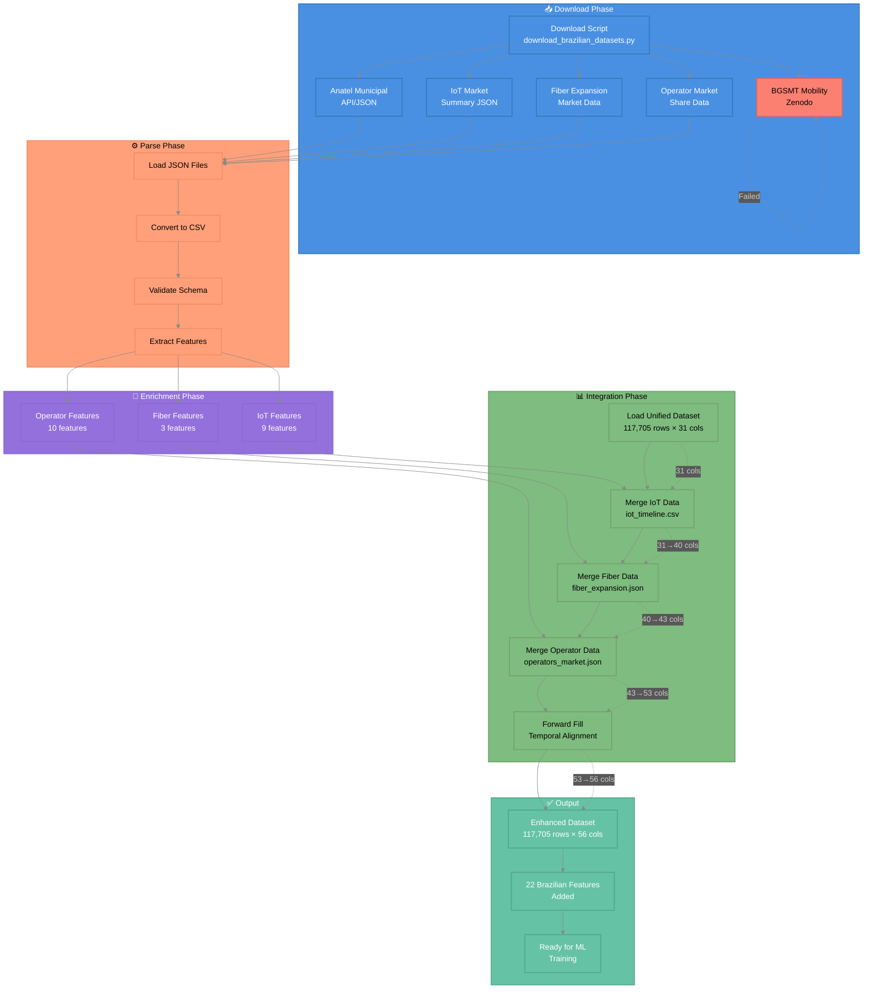

# 📊 Brazilian Integration Flow

## 📋 Overview

Brazilian dataset integration pipeline showing download, parsing, enrichment, and integration phases with 22 new features.

**Source File:** `docs\diagrams\brazilian_integration_flow.mmd`

**Generated:** 2025-11-05 00:36:46

---

## 🎨 Diagram

## 🔧 Components

1. **📥 Download Phase**
2. **⚙️ Parse Phase**
3. **🔧 Enrichment Phase**
4. **📊 Integration Phase**
5. **✅ Output**

## 📖 Usage

This diagram can be viewed in:

- **GitHub/GitLab**: Automatically rendered when viewing this file
- **VS Code**: Install the 'Markdown Preview Mermaid Support' extension
- **Obsidian**: Native Mermaid support
- **Documentation Sites**: MkDocs, Docusaurus, etc. with Mermaid plugin

---

## 🔗 Related Documents

- [Documentation Index](docs/INDEX_MASTER_NAVIGATION_PT_BR.md)
- [Diagrams Directory](docs/diagrams/)
- [Project Strategy](docs/proj/strategy/)
- [Roadmaps](docs/proj/roadmaps/)

