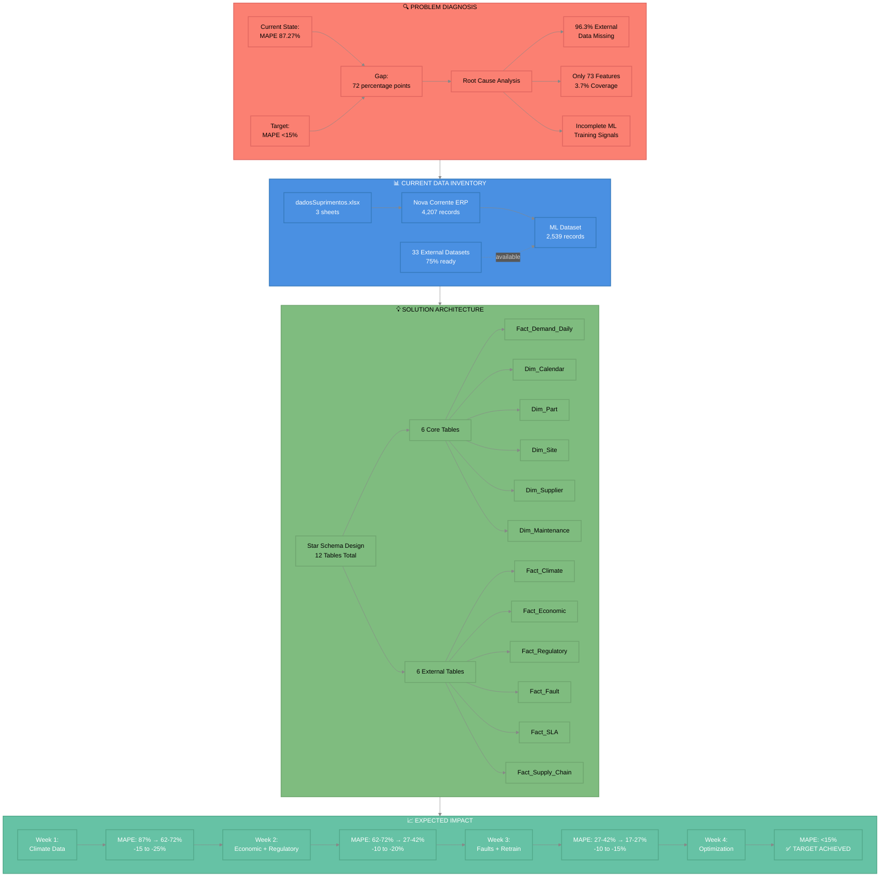

# 📊 Data Strategy Visual Breakdown

## 📋 Overview

Visual breakdown of the data strategy implementation, showing problem diagnosis, current data inventory, solution architecture, and expected impact.

**Source File:** `data_strategy_visual_breakdown.mmd`

**Generated:** 2025-11-05 00:36:46

---

## 🎨 Diagram

## 🔧 Components

1. **🔍 PROBLEM DIAGNOSIS**
2. **📊 CURRENT DATA INVENTORY**
3. **💡 SOLUTION ARCHITECTURE**
4. **📈 EXPECTED IMPACT**

## 📖 Usage

This diagram can be viewed in:

- **GitHub/GitLab**: Automatically rendered when viewing this file
- **VS Code**: Install the 'Markdown Preview Mermaid Support' extension
- **Obsidian**: Native Mermaid support
- **Documentation Sites**: MkDocs, Docusaurus, etc. with Mermaid plugin

---

## 🔗 Related Documents

- [Documentation Index](docs/INDEX_MASTER_NAVIGATION_PT_BR.md)
- [Diagrams Directory](docs/diagrams/)
- [Project Strategy](docs/proj/strategy/)
- [Roadmaps](docs/proj/roadmaps/)

