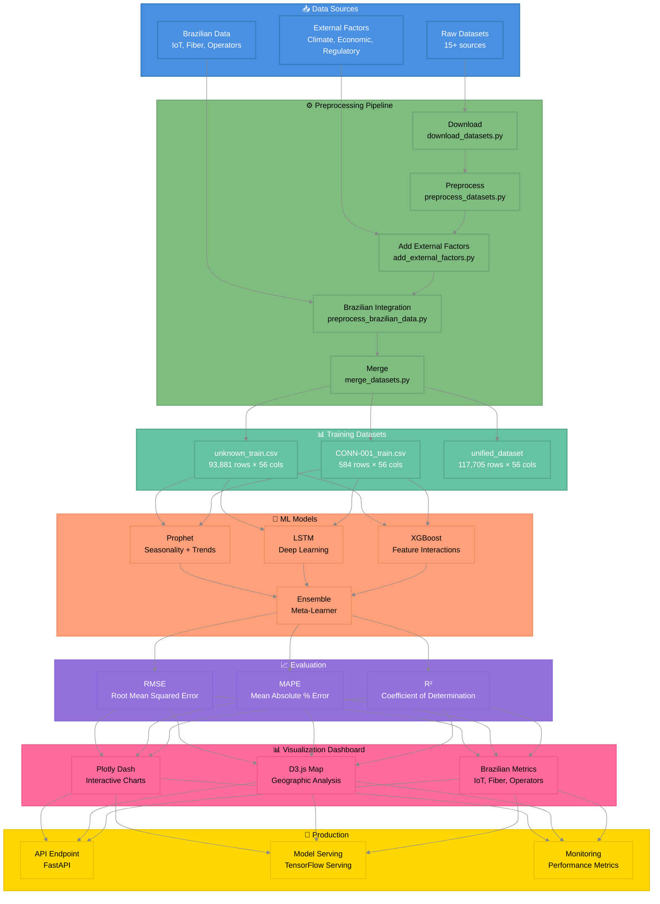

# 📊 Nova Corrente System Architecture

## 📋 Overview

Complete system architecture showing data flow from sources through preprocessing, models, evaluation, visualization, and deployment.

**Source File:** `docs\diagrams\nova_corrente_system_architecture.mmd`

**Generated:** 2025-11-05 00:36:46

---

## 🎨 Diagram

## 🔧 Components

1. **📥 Data Sources**
2. **⚙️ Preprocessing Pipeline**
3. **📊 Training Datasets**
4. **🤖 ML Models**
5. **📈 Evaluation**
6. **📊 Visualization Dashboard**
7. **🚀 Production**

## 📖 Usage

This diagram can be viewed in:

- **GitHub/GitLab**: Automatically rendered when viewing this file
- **VS Code**: Install the 'Markdown Preview Mermaid Support' extension
- **Obsidian**: Native Mermaid support
- **Documentation Sites**: MkDocs, Docusaurus, etc. with Mermaid plugin

---

## 🔗 Related Documents

- [Documentation Index](docs/INDEX_MASTER_NAVIGATION_PT_BR.md)
- [Diagrams Directory](docs/diagrams/)
- [Project Strategy](docs/proj/strategy/)
- [Roadmaps](docs/proj/roadmaps/)

