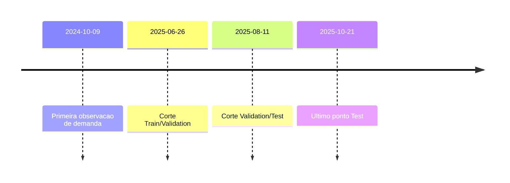

## Nova Corrente Demand Forecasting - Mathematical Technical Note

### 1. Purpose and Scope

This document formalizes the mathematical rationale behind the Nova Corrente demand forecasting experiments, translating pipeline artefacts into explicit notation, formulas, and analytical insights. It covers data provenance, feature engineering, model families, evaluation metrics, empirical results, and diagnostic findings required to support future iterations.

### 2. Source Data and Notation

The foundational dataset originates from `dadosSuprimentos.xlsx`, processed into a structured table containing 4188 records across 872 items, 20 material families, 191 sites, and 468 suppliers, covering the period 2024-10-09 to 2025-10-24[^processing-summary].

Let:
- \( t \in \{1, \dots, T\} \) index business days ordered chronologically.
- \( i \) index material items.
- \( f \) index material families.
- \( s \) index sites (depositos).
- \( y_{t,i} \) denote the observed quantity requisitioned for item \( i \) on day \( t \).
- \( \mathbf{x}_{t,i} \in \mathbb{R}^p \) denote the engineered feature vector for \( (t, i) \).
- \( \hat{y}_{t+h,i} \) denote the \( h \)-step-ahead forecast.

The supervised learning task is to estimate a mapping \( f_\theta : \mathbf{x}_{t,i} \mapsto \hat{y}_{t+1,i} \) for each high-impact family \( f \in \{\text{MATERIAL ELETRICO}, \text{FERRO E ACO}, \text{MATERIAL CIVIL}, \text{FERRAMENTAS E EQUIPAMENTOS}, \text{EPI}\} \).

### 3. Feature Engineering

#### 3.1 Temporal Encoding

Calendar features are encoded via ordinal and cyclical transformations:
\[
\begin{aligned}
&\text{month}(t) = m_t, \quad &&\text{day}(t) = d_t, \quad &&\text{weekday}(t) = w_t,\\
&\text{month\_sin}(t) = \sin\!\left(\frac{2\pi m_t}{12}\right), \quad &&\text{month\_cos}(t) = \cos\!\left(\frac{2\pi m_t}{12}\right),\\
&\text{day\_of\_year\_sin}(t) = \sin\!\left(\frac{2\pi \text{doy}_t}{365}\right), \quad &&\text{day\_of\_year\_cos}(t) = \cos\!\left(\frac{2\pi \text{doy}_t}{365}\right).
\end{aligned}
\]

These angular encodings preserve temporal locality otherwise lost with discrete integer representations.

#### 3.2 Lead-Time Metrics

Lead time is computed as the elapsed time between request and purchase:
\[
\text{lead\_time\_days}_{t,i} = \bigl(\text{data\_compra}_{t,i} - \text{data\_solicitado}_{t,i}\bigr),
\]
and aggregated per supplier/family to derive statistics such as \( \mu_{\text{lead}}^{(s)} \) and \( \sigma_{\text{lead}}^{(s)} \).

#### 3.3 Rolling Demand Features

Demand history is encoded with moving averages and dispersion:
\[
\text{family\_demand\_ma\_k}^{(f)}(t) = \frac{1}{k} \sum_{j=0}^{k-1} y_{t-j}^{(f)}, \qquad
\text{family\_demand\_std\_k}^{(f)}(t) = \sqrt{\frac{1}{k}\sum_{j=0}^{k-1} \bigl(y_{t-j}^{(f)} - \text{family\_demand\_ma\_k}^{(f)}(t)\bigr)^2 }.
\]
Analogous metrics are computed for sites and suppliers. The feature inventory totals 71 attributes, with 28 sourced from external climatological, economic, and operational indicators[^enrichment-summary].

#### 3.4 External Indicator Encoding

External flags translate domain events into binary indicators, e.g.
\[
\text{is\_critical\_lead\_time}_{t,i} = \mathbb{1}\{\text{lead\_time\_days}_{t,i} > \tau\},
\]
for a domain-defined threshold \( \tau \). Economic variables such as inflation and exchange rates are incorporated directly, while categorical risk factors (e.g. strike risk) are one-hot encoded.

### 4. Dataset Partitioning and Quality

The enriched dataset is split into time-ordered partitions: 63.96% train, 16.03% validation, and 20.01% test, respecting chronological order to avoid leakage[^combined-summary]. Quality diagnostics report a 70% aggregate score, with 29 features containing missing values (notably >=96% missingness for most external signals) and 10 columns exhibiting outliers[^dq-summary]. High sparsity in external enrichments directly impacts model learning capacity.

### 5. Forecasting Models

#### 5.1 Baseline Heuristics

- **Naive Last Observation:** \( \hat{y}_{t+1} = y_t \). Establishes a persistence benchmark.
- **Rolling Mean (window \( k \))**: \( \hat{y}_{t+1} = \text{MA}_k(t) \) using the formula above with \( k=7 \).
- **Rolling Median:** \( \hat{y}_{t+1} = \operatorname{median}\{y_{t-j}\}_{j=0}^{k-1} \), offering robustness to outliers.

#### 5.2 Parametric Trend Model

Linear trend fits \( y_t = \beta_0 + \beta_1 t + \varepsilon_t \) via ordinary least squares (OLS), projecting \( \hat{y}_{t+h} = \beta_0 + \beta_1 (t+h) \).

#### 5.3 ARIMA

AutoRegressive Integrated Moving Average models \( \text{ARIMA}(p,d,q) \) capture autocorrelation and moving-average structure:
\[
\phi(B)(1-B)^d y_t = \theta(B)\varepsilon_t,
\]
where \( \phi \) and \( \theta \) are lag polynomials and \( B \) is the backshift operator. Experiments utilized \( (p,d,q) = (1,1,1) \) as a compact specification.

#### 5.4 Gradient Boosting (XGBoost)

XGBoost minimizes regularized squared error:
\[
\mathcal{L} = \sum_{(t,i)} (y_{t,i} - \hat{y}_{t,i})^2 + \sum_{m=1}^M \Omega(f_m),
\]
with additive trees \( \hat{y}_{t,i} = \sum_{m=1}^M f_m(\mathbf{x}_{t,i}) \) and regularization \( \Omega(f) = \gamma T + \tfrac{1}{2}\lambda \|w\|_2^2 \). Feature importances highlight lead time, temporal harmonics, and family/site frequencies as dominant signals.

#### 5.5 Optimized Ensembles

An optimization pass evaluated simple ensembles over baseline components (naive, moving average, median). Despite lowered global MAPE from 100% to 87.27%, no family achieved the <15% production target.

### 6. Evaluation Metrics

Performance is measured primarily with Mean Absolute Percentage Error (MAPE):
\[
\text{MAPE} = \frac{100}{N}\sum_{n=1}^{N} \left| \frac{y_n - \hat{y}_n}{\max(\epsilon, y_n)} \right|,
\]
where \( \epsilon \) avoids division by zero (domain-set, typically \( \epsilon = 1 \)). Additional diagnostics (not yet computed) should include Mean Absolute Error (MAE) and symmetric MAPE (sMAPE) to mitigate instability with low-volume demands.

### 7. Empirical Results

| Family | Records | Baseline MAPE | Best Optimized MAPE | Best Optimized Model | Delta vs Baseline (%) |
|--------|---------|---------------|---------------------|----------------------|-------------------|
| MATERIAL ELETRICO | 821 | 100.00 | 123.92 | Median | -23.92 |
| FERRO E ACO | 483 | 100.00 | 107.32 | Naive Last | -7.32 |
| MATERIAL CIVIL | 420 | 100.00 | 115.92 | Moving Average (7) | -15.92 |
| FERRAMENTAS E EQUIPAMENTOS | 331 | 100.00 | 89.30 | Median | +10.70 |
| EPI | 484 | 100.00 | 87.27 | Median | +12.73 |

Positive deltas indicate improvement. Only two families (FERRAMENTAS E EQUIPAMENTOS, EPI) benefited from the optimization pass; the others degraded, reinforcing the impact of sparse signals and the inadequacy of simple baselines for volatile demand.

### 8. Diagnostic Insights

1. **External Feature Sparsity:** >=96% missingness across climatological, economic, and regulatory indicators limits the utility of advanced models[^enrichment-summary].
2. **Data Quality Constraints:** 29 features with missing values and 10 with outliers reduce trainable signal-to-noise ratio[^dq-summary].
3. **Short History Window:** 377-380 days of history constrains seasonality capture, especially for low-volume families.
4. **Model Underperformance:** Gradient-boosted trees overfit sparse signals, while ARIMA struggles with intermittent demand typical of spare parts.

### 9. Recommended Mathematical Extensions

- **Imputation via Domain Priors:** Apply Bayesian or hierarchical imputation for climate/economic factors to reduce missingness.
- **Croston's Method / SBA:** Specialized intermittent-demand models with demand-size and inter-arrival components:
  \[
  \hat{y}_{t+1} = \frac{\hat{z}_t}{\hat{p}_t}, \quad \hat{z}_{t} = \alpha z_t + (1-\alpha)\hat{z}_{t-1}, \quad \hat{p}_{t} = \beta p_t + (1-\beta)\hat{p}_{t-1}.
  \]
- **Probabilistic Forecasting:** Use Negative Binomial GLM with log-link \( \log \mathbb{E}[y_{t,i}] = \mathbf{w}^\top \mathbf{x}_{t,i} \) to accommodate zero-inflation.
- **Hierarchical Models:** Multi-level Bayesian models capturing family-site interactions: \( y_{t,i} \sim \text{Poisson}(\lambda_{t,f,s}) \) with random effects.

### 10. Visual Summary

```mermaid
flowchart TD
    A[dadosSuprimentos.xlsx<br/>4207 linhas] --> B[Limpeza e Normalizacao<br/>4188 linhas];
    B --> C[Engenharia de Atributos<br/>71 features];
    C --> D[Particionamento Temporal<br/>Train/Val/Test];
    D --> E1[Baselines];
    D --> E2[ARIMA / XGBoost];
    {E1, E2} --> F[Analise de Metricas<br/>MAPE, Outliers];
    F --> G[Relatorios Nova Corrente];
```



### 11. Next Analytical Steps

1. Recompute feature set after resolving external data ingestion to reduce missingness below 20%.
2. Experiment with intermittent-demand algorithms (Croston, ADIDA) and probabilistic forecasting.
3. Incorporate error decomposition (bias vs variance) and backtesting across rolling windows.
4. Establish production-grade evaluation using sMAPE, MAE, and service-level KPIs linked to inventory outcomes.

---

[^processing-summary]: 
```2:66:data/outputs/nova_corrente/processing_summary.json
  "total_records": 4188,
```

[^enrichment-summary]:
```4:83:data/outputs/nova_corrente/enrichment_summary.json
  "total_features": 71,
```

[^combined-summary]:
```1:29:data/outputs/nova_corrente/combined_ml_dataset_summary.json
  "splits": {
```

[^dq-summary]:
```8:28:data/outputs/nova_corrente/data_quality_summary.txt
Total de registros: 2,539
```

