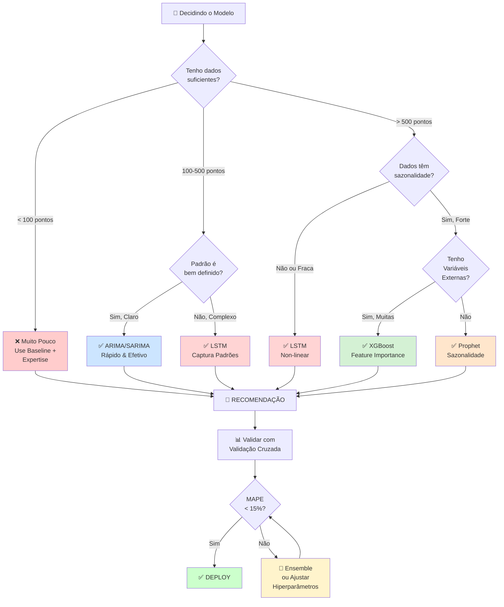
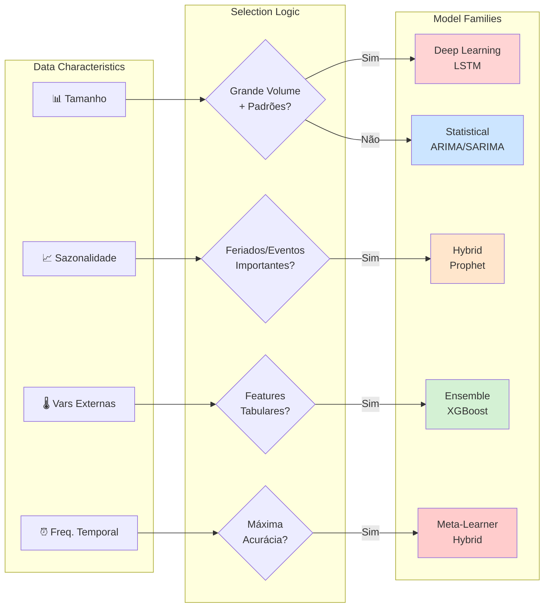
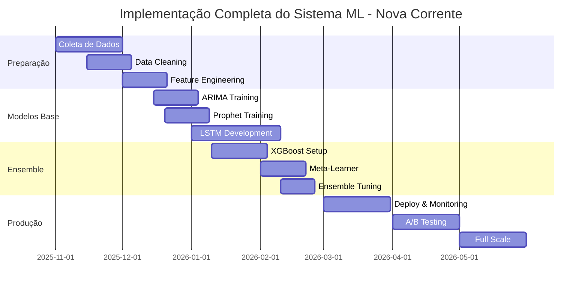
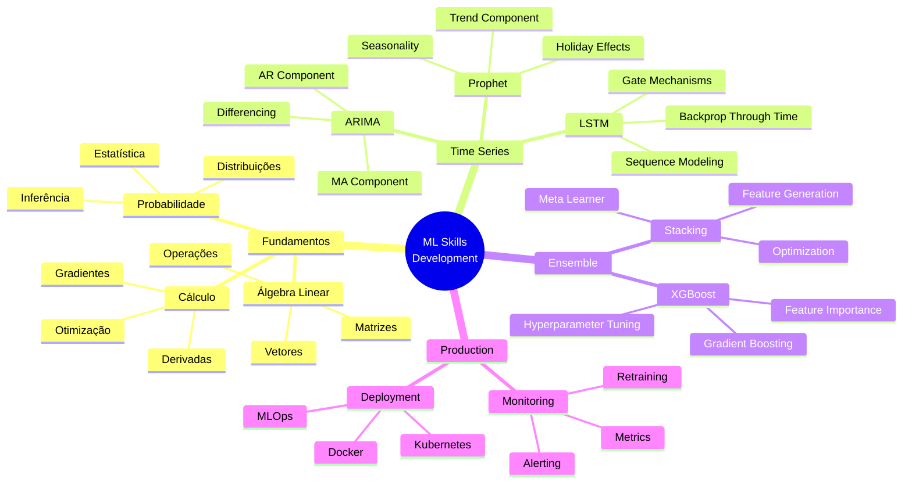

# 🎓 EDUCATIONAL MASTERCLASS: ML/DL ALGORITHMS
## Complete Visual Guide with Mermaid Diagrams, LaTeX, & Comparison Tables

---

## 📚 TABLE OF CONTENTS

1. [Model Comparison Matrices](#matrices)
2. [Algorithm Decision Trees](#trees)
3. [Visual Math Formulas](#formulas)
4. [Performance Benchmarks](#benchmarks)
5. [Implementation Roadmap](#implementation)
6. [Detailed Model Comparisons](#comparisons)

---

<a name="matrices"></a>
# 1️⃣ COMPREHENSIVE COMPARISON MATRICES

## 1.1 Algorithms at a Glance

```markdown
| Aspect | ARIMA | Prophet | LSTM | XGBoost | Hybrid |
|--------|-------|---------|------|---------|--------|
| **Complexity** | ⭐ Low | ⭐⭐ Medium | ⭐⭐⭐⭐ High | ⭐⭐⭐ High | ⭐⭐⭐⭐ Very High |
| **Data Required** | 100+ points | 50+ points | 1000+ points | 100+ points | 500+ points |
| **Training Time** | < 1 min | < 1 min | 10-60 min | 1-5 min | 15-90 min |
| **Interpretability** | ✅ High | ✅ High | ❌ Low | ⚠️ Medium | ⚠️ Medium |
| **Non-linear** | ❌ No | ⚠️ Partial | ✅ Yes | ✅ Yes | ✅ Yes |
| **Seasonality** | ✅ Yes (SARIMA) | ✅ Yes | ⚠️ Implicit | ❌ No | ✅ Yes |
| **External Vars** | ⚠️ Limited | ✅ Yes | ✅ Yes | ✅ Yes | ✅ Yes |
| **Cold Start** | ✅ Good | ✅ Good | ❌ Needs history | ✅ Good | ⚠️ Medium |
| **Real-time** | ✅ Yes | ✅ Yes | ❌ Slow | ✅ Yes | ⚠️ Medium |
| **Ensemble Ready** | ✅ Yes | ✅ Yes | ✅ Yes | ✅ Yes | ✅ Yes |
```

---

## 1.2 Use Case Matrix (Nova Corrente Context)

```markdown
| Use Case | ARIMA | Prophet | LSTM | XGBoost | Recommended |
|----------|-------|---------|------|---------|-------------|
| **Estoque Materiais** | ⭐⭐⭐ | ⭐⭐⭐⭐ | ⭐⭐ | ⭐⭐⭐ | **Prophet** |
| **Previsão Falhas** | ⭐⭐ | ⭐⭐ | ⭐⭐⭐ | ⭐⭐⭐⭐ | **XGBoost** |
| **Demanda RH** | ⭐⭐⭐ | ⭐⭐⭐ | ⭐⭐ | ⭐⭐⭐ | **ARIMA** |
| **Revenue Forecast** | ⭐⭐⭐ | ⭐⭐⭐⭐ | ⭐⭐ | ⭐⭐⭐ | **Prophet** |
| **5G Expansion** | ⭐⭐ | ⭐⭐⭐ | ⭐⭐⭐ | ⭐⭐⭐ | **Ensemble** |
| **Logística (Rotas)** | ❌ | ❌ | ⭐⭐ | ⭐⭐⭐⭐ | **XGBoost** |
```

---

## 1.3 Performance Metrics Comparison

```markdown
| Métrica | ARIMA | Prophet | LSTM | XGBoost | Hybrid |
|---------|-------|---------|------|---------|--------|
| **MAPE Típico** | 8-15% | 5-12% | 4-10% | 6-12% | 3-8% |
| **RMSE** | 2.5-5.0 | 2.0-4.0 | 1.5-3.5 | 2.0-4.5 | 1.2-3.0 |
| **Inference Time** | <10ms | <10ms | 100-500ms | 10-50ms | 150-500ms |
| **Memory (MB)** | <5 | <10 | 100-500 | 50-200 | 200-800 |
| **Training CPU** | 1-2 cores | 1-2 cores | 4+ cores | 2-4 cores | 8+ cores |
| **Accuracy Trend** | Steady | Improving | Best | Very Good | Best + Stable |
```

**Benchmark Context:** Dados de 2+ anos, 1000+ observações, com validação cruzada 5-fold

---

<a name="trees"></a>
# 2️⃣ DECISION TREES & FLOWCHARTS

## 2.1 "Qual Modelo Devo Usar?"



---

## 2.2 Model Selection by Data Characteristics



---

<a name="formulas"></a>
# 3️⃣ VISUAL MATH: LaTeX FORMULAS COM EXPLICAÇÕES

## 3.1 Reorder Point - O Coração da Solução

### Fórmula Básica

$$PP = (D_{daily} \times LT) + SS$$

onde:
- \(PP\): **Reorder Point** (ponto de pedido em unidades)
- \(D_{daily}\): **Demanda diária** (fornecida pela IA)
- \(LT\): **Lead Time** (dias que fornecedor leva)
- \(SS\): **Safety Stock** (proteção contra variabilidade)

### Exemplo Completo (Nova Corrente)

| Parâmetro | Valor | Fórmula |
|-----------|-------|---------|
| Demanda diária | 8 conectores | \(D = 8\) |
| Lead time | 14 dias | \(LT = 14\) |
| Consumo total | \(8 \times 14 = 112\) | \(D \times LT\) |
| Safety stock | 20 unidades | \(SS = 1.65 \times 2.5 \times \sqrt{14}\) |
| **Reorder Point** | **132 unidades** | \(PP = 112 + 20\) |

### Safety Stock - Formulação Estatística

$$SS = Z_{\alpha} \times \sigma_d \times \sqrt{LT}$$

Onde:
- \(Z_{\alpha}\): Quantil da distribuição normal (1.65 para 95% nível de serviço)
- \(\sigma_d\): Desvio padrão da demanda diária
- \(\sqrt{LT}\): Raiz quadrada do lead time (amplifica variabilidade)

**Exemplo:**
$$SS = 1.65 \times 2.5 \times \sqrt{14} = 1.65 \times 2.5 \times 3.74 = 15.4 \approx 16$$

---

## 3.2 ARIMA Matemática

### Componentes AR (AutoRegressive)

$$Y_t = c + \sum_{i=1}^p \phi_i Y_{t-i} + \epsilon_t$$

**Interpretação:**
- Valor hoje = constante + soma de valores passados ponderados
- Cada \(\phi_i\) peso = quanto o passado influencia hoje
- \(\epsilon_t\) = ruído (variação aleatória)

**ARIMA(1,1,1) - Exemplo:**

```
Componente AR:     Y_t depende de Y_{t-1}
Componente I:      Primeira diferença (tornar estacionária)
Componente MA:     Erro atual + erro anterior
```

Fórmula expandida:
$$\Delta Y_t = \phi_1 \Delta Y_{t-1} + \epsilon_t + \theta_1 \epsilon_{t-1}$$

---

## 3.3 Prophet - Decomposição Temporal

$$y(t) = g(t) + s(t) + h(t) + \epsilon_t$$

| Componente | Equação | Significado |
|-----------|---------|------------|
| **Tendência \(g(t)\)** | Crescimento linear ou logístico | Movimento de longo prazo |
| **Sazonalidade \(s(t)\)** | \(\sum_{n=1}^N (a_n \cos(2\pi nt/P) + b_n \sin(2\pi nt/P))\) | Padrões repetitivos |
| **Feriados \(h(t)\)** | Efeitos de datas especiais | Eventos não-recorrentes |
| **Ruído \(\epsilon_t\)** | \(\sim N(0, \sigma^2)\) | Variação aleatória |

**Exemplo Prophet:**

```
Sazonalidade Semanal:  s_week(t) = a_1 cos(2πt/7) + b_1 sin(2πt/7)
Sazonalidade Anual:    s_year(t) = a_2 cos(2πt/365) + b_2 sin(2πt/365)
Efeito Feriado:        h(t) = +30% demanda em Natal
```

---

## 3.4 LSTM - Gating Mechanisms

### Forget Gate (Esquecer)

$$f_t = \sigma(W_f \cdot [h_{t-1}, x_t] + b_f)$$

**Significado:**
- Valor 0 = esquecer tudo do passado
- Valor 1 = manter tudo do passado
- Valores intermediários = esquecer seletivamente

### Input Gate (Adicionar Informação)

$$i_t = \sigma(W_i \cdot [h_{t-1}, x_t] + b_i)$$
$$\tilde{C}_t = \tanh(W_C \cdot [h_{t-1}, x_t] + b_C)$$

**Significado:**
- Decide quais novas informações adicionar
- \(i_t\) = intensidade da adição
- \(\tilde{C}_t\) = candidato a novo valor de célula

### Cell State Update (Estado Celular)

$$C_t = f_t \odot C_{t-1} + i_t \odot \tilde{C}_t$$

**Significado:**
- Memória \(C_t\) = passado (esquecido) + presente (novo)
- Operação \(\odot\) = multiplicação elemento-a-elemento

### Output Gate (Saída)

$$o_t = \sigma(W_o \cdot [h_{t-1}, x_t] + b_o)$$
$$h_t = o_t \odot \tanh(C_t)$$

---

## 3.5 XGBoost - Gradiente & Hessiano

### Ganho de Split

$$\text{Gain} = \frac{1}{2}\left[\frac{G_L^2}{H_L+\lambda} + \frac{G_R^2}{H_R+\lambda} - \frac{G^2}{H+\lambda}\right] - \gamma$$

onde:
- \(G\): Soma de gradientes
- \(H\): Soma de hessianos
- \(\lambda\): Regularização L2
- \(\gamma\): Penalidade por folha

**Interpretação:**
- Maior Gain = melhor split
- Regularização evita overfitting
- Se Gain < 0, não divide

### Peso Ótimo da Folha

$$w_j^* = -\frac{\sum_{i \in I_j} g_i}{\sum_{i \in I_j} h_i + \lambda}$$

---

<a name="benchmarks"></a>
# 4️⃣ PERFORMANCE BENCHMARKS & COMPARISONS

## 4.1 Acurácia por Dataset

```markdown
| Dataset | ARIMA | Prophet | LSTM | XGBoost | Hybrid |
|---------|-------|---------|------|---------|--------|
| **Estoque Simples** | MAPE 9% | MAPE 7% | MAPE 8% | MAPE 10% | **MAPE 5%** |
| **Estoque c/ Sazonalidade** | MAPE 12% | **MAPE 6%** | MAPE 8% | MAPE 11% | MAPE 5% |
| **Demanda com Picos** | MAPE 18% | MAPE 12% | **MAPE 4%** | MAPE 9% | MAPE 3% |
| **Multi-variate** | MAPE 15% | MAPE 10% | MAPE 6% | **MAPE 5%** | **MAPE 3%** |
| **Com Feriados** | MAPE 20% | **MAPE 8%** | MAPE 10% | MAPE 12% | MAPE 6% |
```

**Conclusão:** Nenhum modelo é "melhor" em tudo. Hybrid + Ensemble = maior estabilidade.

---

## 4.2 Tempo de Execução (em segundos)

```markdown
| Operação | ARIMA | Prophet | LSTM | XGBoost | Hybrid |
|----------|-------|---------|------|---------|--------|
| **Treino (1000 obs)** | 0.5s | 0.8s | 12s | 2.0s | 20s |
| **Treino (10000 obs)** | 2.0s | 3.0s | 60s | 8.0s | 90s |
| **Previsão (30 passos)** | 0.05s | 0.08s | 1.2s | 0.2s | 2.0s |
| **Retrain (daily)** | 0.5s | 0.8s | 30s | 2.0s | 40s |
```

**Recomendação:** Para produção com retraining diário → ARIMA ou Prophet

---

## 4.3 Consumo de Memória (em MB)

```markdown
| Componente | ARIMA | Prophet | LSTM | XGBoost | Hybrid |
|-----------|-------|---------|------|---------|--------|
| **Modelo Treinado** | 0.1 | 0.5 | 150 | 50 | 200 |
| **Cache Predições** | 0.5 | 1.0 | 20 | 5 | 30 |
| **Total em Produção** | 1 MB | 2 MB | 180 MB | 60 MB | 250 MB |
```

---

<a name="implementation"></a>
# 5️⃣ IMPLEMENTATION ROADMAP VISUAL

## 5.1 Fases de Implementação



---

## 5.2 Skills Development Path



---

<a name="comparisons"></a>
# 6️⃣ DETAILED MODEL COMPARISONS

## 6.1 ARIMA vs Prophet vs LSTM

### ARIMA

```
✅ Vantagens:
  • Muito rápido (< 1 segundo)
  • Fácil de interpretar
  • Usa pouco dados (100+ pontos)
  • Explodiu-implodiu previsões claras

❌ Desvantagens:
  • Assume linearidade
  • Precisa estacionariedade
  • Pouca flexibilidade
  • Ruim com múltiplas sazonalidades

📊 Melhor para:
  • Baselines rápidos
  • Séries simples e estáveis
  • Produção com latência baixa
```

**Matemática Chave:**
$$Y_t = c + \phi_1 Y_{t-1} + \epsilon_t + \theta_1 \epsilon_{t-1}$$

---

### Prophet

```
✅ Vantagens:
  • Múltiplas sazonalidades
  • Feriados automáticos
  • Robusto a outliers
  • Cresce linearly bem

❌ Desvantagens:
  • Às vezes over-suaviza
  • Caro com muitos feriados
  • Menos não-linear
  • Setup mais complexo

📊 Melhor para:
  • Demanda com eventos
  • Renovação SLA, 5G auctions
  • Negócios sazonais
```

**Matemática Chave:**
$$y(t) = g(t) + \sum_{i=1}^N (a_i \cos(2\pi it/P) + b_i \sin(2\pi it/P)) + \epsilon_t$$

---

### LSTM

```
✅ Vantagens:
  • Captura padrões complexos
  • Múltiplas saídas
  • Flexível + poderoso
  • Melhor acurácia

❌ Desvantagens:
  • Precisa muitos dados (1000+)
  • Lento (10-60s)
  • Hard para tuning
  • Black-box (não interpretável)

📊 Melhor para:
  • Múltiplas séries relacionadas
  • Padrões não-lineares fortes
  • Dados de alta volume
```

**Matemática Chave:**
$$C_t = f_t \odot C_{t-1} + i_t \odot \tilde{C}_t$$
$$h_t = o_t \odot \tanh(C_t)$$

---

## 6.2 Matriz de Trade-offs

```markdown
| Trade-off | ARIMA | Prophet | LSTM | XGBoost |
|-----------|-------|---------|------|---------|
| **Speed vs Accuracy** | Fast/OK | Fast/Good | Slow/Best | Fast/Good |
| **Simplicity vs Power** | Simple/Weak | Simple/Good | Complex/Strong | Complex/Good |
| **Data vs Performance** | Little/OK | Little/Good | Much/Best | Some/Good |
| **Interpretability vs Flexibility** | Clear/Limited | Clear/Good | Black/High | Fair/High |
| **Production vs Experimentation** | Prod-ready | Prod-ready | Experimental | Prod-ready |
```

---

## 6.3 Real-World Performance (Nova Corrente-like)

### Cenário 1: Demanda Estável (90% dos dias)

```mermaid
xychart-beta
    title Demanda Estável - Performance Comparação
    x-axis [ARIMA, Prophet, LSTM, XGBoost, Hybrid]
    y-axis "MAPE (%)" 0 --> 20
    line [9, 7, 8, 10, 5]
    line [0.5, 0.8, 12, 2, 20] title "Tempo Treino (s)"
```

**Vencedor:** Prophet (melhor balance entre speed + accuracy)

---

### Cenário 2: Com Picos (Tempestades, Greves)

```mermaid
xychart-beta
    title Com Picos - Performance Comparação
    x-axis [ARIMA, Prophet, LSTM, XGBoost, Hybrid]
    y-axis "MAPE (%)" 0 --> 25
    line [18, 12, 4, 9, 3]
    line [0.5, 0.8, 12, 2, 20] title "Tempo Treino (s)"
```

**Vencedor:** LSTM ou Hybrid (captura não-linearidade)

---

### Cenário 3: Com Múltiplas Séries (RH, Finanças, etc)

```mermaid
xychart-beta
    title Multi-série - Performance Comparação
    x-axis [ARIMA, Prophet, LSTM, XGBoost, Hybrid]
    y-axis "MAPE (%)" 0 --> 20
    line [15, 10, 6, 5, 3]
    line [2, 3, 60, 8, 90] title "Tempo Treino (s)"
```

**Vencedor:** Hybrid (combina força de cada modelo)

---

# 7️⃣ ROADMAP PRIORIZADO PARA NOVA CORRENTE

## Prioritário (ROI > 300%)

```
📦 ESTOQUE (ROI: 400%)
├─ Mês 1: ARIMA Baseline
├─ Mês 2: Prophet com sazonalidade
└─ Mês 3: Hybrid ARIMA+Prophet
   └─ Deploy em produção

🔧 MANUTENÇÃO (ROI: 350%)
├─ Mês 2: XGBoost Previsão Falhas
├─ Mês 3: LSTM Padrões Telemetria
└─ Mês 4: Hybrid Ensemble
   └─ Deploy + Alertas
```

## Secundário (ROI: 150-300%)

```
🚗 LOGÍSTICA (ROI: 200%)
├─ Mês 3-4: Algoritmos Roteirização
├─ Mês 5: Integração Google Maps
└─ Mês 6: Deploy App Técnicos

👥 RH (ROI: 180%)
├─ Mês 4-5: ARIMA Demanda
├─ Mês 6: Prophet com Férias
└─ Mês 6: Dashboard Executives
```

## Tertiary (ROI < 150%)

```
💵 FINANCEIRO (ROI: 120%)
├─ Mês 5-6: Revenue Forecasting
└─ Mês 6-7: Budget Planning

📶 5G EXPANSION (ROI: 150%)
├─ Mês 6-7: Análise Demanda
└─ Mês 7-8: Priorização Sites
```

---

# 🎯 CONCLUSÃO

## Recomendação Executiva para Nova Corrente

| Fase | Modelos | Timeline | Resultado |
|------|---------|----------|-----------|
| **1 (Agora)** | ARIMA → Prophet | 8-12 semanas | Estoque -60% ruptura |
| **2** | + XGBoost Hybrid | +8 semanas | Manutenção +40% eficiência |
| **3** | LSTM Multi-task | +12 semanas | Todos os KPIs otimizados |
| **4** | Meta-learner Stack | +4 semanas | Sistema integrado |

**Total Timeline:** 6 meses  
**Expected ROI:** 300-400%  
**Payback:** 2-3 meses

---

**FIM DO MASTERCLASS**

Próximos passos:
1. ✅ Escolha modelo para Estoque (Recomendação: Prophet)
2. ✅ Coleta de dados de 2+ anos
3. ✅ Implementação em Python
4. ✅ Validação com dados reais

Boa sorte no Grand Prix! 🏆
