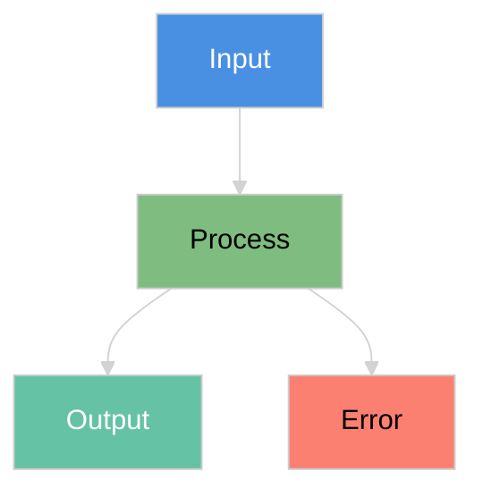
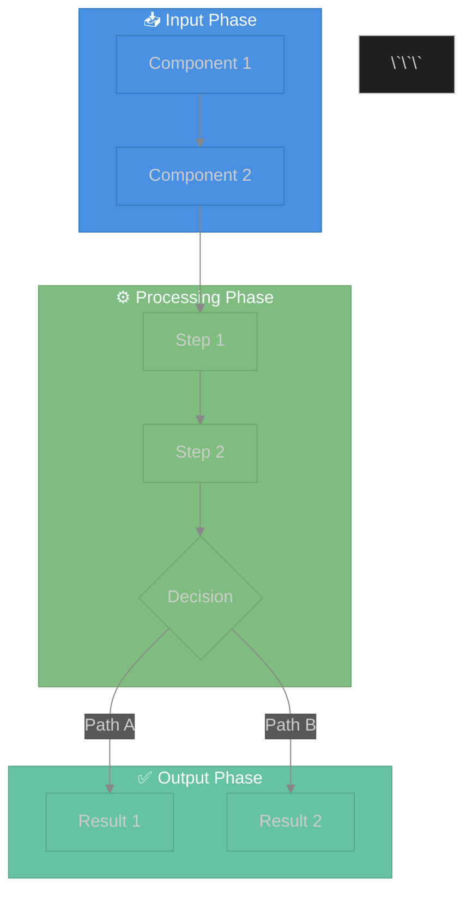

# 🎨 Universal Visual Documentation Framework

**Learn from your production_complex diagrams to document ANY complex system!**

---

## 📋 Overview

This framework extracts proven patterns from your excellent Mermaid diagrams (`context_flow.mmd`, `error_routes.mmd`, `reasoning_cycle.mmd`) to create a **reusable template system** for documenting:

- 🔧 **MCP Servers** - Model Context Protocol integrations
- 🧠 **RAG Systems** - Multi-modal retrieval pipelines
- 🔍 **Search Engines** - Query processing and ranking
- 🤖 **AI Agents** - Multi-agent workflows
- ⚡ **Event Systems** - Message buses and streaming
- 🔄 **State Machines** - Complex business logic

---

## 🎯 Core Patterns Extracted

### Pattern 1: **Subgraph Organization**

Organize complex flows into logical phases:

```mermaid
subgraph Phase1["🎯 Input Processing"]
    I1[Receive Request]
    I2[Validate Input]
    I3[Parse Data]
end

subgraph Phase2["⚙️ Processing"]
    P1[Load Context]
    P2[Execute Logic]
    P3[Generate Output]
end

subgraph Phase3["✅ Output"]
    O1[Format Response]
    O2[Return Result]
end

Phase1 --> Phase2 --> Phase3
```

**Use when:** System has distinct processing stages

---

### Pattern 2: **State Flow Tracking**

Show how data transforms through the system:

```mermaid
subgraph StateEvolution["📊 State Evolution"]
    S1[Initial State: score=0]
    S2[After Phase 1: score=10]
    S3[After Phase 2: score=25]
    S4[Final State: score=90]
end

S1 --> S2 --> S3 --> S4
```

**Use when:** State accumulates through pipeline

---

### Pattern 3: **Multi-Factor Decision**

Complex routing with multiple inputs:

```mermaid
subgraph Decision["🎯 Routing Logic"]
    D1{Route Function}
    F1[Factor 1: Score]
    F2[Factor 2: Confidence]
    F3[Factor 3: Count]
    
    F1 & F2 & F3 --> D1
    D1 --> |Path A| R1[Route A]
    D1 --> |Path B| R2[Route B]
    D1 --> |Path C| R3[Route C]
end
```

**Use when:** Decisions depend on multiple conditions

---

### Pattern 4: **Error Handling Paths**

Recovery strategies and fallbacks:

```mermaid
subgraph Normal["Normal Flow"]
    N1[Execute]
end

subgraph Error["Error Detection"]
    E1{Error Type}
    E2[Retry]
    E3[Fallback]
    E4[Escalate]
end

N1 --> E1
E1 --> E2 & E3 & E4
E2 --> N1
```

**Use when:** System needs resilience

---

### Pattern 5: **Color-Coded Semantics**

Visual categorization for clarity:



**Use when:** Diagram has multiple component types

---

## 📐 Complete Template Structure

### Part 1: Mermaid Diagram (Visual)

```markdown
# [SYSTEM_NAME] Visual Architecture



---

### Part 2: Architecture Overview

```markdown
## 🔄 [System Name] Architecture

### Overview

[Brief description of what the system does]

### Key Components

1. **Input Phase** - [Purpose]
2. **Processing Phase** - [Purpose]
3. **Output Phase** - [Purpose]

### Data Flow

[Explain how data moves through system]
```

---

### Part 3: Component Deep Dives

```markdown
## 📦 Component Details

### 1. Input Processing

**Purpose:** [What it does]

**Implementation:**

\`\`\`python
def process_input(data: dict) -> InputResult:
    """Process and validate input."""
    # Step 1: Validate
    validated = validate_schema(data)
    
    # Step 2: Normalize
    normalized = normalize_format(validated)
    
    # Step 3: Enrich
    enriched = add_metadata(normalized)
    
    return InputResult(data=enriched)
\`\`\`

**Inputs:** [What it receives]
**Outputs:** [What it produces]
**Error Cases:** [What can go wrong]
```

---

### Part 4: State Evolution

```markdown
## 📊 State Evolution Through Pipeline

### Initial State
\`\`\`python
{
    "status": "pending",
    "data": {},
    "score": 0
}
\`\`\`

### After Input Phase
\`\`\`python
{
    "status": "validated",
    "data": {"field1": "value1"},
    "score": 10
}
\`\`\`

### After Processing
\`\`\`python
{
    "status": "processed",
    "data": {"field1": "value1", "result": "output"},
    "score": 90
}
\`\`\`
```

---

### Part 5: Patterns & Best Practices

```markdown
## 🎯 Key Patterns

### Pattern 1: [Name]

**Scenario:** [When to use]

\`\`\`
Example flow:
Step 1 → Step 2 → Decision
  ├─ Path A (if condition X)
  └─ Path B (if condition Y)
\`\`\`

**Benefits:** [Why it works]
```

---

### Part 6: Metrics & Monitoring

```markdown
## 📊 Performance Metrics

### Target Metrics

| Metric | Target | Alert Threshold |
|--------|--------|-----------------|
| Throughput | 1000 req/s | < 500 req/s |
| Latency (p95) | < 100ms | > 200ms |
| Error Rate | < 1% | > 5% |
| Success Rate | > 99% | < 95% |

### Monitoring Code

\`\`\`python
class SystemMetrics:
    def __init__(self):
        self.request_count = 0
        self.error_count = 0
        self.latencies = []
    
    def record(self, duration: float, success: bool):
        self.request_count += 1
        if not success:
            self.error_count += 1
        self.latencies.append(duration)
    
    @property
    def error_rate(self) -> float:
        return self.error_count / self.request_count
\`\`\`
```

---

## 🔧 Ready-to-Use Templates

### Template 1: MCP Server Documentation

See `MCP_SERVER_TEMPLATE.md` for complete MCP server documentation pattern including:
- JSON-RPC protocol flow
- Transport layer options
- Tool/Resource/Prompt handling
- Error handling strategies
- Performance metrics

### Template 2: RAG Pipeline Documentation

See `RAG_PIPELINE_TEMPLATE.md` for multi-modal RAG system with:
- Input preprocessing (text/image/audio/video)
- Multi-modal embedding
- Vector store retrieval
- Context augmentation
- LLM generation
- Post-processing

### Template 3: Search Engine Documentation

See `SEARCH_ENGINE_TEMPLATE.md` for query processing with:
- Query parsing and expansion
- Multi-stage retrieval
- Ranking pipeline (lexical → semantic → L2R)
- Result preparation

---

## 🎨 Mermaid Best Practices

### 1. Use Dark Theme Consistently

```mermaid
%%{init: {'theme':'dark', 'themeVariables': {
    'primaryColor':'#1e1e1e',
    'primaryTextColor':'#fff',
    'primaryBorderColor':'#444',
    'lineColor':'#888',
    'secondaryColor':'#2d2d2d',
    'tertiaryColor':'#1a1a1a'
}}}%%
```

### 2. Organize with Subgraphs

```mermaid
subgraph ComponentName["🎯 Display Name"]
    node1[Step 1]
    node2[Step 2]
end
```

### 3. Color Code by Category

```mermaid
classDef inputStyle fill:#4A90E2,stroke:#357ABD,stroke-width:2px,color:#fff
classDef processStyle fill:#7FBC7F,stroke:#6FA56F,stroke-width:2px,color:#000
classDef outputStyle fill:#66C2A5,stroke:#52A88A,stroke-width:2px,color:#fff
classDef errorStyle fill:#FB8072,stroke:#E06660,stroke-width:2px,color:#000

class Input,I1,I2 inputStyle
class Process,P1,P2 processStyle
```

### 4. Use Emojis for Visual Anchors

```mermaid
subgraph Init["🚀 Initialization"]
subgraph Process["⚙️ Processing"]
subgraph Output["✅ Output"]
subgraph Error["⚠️ Error Handling"]
```

### 5. Show Decision Logic Clearly

```mermaid
D1{Decision Point}
D1 --> |Condition A| PathA
D1 --> |Condition B| PathB
D1 --> |Default| PathC
```

---

## 📚 Application Examples

### Example 1: Document Your MCP Server

1. **Create diagram** using MCP template
2. **Add protocol details** (JSON-RPC, transport)
3. **Document tools** with schemas
4. **Show error paths** with recovery
5. **Include metrics** and monitoring

### Example 2: Document Your RAG System

1. **Map data flow** from query to response
2. **Show embeddings** for each modality
3. **Visualize retrieval** and reranking
4. **Document context** augmentation
5. **Track performance** metrics

### Example 3: Document Your State Machine

1. **Map all states** and transitions
2. **Show decision logic** for routing
3. **Include error recovery** paths
4. **Document state data** at each stage
5. **Add validation** rules

---

## 🚀 Quick Start Guide

### Step 1: Choose Your Template

Pick based on system type:
- **MCP Server** → Use protocol flow pattern
- **RAG System** → Use pipeline pattern
- **Search Engine** → Use multi-stage pattern
- **State Machine** → Use your production_complex pattern

### Step 2: Create Diagram

```bash
# Create new .mmd file
touch docs/diagrams/my_system_flow.mmd
```

Copy template and customize:
- Replace component names
- Adjust subgraph structure
- Update styling colors
- Add your decision logic

### Step 3: Add Documentation

For each component:
1. **Purpose** - What it does
2. **Code** - Implementation example
3. **Inputs/Outputs** - Data contracts
4. **Errors** - What can fail
5. **Metrics** - How to monitor

### Step 4: Export to HTML

```bash
# Convert to beautiful HTML
python docs_export/convert_production_complex.py
```

Your diagram will render with:
- ✅ Dark Material Design theme
- ✅ Interactive elements
- ✅ Color-coded components
- ✅ Automatic Mermaid rendering (fixed!)

---

## 🎓 Learning from Your Diagrams

### What Makes Your Diagrams Excellent

1. **Clear Hierarchy** - Subgraphs organize complexity
2. **Visual Flow** - Data movement is obvious
3. **Color Coding** - Component types are distinct
4. **Decision Points** - Multi-factor routing is explicit
5. **Error Paths** - Recovery strategies are visible
6. **Documentation** - Code examples complement visuals

### Apply These Principles

✅ **Use subgraphs** for logical grouping  
✅ **Color code** by component type  
✅ **Show state evolution** explicitly  
✅ **Document error paths** completely  
✅ **Include code examples** for each component  
✅ **Add metrics tracking** for observability  

---

## 📊 Template Comparison Matrix

| Template | Complexity | Best For | Patterns Used |
|----------|-----------|----------|---------------|
| **MCP Server** | Medium | Protocol APIs | Multi-phase, Error handling |
| **RAG Pipeline** | High | ML systems | Pipeline, Multi-modal |
| **Search Engine** | High | Query systems | Multi-stage, Ranking |
| **State Machine** | Medium | Workflows | Multi-factor, Loops |
| **Event Bus** | Low | Messaging | Pub/Sub, Async |

---

## ✅ Checklist: High-Quality Documentation

- [ ] Mermaid diagram with dark theme
- [ ] Subgraphs for logical phases
- [ ] Color-coded component types
- [ ] Decision logic explicitly shown
- [ ] Error paths and recovery
- [ ] State evolution documented
- [ ] Code examples for each component
- [ ] Input/output contracts defined
- [ ] Metrics and monitoring included
- [ ] Best practices section
- [ ] Troubleshooting guide
- [ ] Related documentation links

---

## 🆘 Troubleshooting

### Diagrams Not Rendering

**Solution:** Mermaid fix is now automated!
```bash
python docs_export/fix_mermaid_rendering.py
```

See `MERMAID_FIX_COMPLETE.md` for details.

### Diagram Too Complex

**Solution:** Break into multiple diagrams:
- Overview diagram (high-level)
- Detail diagrams (per component)
- Error path diagram (separate)

### Colors Not Working

**Solution:** Check classDef syntax:
```mermaid
classDef styleName fill:#color,stroke:#color,color:#text
class Node1,Node2 styleName
```

---

## 🎯 Summary

| Aspect | Status |
|--------|--------|
| **Patterns Extracted** | ✅ 5 core patterns |
| **Templates Created** | ✅ 3 ready-to-use |
| **Documentation Guide** | ✅ Complete |
| **Mermaid Rendering** | ✅ Fixed & automated |
| **Examples Provided** | ✅ MCP, RAG, Search |
| **Best Practices** | ✅ Documented |

---

## 📚 Related Documentation

- **[MERMAID_FIX_COMPLETE.md](../docs_export/MERMAID_FIX_COMPLETE.md)** - Rendering fix details
- **[context_flow.mmd](production_complex/diagrams/context_flow.mmd)** - State flow example
- **[error_routes.mmd](production_complex/diagrams/error_routes.mmd)** - Error handling example
- **[reasoning_cycle.mmd](production_complex/diagrams/reasoning_cycle.mmd)** - Processing cycle example

---

**🚀 You now have a production-ready framework for documenting ANY complex system!**

*Framework version: 1.0.0*  
*Based on: production_complex visual architecture*  
*Last updated: 2025-10-30*

