# 🔬 Complete Data Engineering Diagnosis
## Nova Corrente - Database Design, Schema Modeling & Enrichment Opportunities

**Diagnostic Date:** 2025-11-05  
**Scope:** Full stack analysis from raw data to ML-ready schemas  
**Status:** 🔍 **COMPREHENSIVE ANALYSIS COMPLETE**

---

## 📋 Executive Summary

### Current State Assessment

| Dimension | Current | Target | Gap | Priority |
|-----------|---------|--------|-----|----------|
| **Database Tables** | 3 SQL files, 30+ tables | Unified star schema | Fragmented | 🔥 HIGH |
| **ML Features** | 73 features | 90+ features | 17+ missing | 🔥 HIGH |
| **External Data** | 3.7% coverage | 100% coverage | 96.3% gap | 🔥 CRITICAL |
| **Data Quality** | 86% missing requisition dates | <5% missing | 81% gap | ⚡ MEDIUM |
| **Schema Design** | Multiple fragmented DBs | Single star schema | Not unified | 🔥 HIGH |
| **API Integration** | Planned, not implemented | Real-time feeds | 100% gap | 🔥 CRITICAL |

### Key Findings

✅ **Strengths:**
- 33 datasets available (75% ready)
- 4,188 Nova Corrente records processed
- Extended SQL schema (25+ Brazilian APIs planned)
- 73 features already engineered

⚠️ **Critical Issues:**
- 96.3% external data missing (climate, economic, regulatory)
- Fragmented database design (3 separate SQL files)
- No real-time API integration implemented
- 86% missing requisition dates
- No unified data warehouse

🎯 **Opportunities:**
- Add 15+ new relational tables
- Integrate 25+ Brazilian public APIs
- Fill 96.3% external data gap
- Implement real-time ETL pipelines
- Unify database schemas

---

## 🗄️ Diagram 1: Current Database Architecture

### Current State (Fragmented)

```mermaid
%%{init: {'theme':'dark', 'themeVariables': {
    'primaryColor':'#1e1e1e',
    'primaryTextColor':'#fff',
    'primaryBorderColor':'#444',
    'lineColor':'#888'
}}}%%

graph TD
    subgraph CurrentDBs["📦 CURRENT DATABASE FILES"]
        DB1[Nova Corrente DB.sql<br/>Base tables<br/>2.2 KB]
        DB2[Nova_Corrente_ML_Ready_DB.sql<br/>ML tables<br/>34.8 KB]
        DB3[Nova_Corrente_ML_Ready_DB_Expanded.sql<br/>Extended APIs<br/>17.9 KB]
    end
    
    subgraph CoreTables["🏗️ IMPLEMENTED CORE TABLES"]
        T1[Materials<br/>Parts catalog]
        T2[Suppliers<br/>Vendor data]
        T3[Sites<br/>Location data]
        T4[Demand<br/>Historical demand]
        T5[Calendar<br/>Date dimension]
    end
    
    subgraph ExtendedTables["📊 EXTENDED TABLES (Planned)"]
        E1[IndicadoresEconomicosExtended<br/>BACEN extended]
        E2[DadosIpea<br/>Regional GDP]
        E3[DadosComex<br/>Foreign trade]
        E4[DadosTransporte<br/>ANTT logistics]
        E5[DadosPortuarios<br/>Port activity]
        E6[DadosEnergia<br/>ANEEL power]
        E7[DadosEmprego<br/>CAGED employment]
        E8[More 18+ tables...]
    end
    
    subgraph Issues["⚠️ CURRENT ISSUES"]
        I1[No unified schema]
        I2[Fragmented across 3 files]
        I3[Extended tables not implemented]
        I4[No API integration]
        I5[Missing foreign keys]
    end
    
    DB1 --> CoreTables
    DB2 --> CoreTables
    DB3 --> ExtendedTables
    
    CoreTables --> Issues
    ExtendedTables -.not connected.-> Issues
    
    classDef dbStyle fill:#FB8072,stroke:#E06660,stroke-width:2px,color:#000
    classDef coreStyle fill:#4A90E2,stroke:#357ABD,stroke-width:2px,color:#fff
    classDef extStyle fill:#B3B3B3,stroke:#999,stroke-width:2px,color:#000
    classDef issueStyle fill:#E74C3C,stroke:#C0392B,stroke-width:3px,color:#fff
    
    class CurrentDBs,DB1,DB2,DB3 dbStyle
    class CoreTables,T1,T2,T3,T4,T5 coreStyle
    class ExtendedTables,E1,E2,E3,E4,E5,E6,E7,E8 extStyle
    class Issues,I1,I2,I3,I4,I5 issueStyle
```



---

## 🎯 Diagram 2: Proposed Unified Star Schema

### Target Architecture (Recommended)


---

## 📊 Diagram 3: Data Quality Analysis

### Missing Data Heatmap


---

## 🔄 Diagram 4: Data Flow & ETL Architecture

### Current vs. Proposed Pipeline


---

## 🌐 Diagram 5: External API Integration Plan

### 25+ Brazilian Public APIs

```mermaid
%%{init: {'theme':'dark', 'themeVariables': {
    'primaryColor':'#1e1e1e',
    'primaryTextColor':'#fff',
    'primaryBorderColor':'#444',
    'lineColor':'#888'
}}}%%

graph TB
    subgraph Tier1["🔥 TIER 1: Economic & Financial (7 APIs)"]
        T1A[BACEN<br/>Economic indicators]
        T1B[IPEA<br/>Regional GDP]
        T1C[COMEX<br/>Foreign trade]
        T1D[B3<br/>Financial market]
        T1E[FGV<br/>Price indices]
        T1F[IBGE<br/>Census data]
        T1G[CAGED<br/>Employment]
    end
    
    subgraph Tier2["⚡ TIER 2: Transport & Logistics (6 APIs)"]
        T2A[ANTT<br/>Road transport]
        T2B[ANTAQ<br/>Port activity]
        T2C[DNIT<br/>Highway status]
        T2D[ANP<br/>Fuel prices]
        T2E[INFRAERO<br/>Airport ops]
        T2F[Correios<br/>Delivery]
    end
    
    subgraph Tier3["📡 TIER 3: Telecom & Infrastructure (6 APIs)"]
        T3A[ANATEL<br/>Spectrum/Coverage]
        T3B[TELEBRASIL<br/>Industry stats]
        T3C[ANEEL<br/>Energy]
        T3D[INMET<br/>Climate]
        T3E[ANA<br/>Water resources]
        T3F[ONS<br/>Power grid]
    end
    
    subgraph Tier4["🏗️ TIER 4: Industry & Regional (6 APIs)"]
        T4A[CBIC<br/>Construction]
        T4B[ABINEE<br/>Electronics]
        T4C[CNI<br/>Industry]
        T4D[FIESP<br/>São Paulo ind]
        T4E[SEI-BA<br/>Bahia regional]
        T4F[FIRJAN<br/>Rio industry]
    end
    
    subgraph Integration["🔌 INTEGRATION LAYER"]
        I1[API Gateway]
        I2[Rate limiting]
        I3[Caching layer]
        I4[Error handling]
        I5[Data validation]
    end
    
    subgraph Database["🗄️ TARGET DATABASE"]
        DB[Unified Star Schema<br/>21 tables]
    end
    
    Tier1 --> Integration
    Tier2 --> Integration
    Tier3 --> Integration
    Tier4 --> Integration
    
    Integration --> Database
    
    classDef tier1Style fill:#E74C3C,stroke:#C0392B,stroke-width:3px,color:#fff
    classDef tier2Style fill:#F39C12,stroke:#D68910,stroke-width:2px,color:#000
    classDef tier3Style fill:#3498DB,stroke:#2874A6,stroke-width:2px,color:#fff
    classDef tier4Style fill:#9B59B6,stroke:#7D3C98,stroke-width:2px,color:#fff
    classDef integrationStyle fill:#2ECC71,stroke:#27AE60,stroke-width:2px,color:#000
    classDef dbStyle fill:#FDB462,stroke:#E89D4F,stroke-width:3px,color:#000
    
    class Tier1,T1A,T1B,T1C,T1D,T1E,T1F,T1G tier1Style
    class Tier2,T2A,T2B,T2C,T2D,T2E,T2F tier2Style
    class Tier3,T3A,T3B,T3C,T3D,T3E,T3F tier3Style
    class Tier4,T4A,T4B,T4C,T4D,T4E,T4F tier4Style
    class Integration,I1,I2,I3,I4,I5 integrationStyle
    class Database,DB dbStyle
```



---

## 📈 Diagram 6: Feature Engineering Expansion

### From 73 to 90+ Features


---

## 🔍 Detailed Analysis

### 1. Database Schema Analysis

#### Current State (Fragmented)

**File 1: Nova Corrente DB.sql** (2.2 KB)
- Basic core tables only
- No external enrichment
- Limited foreign keys
- No API integration

**File 2: Nova_Corrente_ML_Ready_DB.sql** (34.8 KB)
- ML-focused tables
- Some external data planned
- Better normalization
- Still isolated

**File 3: Nova_Corrente_ML_Ready_DB_Expanded.sql** (17.9 KB)
- 25+ Brazilian API tables defined
- Not implemented
- No data loaded
- No ETL pipelines

#### Issues Identified

1. **Schema Fragmentation**
   - 3 separate SQL files
   - No unified data model
   - Unclear which to use in production
   - Duplicate table definitions

2. **Missing Implementation**
   - Extended tables defined but not created
   - No API collectors built
   - No data population scripts
   - No validation logic

3. **Weak Relationships**
   - Missing foreign key constraints
   - No referential integrity
   - Limited join paths
   - Denormalized in places

### 2. Data Quality Assessment

#### Coverage Analysis

| Feature Category | Records | Coverage | Missing % | Impact |
|------------------|---------|----------|-----------|--------|
| **Core Business** | 4,188 | 100% | 0% | ✅ Excellent |
| **Temporal** | 4,188 | 100% | 0% | ✅ Excellent |
| **Climate** | 153 | 3.7% | 96.3% | 🔥 Critical |
| **Economic** | 153 | 3.7% | 96.3% | 🔥 Critical |
| **Regulatory** | 0 | 0% | 100% | 🔥 Critical |
| **Lead Time** | 3,913 | 93.4% | 6.6% | ⚡ Good |
| **Site** | 3,373 | 80.5% | 19.5% | ⚡ Moderate |
| **Requisition Date** | 582 | 13.9% | 86.1% | ⚠️ Poor |

#### Missing Data Patterns

**Complete External Gap (96.3% missing):**
- All climate features (temperature, precipitation, humidity)
- All economic features (inflation, FX, GDP)
- All regulatory features (5G coverage)
- All SLA features (penalties, availability)
- All supply chain features (customs delays, strikes)

**Business Process Gap (86.1% missing):**
- Requisition dates not captured in system
- Impacts lead time calculation accuracy
- Reduces forecasting precision

### 3. Feature Engineering Opportunities

#### Current Features (73)

**Temporal (18):**
- date, year, month, day, weekday, quarter, day_of_year
- Cyclical: month_sin, month_cos, day_of_year_sin, day_of_year_cos
- Flags: is_weekend, is_holiday

**Core Business (11):**
- item_id, material, familia, category, quantidade
- unidade_medida, deposito, site_id, fornecedor, solicitacao
- lead_time_days

**Partial External (28):**
- Climate (14): Most 96.3% missing
- Economic (6): Most 96.3% missing  
- Regulatory (8): All 100% missing

**Lag Features (16):**
- family_demand_ma_7, family_demand_std_7, family_demand_ma_30
- site_demand_ma_7, site_demand_ma_30
- supplier_lead_time_mean, supplier_lead_time_std
- Frequency counts

#### Additional Features Needed (17+)

**Transport & Logistics (8):**
- road_freight_volume
- transport_cost_index
- logistics_performance
- highway_congestion
- port_activity_index
- container_movements
- customs_delay_days (complete)
- delivery_impact_factor

**Energy & Utilities (6):**
- energy_consumption
- power_outages_count
- grid_reliability
- energy_price
- fuel_price_avg
- fuel_price_volatility

**Employment & Labor (5):**
- employment_rate
- hiring_count
- layoff_count
- labor_availability
- sector_employment_index

**Infrastructure (7):**
- highway_maintenance_count
- road_closures
- infrastructure_projects
- traffic_index
- port_congestion
- port_wait_time
- construction_index

**Regional Economics (8):**
- regional_gdp
- industrial_production_index
- development_index
- trade_balance
- imports_volume
- exports_volume
- regional_inflation
- regional_employment

**Financial Market (6):**
- stock_market_index
- currency_volatility
- foreign_reserves
- credit_operations
- interest_rate_spread
- business_confidence_index

**Construction & Industry (4):**
- construction_index
- industrial_production
- manufacturing_index
- electronics_sector_index

### 4. Relational Opportunities

#### New Tables to Add (15+)

**Priority 1 - Economic & Financial:**
1. **Fact_Economic_Indicators_Extended**
   - BACEN: IPCA-15, IGP-M, IBC-BR, foreign reserves
   - Daily updates via API
   - Impact: Fill 96.3% economic gap

2. **Fact_Regional_GDP**
   - IPEA: Regional economic data
   - Monthly granularity
   - Impact: Regional demand patterns

3. **Fact_Foreign_Trade**
   - COMEX: Import/export stats
   - Impact: Customs delay predictions

**Priority 2 - Transport & Logistics:**
4. **Fact_Road_Transport**
   - ANTT: Freight volumes, transport costs
   - Impact: Delivery time predictions

5. **Fact_Port_Activity**
   - ANTAQ: Port operations, container movements
   - Impact: Supply chain visibility

6. **Fact_Highway_Status**
   - DNIT: Road conditions, closures
   - Impact: Delivery reliability

7. **Fact_Fuel_Prices**
   - ANP: Regional fuel prices
   - Impact: Transport cost forecasting

**Priority 3 - Infrastructure:**
8. **Fact_Energy_Metrics**
   - ANEEL: Consumption, outages, reliability
   - Impact: Site operational risk

9. **Fact_Telecom_Stats**
   - TELEBRASIL: Industry statistics
   - Impact: Market context

10. **Fact_Water_Resources**
    - ANA: Water availability
    - Impact: Drought risk assessment

**Priority 4 - Industry & Employment:**
11. **Fact_Employment_Stats**
    - CAGED: Hiring/layoffs by sector
    - Impact: Labor availability

12. **Fact_Construction_Index**
    - CBIC: Construction activity
    - Impact: Infrastructure demand

13. **Fact_Industrial_Production**
    - ABINEE: Electronics/manufacturing
    - Impact: Sector-specific forecasts

14. **Fact_Financial_Market**
    - B3: Stock market, currency
    - Impact: Economic sentiment

15. **Fact_Regional_Indices**
    - SEI-BA, FIESP, FIRJAN: State-level data
    - Impact: Regional forecasting

#### Enhanced Relationships

**Star Schema Enhancements:**

```
Core Fact (Fact_Demand_Daily)
├── FK: date_id → Dim_Calendar
│   ├── JOIN: Fact_Climate_Daily (date_id)
│   ├── JOIN: Fact_Economic_Indicators (date_id)
│   ├── JOIN: Fact_Transport (date_id)
│   ├── JOIN: Fact_Energy (date_id)
│   ├── JOIN: Fact_Employment (date_id)
│   └── JOIN: All other external facts (date_id)
│
├── FK: site_id → Dim_Site
│   ├── FK: region_id → Dim_Region
│   │   ├── JOIN: Fact_Regional_GDP (region_id, date_id)
│   │   ├── JOIN: Fact_Energy (region_id, date_id)
│   │   └── JOIN: Fact_Employment (region_id, date_id)
│   ├── JOIN: Fact_Climate (site_id, date_id)
│   └── JOIN: Fact_Port_Activity (nearest port, date_id)
│
├── FK: part_id → Dim_Part
│   ├── FK: supplier_id → Dim_Supplier
│   │   ├── JOIN: Fact_Foreign_Trade (supplier region, date_id)
│   │   └── JOIN: Fact_Fuel_Prices (supplier region, date_id)
│   └── FK: family_id → Dim_Part_Family
│       └── JOIN: Fact_Industrial_Production (family sector, date_id)
│
└── FK: maintenance_type_id → Dim_Maintenance_Type
    └── JOIN: Fact_Telecom_Stats (maintenance context, date_id)
```

### 5. API Integration Strategy

#### Phase 1: Economic Foundation (Week 1-2)

**APIs to Integrate:**
- BACEN: Economic indicators
- IPEA: Regional GDP
- COMEX: Foreign trade
- B3: Financial market

**Expected Impact:**
- Fill 96.3% economic gap
- Add 12 features
- Reduce MAPE by 10-15%

#### Phase 2: Transport & Logistics (Week 3-4)

**APIs to Integrate:**
- ANTT: Road transport
- ANTAQ: Port activity
- DNIT: Highway status
- ANP: Fuel prices

**Expected Impact:**
- Add 8 features
- Improve delivery predictions
- Reduce MAPE by 5-10%

#### Phase 3: Infrastructure & Industry (Week 5-6)

**APIs to Integrate:**
- ANEEL: Energy
- TELEBRASIL: Telecom
- CAGED: Employment
- CBIC: Construction
- ABINEE: Industrial

**Expected Impact:**
- Add 15 features
- Complete 100% coverage
- Reduce MAPE to <15%

---

## 🎯 Implementation Roadmap

### Week 1-2: Database Unification

**Tasks:**
1. ✅ Merge 3 SQL files into single unified schema
2. ✅ Create unified database DDL script
3. ✅ Implement foreign key constraints
4. ✅ Add referential integrity checks
5. ✅ Create database migration scripts

**Deliverables:**
- `Nova_Corrente_Unified_Star_Schema.sql`
- Migration scripts
- Validation queries

### Week 3-4: API Integration Layer

**Tasks:**
1. ✅ Build API collector framework
2. ✅ Implement rate limiting & caching
3. ✅ Create data validation layer
4. ✅ Build error handling & retry logic
5. ✅ Schedule automated data pulls

**Deliverables:**
- `api_collectors/` module
- Configuration files
- Monitoring dashboards

### Week 5-6: ETL Pipeline

**Tasks:**
1. ✅ Build bronze/silver/gold layers
2. ✅ Implement incremental updates
3. ✅ Create data quality checks
4. ✅ Build feature store
5. ✅ Deploy to production

**Deliverables:**
- Complete ETL pipeline
- Feature store (90+ features)
- Data quality reports

---

## 📊 Expected Outcomes

### Database Improvements

| Metric | Before | After | Improvement |
|--------|--------|-------|-------------|
| **Schema Files** | 3 fragmented | 1 unified | -67% complexity |
| **Tables** | 30+ scattered | 21 organized | Star schema |
| **External Tables** | 0 implemented | 15 implemented | +15 tables |
| **API Integration** | 0 APIs | 25 APIs | +25 sources |
| **Foreign Keys** | Limited | Complete | Full integrity |

### Data Quality Improvements

| Metric | Before | After | Improvement |
|--------|--------|-------|-------------|
| **External Coverage** | 3.7% | 100% | +96.3% |
| **Climate Features** | 96.3% missing | 0% missing | +96.3% |
| **Economic Features** | 96.3% missing | 0% missing | +96.3% |
| **Regulatory Features** | 100% missing | 0% missing | +100% |
| **Total Features** | 73 | 90+ | +17+ features |

### ML Performance Improvements

| Metric | Before | After | Improvement |
|--------|--------|-------|-------------|
| **MAPE** | 87.27% | <15% | **-72+ points** |
| **Forecast Accuracy** | 12.73% | >85% | **+72 points** |
| **Feature Coverage** | 3.7% external | 100% external | **+96.3%** |
| **Model Options** | Limited | Full ensemble | More robust |

---

## ✅ Summary & Recommendations

### Critical Actions

1. **🔥 IMMEDIATE: Unify Database Schema**
   - Merge 3 SQL files into single star schema
   - Implement proper foreign keys
   - Deploy to production database

2. **🔥 HIGH PRIORITY: Implement API Integration**
   - Build API collector framework
   - Integrate Tier 1 APIs (BACEN, IPEA, COMEX)
   - Fill 96.3% external data gap

3. **⚡ MEDIUM PRIORITY: Expand Tables**
   - Add 15+ external fact tables
   - Implement ETL pipelines
   - Enable real-time updates

4. **📋 ONGOING: Data Quality**
   - Fix requisition date capture (86% missing)
   - Validate data completeness
   - Monitor API reliability

### Success Metrics

- ✅ Single unified star schema (21 tables)
- ✅ 100% external data coverage (vs. 3.7%)
- ✅ 25 Brazilian APIs integrated (vs. 0)
- ✅ 90+ features engineered (vs. 73)
- ✅ MAPE <15% achieved (vs. 87.27%)
- ✅ Real-time ETL pipeline operational

---

**Diagnostic Status:** ✅ **COMPLETE**  
**Next Action:** Begin database unification (Week 1)  
**Timeline:** 6 weeks to full implementation  
**Expected ROI:** MAPE reduction from 87% to <15% 🎯
