# 🔄 Complete ETL Pipeline Architecture
## Nova Corrente - Bronze/Silver/Gold Data Layers

**Pipeline Version:** 2.0  
**Architecture:** Medallion (Bronze → Silver → Gold → Platinum)  
**Update Frequency:** Real-time to Daily

---

## 🏗️ Pipeline Overview


---

## 📋 Layer Specifications

### 🥉 Bronze Layer (Raw Data)

**Purpose:** Store raw, unprocessed data exactly as received

**Characteristics:**
- ✅ Immutable (append-only)
- ✅ Full audit trail
- ✅ Schema on read
- ✅ Compressed storage (Parquet)

**Tables:**

```
bronze/
├── raw_suprimentos/
│   ├── suprimentos_2024_10_09.parquet
│   ├── suprimentos_2024_10_10.parquet
│   └── ...
├── raw_bacen_api/
│   ├── economic_indicators_2024_10.json
│   └── ...
├── raw_inmet_api/
│   ├── climate_data_2024_10.json
│   └── ...
└── raw_anatel_api/
    ├── regulatory_data_2024_10.json
    └── ...
```

**Storage Strategy:**
- Format: Parquet (columnar, compressed)
- Partitioning: Year/Month/Day
- Retention: 2 years
- Compression: Snappy

---

### 🥈 Silver Layer (Cleaned Data)

**Purpose:** Cleaned, validated, deduplicated data ready for business use

**Transformations:**

```mermaid
%%{init: {'theme':'dark', 'themeVariables': {
    'primaryColor':'#1e1e1e',
    'primaryTextColor':'#fff',
    'primaryBorderColor':'#444',
    'lineColor':'#888'
}}}%%

flowchart LR
    subgraph Input["📥 Bronze Input"]
        I1[Raw Records<br/>Duplicates, Nulls]
    end
    
    subgraph Clean["🧹 Cleaning"]
        C1[Remove Duplicates<br/>Based on keys]
        C2[Handle Nulls<br/>Impute or Flag]
        C3[Type Conversion<br/>String → Numeric]
        C4[Standardize Format<br/>Dates, Codes]
    end
    
    subgraph Validate["✅ Validation"]
        V1[Schema Check<br/>Column types]
        V2[Range Check<br/>Min/Max values]
        V3[Business Rules<br/>Logical checks]
        V4[Referential Integrity<br/>FK validation]
    end
    
    subgraph Output["📤 Silver Output"]
        O1[Clean Records<br/>Quality flags]
    end
    
    I1 --> C1
    C1 --> C2
    C2 --> C3
    C3 --> C4
    
    C4 --> V1
    V1 --> V2
    V2 --> V3
    V3 --> V4
    
    V4 --> O1
    
    classDef inputStyle fill:#FB8072,stroke:#E06660,stroke-width:2px,color:#000
    classDef cleanStyle fill:#F39C12,stroke:#D68910,stroke-width:2px,color:#000
    classDef validateStyle fill:#3498DB,stroke:#2874A6,stroke-width:2px,color:#fff
    classDef outputStyle fill:#2ECC71,stroke:#27AE60,stroke-width:2px,color:#000
    
    class Input,I1 inputStyle
    class Clean,C1,C2,C3,C4 cleanStyle
    class Validate,V1,V2,V3,V4 validateStyle
    class Output,O1 outputStyle
```



**Quality Checks:**

| Check Type | Rule | Action on Failure |
|------------|------|-------------------|
| **Duplicate** | Unique (date_id, site_id, part_id) | Keep most recent |
| **Null** | quantidade NOT NULL | Reject record |
| **Range** | quantidade > 0 | Reject record |
| **Range** | lead_time_days >= 0 | Flag for review |
| **Range** | temperature BETWEEN -20 AND 50 | Flag outlier |
| **FK** | site_id EXISTS in Dim_Site | Reject record |
| **FK** | part_id EXISTS in Dim_Part | Reject record |
| **Date** | data_solicitado <= CURRENT_DATE | Reject record |

**Tables:**

```
silver/
├── Fact_Demand_Daily_cleaned
├── Dim_Calendar_cleaned
├── Dim_Part_cleaned
├── Dim_Site_cleaned
├── Dim_Supplier_cleaned
├── Fact_Climate_Daily_cleaned
├── Fact_Economic_Daily_cleaned
└── ...
```

---

### 🥇 Gold Layer (Analytics-Ready)

**Purpose:** Business-optimized, aggregated data for analytics and reporting

**Aggregations:**


**Key Tables:**

**Demand_Analytics_Daily:**
```sql
CREATE TABLE Demand_Analytics_Daily AS
SELECT 
    f.date_id,
    c.full_date,
    c.year, c.month, c.weekday,
    f.site_id,
    s.site_name, s.region_id, r.region_name,
    f.part_id,
    p.material, p.familia, p.abc_class,
    f.quantidade,
    f.lead_time_days,
    
    -- External enrichment
    cl.temperature_avg_c,
    cl.precipitation_mm,
    ec.inflation_rate,
    ec.exchange_rate_brl_usd,
    reg.coverage_5g_pct,
    
    -- Calculated metrics
    f.quantidade * p.avg_unit_cost AS estimated_cost,
    CASE WHEN f.lead_time_days > s.avg_lead_time THEN 1 ELSE 0 END AS is_delayed,
    p.abc_class AS part_priority
    
FROM Fact_Demand_Daily f
INNER JOIN Dim_Calendar c ON f.date_id = c.date_id
INNER JOIN Dim_Part p ON f.part_id = p.part_id
INNER JOIN Dim_Site s ON f.site_id = s.site_id
INNER JOIN Dim_Region r ON s.region_id = r.region_id
LEFT JOIN Fact_Climate_Daily cl ON f.date_id = cl.date_id AND f.site_id = cl.site_id
LEFT JOIN Fact_Economic_Daily ec ON f.date_id = ec.date_id
LEFT JOIN Fact_Regulatory_Daily reg ON f.date_id = reg.date_id AND s.region_id = reg.region_id;
```

---

### 💎 Platinum Layer (ML Feature Store)

**Purpose:** ML-ready features with train/val/test splits

**Feature Engineering Pipeline:**


**Feature Categories (90+ total):**

| Category | Count | Examples |
|----------|-------|----------|
| **Temporal** | 25 | year, month, day, weekday, is_weekend, is_holiday, month_sin/cos, day_sin/cos |
| **Climate** | 14 | temperature_avg/min/max, precipitation, humidity, wind_speed, corrosion_risk |
| **Economic** | 12 | inflation_rate, exchange_rate, gdp_growth, selic_rate, credit_operations |
| **Regulatory** | 10 | 5g_coverage_pct, spectrum_allocation, active_operators, b2b_contracts |
| **Transport** | 8 | road_freight_volume, transport_cost, highway_congestion, customs_delay |
| **Energy** | 6 | energy_consumption, power_outages, grid_reliability, fuel_price |
| **Employment** | 5 | employment_rate, hiring_count, labor_availability |
| **Lag/MA** | 20 | family_demand_ma_7/30, site_demand_ma_7/30, supplier_lead_time_mean/std |
| **Categorical** | 8 | familia_encoded, abc_class, site_type, criticality |
| **Derived** | 12 | sla_violation_risk, delivery_impact, corrosion_risk, abc_class |

---

## 🔄 Data Flow Schedule

### Batch Processing

```mermaid
%%{init: {'theme':'dark', 'themeVariables': {
    'primaryColor':'#1e1e1e',
    'primaryTextColor':'#fff',
    'primaryBorderColor':'#444',
    'lineColor':'#888'
}}}%%

gantt
    title Daily ETL Schedule (UTC-3 Brazil Time)
    dateFormat HH:mm
    axisFormat %H:%M
    
    section Bronze
    API Collection - Economic    :00:00, 30m
    API Collection - Climate      :00:30, 30m
    API Collection - Regulatory   :01:00, 30m
    API Collection - Transport    :01:30, 30m
    File Upload Processing        :02:00, 60m
    
    section Silver
    Data Cleaning                 :03:00, 60m
    Validation & Deduplication    :04:00, 45m
    Quality Checks                :04:45, 30m
    
    section Gold
    Daily Aggregations            :05:15, 45m
    Star Schema Enrichment        :06:00, 60m
    KPI Calculation               :07:00, 30m
    
    section Platinum
    Feature Engineering           :07:30, 90m
    ML Dataset Generation         :09:00, 45m
    Train/Val/Test Splits         :09:45, 30m
```



### Real-time Processing

**Stream Processing (Kafka/RabbitMQ):**

```
Event Stream → Bronze (immediate)
             → Silver (5 min delay)
             → Gold (15 min delay)
             → Platinum (hourly batch)
```

**Update Frequencies:**

| Layer | Update Frequency | Latency |
|-------|------------------|---------|
| **Bronze** | Real-time | <1 minute |
| **Silver** | Every 5 minutes | 5-10 minutes |
| **Gold** | Every 15 minutes | 15-30 minutes |
| **Platinum** | Hourly batch | 1 hour |
| **API Refresh** | Daily 00:00-02:00 | Next day |

---

## 🛠️ Implementation Code

### Bronze Layer - API Collector

```python
# backend/data/collectors/api_collector_base.py

import requests
from datetime import datetime
import json
from pathlib import Path

class APICollectorBase:
    def __init__(self, api_name, base_url, rate_limit_per_min=60):
        self.api_name = api_name
        self.base_url = base_url
        self.rate_limit = rate_limit_per_min
        self.bronze_path = Path(f"data/bronze/{api_name}")
        self.bronze_path.mkdir(parents=True, exist_ok=True)
    
    def collect(self, endpoint, params=None):
        """Collect data from API and save to bronze layer"""
        try:
            response = requests.get(
                f"{self.base_url}/{endpoint}",
                params=params,
                timeout=30
            )
            response.raise_for_status()
            
            data = response.json()
            
            # Save to bronze (raw)
            timestamp = datetime.now().strftime("%Y%m%d_%H%M%S")
            filename = self.bronze_path / f"{endpoint}_{timestamp}.json"
            
            with open(filename, 'w') as f:
                json.dump({
                    'collected_at': datetime.now().isoformat(),
                    'endpoint': endpoint,
                    'params': params,
                    'data': data
                }, f, indent=2)
            
            return data
            
        except Exception as e:
            self._log_error(endpoint, str(e))
            return None
    
    def _log_error(self, endpoint, error):
        error_log = self.bronze_path / "errors.log"
        with open(error_log, 'a') as f:
            f.write(f"{datetime.now()},{endpoint},{error}\n")
```

### Silver Layer - Data Cleaner

```python
# backend/data/pipelines/silver_cleaner.py

import pandas as pd
import numpy as np

class SilverDataCleaner:
    def __init__(self, table_name):
        self.table_name = table_name
        self.quality_metrics = {}
    
    def clean_demand_data(self, bronze_df):
        """Clean Fact_Demand_Daily from bronze to silver"""
        df = bronze_df.copy()
        
        # 1. Remove duplicates
        initial_rows = len(df)
        df = df.drop_duplicates(subset=['date_id', 'site_id', 'part_id', 'solicitacao'])
        self.quality_metrics['duplicates_removed'] = initial_rows - len(df)
        
        # 2. Handle nulls
        df['quantidade'] = df['quantidade'].fillna(0)
        df['lead_time_days'] = df['lead_time_days'].fillna(df['lead_time_days'].median())
        
        # 3. Type conversion
        df['quantidade'] = pd.to_numeric(df['quantidade'], errors='coerce')
        df['date_id'] = pd.to_datetime(df['date_id']).dt.strftime('%Y%m%d').astype(int)
        
        # 4. Range validation
        df = df[df['quantidade'] > 0]
        df = df[df['lead_time_days'] >= 0]
        
        # 5. Add quality flags
        df['data_quality_score'] = 100
        df.loc[df['data_requisitada'].isna(), 'data_quality_score'] -= 20
        df.loc[df['lead_time_days'] > 90, 'data_quality_score'] -= 10
        
        self.quality_metrics['final_rows'] = len(df)
        self.quality_metrics['completeness_pct'] = (df.notna().sum() / df.size * 100).mean()
        
        return df
```

### Gold Layer - Aggregator

```python
# backend/data/pipelines/gold_aggregator.py

import pandas as pd

class GoldAggregator:
    def create_daily_analytics(self, silver_dfs):
        """Create gold layer analytics from silver tables"""
        
        fact = silver_dfs['Fact_Demand_Daily']
        dim_calendar = silver_dfs['Dim_Calendar']
        dim_part = silver_dfs['Dim_Part']
        dim_site = silver_dfs['Dim_Site']
        
        # Star schema join
        analytics = (fact
            .merge(dim_calendar, on='date_id', how='inner')
            .merge(dim_part, on='part_id', how='inner')
            .merge(dim_site, on='site_id', how='inner')
        )
        
        # Add external facts
        if 'Fact_Climate_Daily' in silver_dfs:
            analytics = analytics.merge(
                silver_dfs['Fact_Climate_Daily'],
                on=['date_id', 'site_id'],
                how='left'
            )
        
        if 'Fact_Economic_Daily' in silver_dfs:
            analytics = analytics.merge(
                silver_dfs['Fact_Economic_Daily'],
                on='date_id',
                how='left'
            )
        
        # Calculate KPIs
        analytics['estimated_cost'] = analytics['quantidade'] * analytics['avg_unit_cost']
        analytics['is_high_value'] = analytics['abc_class'] == 'A'
        analytics['is_delayed'] = analytics['lead_time_days'] > analytics['lead_time_days'].median()
        
        return analytics
```

### Platinum Layer - Feature Engineer

```python
# backend/ml/feature_store.py

import pandas as pd
import numpy as np

class FeatureEngineer:
    def engineer_features(self, gold_df):
        """Generate 90+ ML features from gold layer"""
        df = gold_df.copy()
        
        # Temporal features
        df['month_sin'] = np.sin(2 * np.pi * df['month'] / 12)
        df['month_cos'] = np.cos(2 * np.pi * df['month'] / 12)
        df['day_of_year_sin'] = np.sin(2 * np.pi * df['day_of_year'] / 365)
        df['day_of_year_cos'] = np.cos(2 * np.pi * df['day_of_year'] / 365)
        
        # Lag features
        df['family_demand_ma_7'] = df.groupby('familia')['quantidade'].transform(
            lambda x: x.rolling(7, min_periods=1).mean()
        )
        df['family_demand_ma_30'] = df.groupby('familia')['quantidade'].transform(
            lambda x: x.rolling(30, min_periods=1).mean()
        )
        df['family_demand_std_7'] = df.groupby('familia')['quantidade'].transform(
            lambda x: x.rolling(7, min_periods=1).std()
        )
        
        # Frequency encoding
        df['family_frequency'] = df.groupby('familia')['familia'].transform('count')
        df['site_frequency'] = df.groupby('site_id')['site_id'].transform('count')
        
        # Categorical encoding
        df['familia_encoded'] = df['familia'].astype('category').cat.codes
        df['abc_class_encoded'] = df['abc_class'].map({'A': 3, 'B': 2, 'C': 1})
        
        # Risk scores
        df['sla_violation_risk'] = (
            (df['is_delayed'].astype(int) * 0.4) +
            (df['is_high_value'].astype(int) * 0.3) +
            ((df['lead_time_days'] > 30).astype(int) * 0.3)
        )
        
        return df
    
    def create_train_test_split(self, df, test_size=0.2, val_size=0.16):
        """Create temporal train/val/test splits"""
        df = df.sort_values('full_date')
        
        n = len(df)
        train_end = int(n * (1 - test_size - val_size))
        val_end = int(n * (1 - test_size))
        
        train = df.iloc[:train_end]
        val = df.iloc[train_end:val_end]
        test = df.iloc[val_end:]
        
        return train, val, test
```

---

## ✅ Pipeline Benefits

### Performance
- ✅ Incremental processing (only new data)
- ✅ Partitioned storage (faster queries)
- ✅ Pre-computed aggregations
- ✅ Columnar format (Parquet)

### Quality
- ✅ Automated validation at each layer
- ✅ Quality metrics tracked
- ✅ Error handling & retry logic
- ✅ Full lineage tracking

### Scalability
- ✅ Horizontal scaling (parallel processing)
- ✅ Event-driven architecture
- ✅ Caching layer
- ✅ Rate limiting

### Maintainability
- ✅ Clear layer separation
- ✅ Modular code design
- ✅ Automated testing
- ✅ Monitoring & alerts

---

**Pipeline Status:** 🔧 **DESIGN COMPLETE**  
**Next Step:** Implement bronze layer collectors  
**Estimated Processing Time:** 2-3 hours daily (batch)
