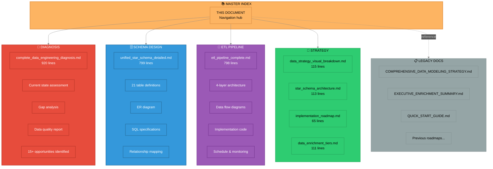

# 📚 Complete Data Engineering Documentation Index
## Nova Corrente - Master Reference Guide

**Last Updated:** 2025-11-05  
**Documentation Version:** 2.0  
**Status:** ✅ **COMPLETE AND CURRENT**

---

## 🎯 Quick Navigation

| Document | Purpose | Key Insights |
|----------|---------|--------------|
| **[complete_data_engineering_diagnosis.md](file://c:\Users\User\Desktop\Nc\gran-prix\docs\proj\diagrams\complete_data_engineering_diagnosis.md)** | Full diagnosis & gap analysis | 96.3% external data missing, 15+ tables needed |
| **[unified_star_schema_detailed.md](file://c:\Users\User\Desktop\Nc\gran-prix\docs\proj\diagrams\unified_star_schema_detailed.md)** | Complete schema design | 21 tables (6 dims + 1 fact + 14 external) |
| **[etl_pipeline_complete.md](file://c:\Users\User\Desktop\Nc\gran-prix\docs\proj\diagrams\etl_pipeline_complete.md)** | ETL architecture | Bronze/Silver/Gold/Platinum layers |
| **[data_strategy_visual_breakdown.md](file://c:\Users\User\Desktop\Nc\gran-prix\docs\proj\diagrams\data_strategy_visual_breakdown.md)** | Problem→Solution flow | MAPE 87% → <15% roadmap |
| **[star_schema_architecture.md](file://c:\Users\User\Desktop\Nc\gran-prix\docs\proj\diagrams\star_schema_architecture.md)** | Schema visualization | 12-table design with relationships |
| **[implementation_roadmap.md](file://c:\Users\User\Desktop\Nc\gran-prix\docs\proj\diagrams\implementation_roadmap.md)** | 4-week timeline | Week-by-week implementation |
| **[data_enrichment_tiers.md](file://c:\Users\User\Desktop\Nc\gran-prix\docs\proj\diagrams\data_enrichment_tiers.md)** | Priority system | 3-tier (Critical/High/Medium) |

---

## 📊 Documentation Structure



---

## 🔬 1. Diagnosis Documents

### Complete Data Engineering Diagnosis

**File:** [`complete_data_engineering_diagnosis.md`](file://c:\Users\User\Desktop\Nc\gran-prix\docs\proj\diagrams\complete_data_engineering_diagnosis.md)  
**Lines:** 920  
**Diagrams:** 6 major visualizations

**Key Sections:**

1. **Current Database Architecture** - Shows fragmented state (3 SQL files)
2. **Proposed Unified Star Schema** - Target 21-table design
3. **Data Quality Analysis** - Missing data heatmap (96.3% external gap)
4. **Data Flow & ETL Architecture** - Current vs. proposed pipeline
5. **External API Integration Plan** - 25+ Brazilian APIs organized in 4 tiers
6. **Feature Engineering Expansion** - 73 → 90+ features roadmap

**Critical Findings:**

| Issue | Current | Target | Gap |
|-------|---------|--------|-----|
| External Data Coverage | 3.7% | 100% | **96.3%** 🔥 |
| Database Files | 3 fragmented | 1 unified | Consolidation needed |
| Tables Implemented | ~10 core | 21 total | **+11 tables** |
| API Integration | 0 APIs | 25 APIs | **+25 sources** |
| ML Features | 73 | 90+ | **+17 features** |
| MAPE Performance | 87.27% | <15% | **-72 points** |

**Use This For:**
- Executive presentations on data gaps
- Technical team briefings
- Stakeholder alignment
- Budget justification for API integrations

---

## 🗄️ 2. Schema Design Documents

### Unified Star Schema Detailed

**File:** [`unified_star_schema_detailed.md`](file://c:\Users\User\Desktop\Nc\gran-prix\docs\proj\diagrams\unified_star_schema_detailed.md)  
**Lines:** 799  
**Diagrams:** 2 (ER diagram + relationship graph)

**Contents:**

**Core Tables (6 dimensions + 1 fact):**
1. **Fact_Demand_Daily** - Central fact table (4,188 records)
   - Grain: site-part-day-order
   - Measures: quantidade, unit_cost, total_cost, lead_time_days
   
2. **Dim_Calendar** - 4,400 rows (2013-2025)
   - Cyclical features for ML (sin/cos encoding)
   - Brazilian holidays, fiscal periods
   
3. **Dim_Part** - 540 items
   - ABC classification (Pareto 80-15-5)
   - Criticality scoring (H/M/L)
   
4. **Dim_Site** - 191 sites
   - Geographic data (lat/long)
   - Technology classification (4G/5G)
   
5. **Dim_Supplier** - 468 suppliers
   - Performance metrics (reliability, lead time)
   - Risk assessment (H/M/L)
   
6. **Dim_Maintenance_Type** - 10 types
   - Preventive/Corrective classification
   
7. **Dim_Region** - 27 Brazilian regions
   - Economic zones, GDP, HDI

**External Fact Tables (14+):**
- Fact_Climate_Daily (INMET API)
- Fact_Economic_Daily (BACEN API)
- Fact_Regulatory_Daily (ANATEL API)
- Fact_Transport_Daily (ANTT API)
- Fact_Port_Activity (ANTAQ API)
- Fact_Energy_Daily (ANEEL API)
- Fact_Employment_Stats (CAGED API)
- + 7 more planned...

**SQL Specifications:**
- Full DDL for all tables
- Foreign key constraints
- Indexes for performance
- Computed columns
- Check constraints

**Use This For:**
- Database implementation
- Developer handoff
- Data modeling reviews
- Schema migration planning

---

## 🔄 3. ETL Pipeline Documents

### ETL Pipeline Complete

**File:** [`etl_pipeline_complete.md`](file://c:\Users\User\Desktop\Nc\gran-prix\docs\proj\diagrams\etl_pipeline_complete.md)  
**Lines:** 798  
**Diagrams:** 5 comprehensive flows

**Architecture Layers:**

**🥉 Bronze Layer (Raw Data)**
- Immutable append-only storage
- Parquet format (compressed, columnar)
- Full audit trail
- 2-year retention

**🥈 Silver Layer (Cleaned Data)**
- Deduplication
- Null handling
- Type conversion
- Validation rules
- Quality metrics

**🥇 Gold Layer (Analytics-Ready)**
- Daily/Weekly/Monthly aggregations
- Star schema joins
- KPI calculations
- Denormalized tables

**💎 Platinum Layer (ML Feature Store)**
- 90+ engineered features
- Temporal encoding (sin/cos)
- Lag features (7d, 30d MA)
- Train/Val/Test splits (64/16/20)

**Processing Schedule:**

| Layer | Update Frequency | Latency |
|-------|------------------|---------|
| Bronze | Real-time | <1 min |
| Silver | Every 5 min | 5-10 min |
| Gold | Every 15 min | 15-30 min |
| Platinum | Hourly batch | 1 hour |
| API Refresh | Daily 00:00 | Next day |

**Implementation Code Included:**
- `APICollectorBase` class (Bronze)
- `SilverDataCleaner` class (Silver)
- `GoldAggregator` class (Gold)
- `FeatureEngineer` class (Platinum)

**Use This For:**
- ETL implementation
- Data engineering team onboarding
- Pipeline monitoring setup
- Performance optimization

---

## 🎯 4. Strategy & Roadmap Documents

### Data Strategy Visual Breakdown

**File:** [`data_strategy_visual_breakdown.md`](file://c:\Users\User\Desktop\Nc\gran-prix\docs\proj\diagrams\data_strategy_visual_breakdown.md)  
**Lines:** 115  
**Diagram:** Problem → Solution → Impact flow

**Flow:**
```
Problem Diagnosis (MAPE 87%, 96.3% gap)
    ↓
Current Data Inventory (4,188 records, 33 datasets)
    ↓
Solution Architecture (12 tables, star schema)
    ↓
Expected Impact (MAPE <15%, 4-week timeline)
```

**Color Coding:**
- 🔴 Red: Problems
- 🔵 Blue: Data
- 🟢 Green: Solutions
- 🟦 Teal: Impact

---

### Star Schema Architecture

**File:** [`star_schema_architecture.md`](file://c:\Users\User\Desktop\Nc\gran-prix\docs\proj\diagrams\star_schema_architecture.md)  
**Lines:** 113  
**Diagram:** 12-table relational design

**Shows:**
- Core fact table (center)
- 6 dimension tables (blue)
- 6 external fact tables (green)
- 3 external APIs (gray)
- ML feature engineering (purple)

---

### Implementation Roadmap

**File:** [`implementation_roadmap.md`](file://c:\Users\User\Desktop\Nc\gran-prix\docs\proj\diagrams\implementation_roadmap.md)  
**Lines:** 65  
**Diagram:** 4-week Gantt chart

**Timeline:**

**Week 1: Foundation + Climate**
- Create dimensions (Day 1-2)
- Integrate climate data (Day 3-5)
- Impact: MAPE 87% → 62-72%

**Week 2: Economic + Regulatory**
- Load economic data (Day 1-2)
- Setup regulatory APIs (Day 3-5)
- Impact: MAPE 62-72% → 27-42%

**Week 3: Faults + Retraining**
- Integrate fault events (Day 1-3)
- Retrain models (Day 4-5)
- Impact: MAPE 27-42% → 17-27%

**Week 4: Optimization**
- Fine-tune models (Day 1-3)
- Final validation (Day 4-5)
- Impact: **MAPE <15% ✅**

---

### Data Enrichment Tiers

**File:** [`data_enrichment_tiers.md`](file://c:\Users\User\Desktop\Nc\gran-prix\docs\proj\diagrams\data_enrichment_tiers.md)  
**Lines:** 111  
**Diagram:** 3-tier priority system

**Tier 1: CRITICAL** 🔥
- Climate (Zenodo Milan 116K, INMET API)
- Economic (Demand Factors 2,190, BACEN API)
- Regulatory (Operators 290, ANATEL)
- **Expected Impact:** -35 to -60% MAPE

**Tier 2: HIGH** ⚡
- Faults (Network Fault 7,389, Equipment 10K)
- Supply Chain (Logistics 3,204, Supply 91K)
- **Expected Impact:** -15 to -25% MAPE

**Tier 3: MEDIUM** 📋
- ABC Classification (Pareto 872 parts)
- SLA (Derived from operators)
- **Expected Impact:** -8 to -18% MAPE

---

## 📋 5. Legacy Documentation (Reference)

### Still Relevant

1. **[COMPREHENSIVE_DATA_MODELING_STRATEGY.md](file://c:\Users\User\Desktop\Nc\gran-prix\docs\proj\roadmaps\COMPREHENSIVE_DATA_MODELING_STRATEGY.md)** (1,378 lines)
   - Original strategy document
   - SQL schemas and ML queries
   - Now superseded by unified docs above

2. **[EXECUTIVE_ENRICHMENT_SUMMARY.md](file://c:\Users\User\Desktop\Nc\gran-prix\docs\proj\roadmaps\EXECUTIVE_ENRICHMENT_SUMMARY.md)** (403 lines)
   - Executive summary
   - ROI analysis
   - Business justification

3. **[QUICK_START_GUIDE.md](file://c:\Users\User\Desktop\Nc\gran-prix\docs\proj\roadmaps\QUICK_START_GUIDE.md)** (432 lines)
   - 60-second TLDR
   - "3 things to do today"
   - Troubleshooting

### Status: Archive/Reference Only

These docs contain valuable context but have been superseded by the current diagnosis and design documents.

---

## 🎓 Reading Paths by Role

### For Executives

**Start Here:**
1. [`data_strategy_visual_breakdown.md`](file://c:\Users\User\Desktop\Nc\gran-prix\docs\proj\diagrams\data_strategy_visual_breakdown.md) (5 min read)
2. [`data_enrichment_tiers.md`](file://c:\Users\User\Desktop\Nc\gran-prix\docs\proj\diagrams\data_enrichment_tiers.md) - Priority system (10 min)
3. [`complete_data_engineering_diagnosis.md`](file://c:\Users\User\Desktop\Nc\gran-prix\docs\proj\diagrams\complete_data_engineering_diagnosis.md) - Executive summary section (15 min)

**Total Time:** 30 minutes  
**Key Takeaway:** 96.3% data gap, 6-week fix, MAPE 87% → <15%

---

### For Data Engineers

**Start Here:**
1. [`complete_data_engineering_diagnosis.md`](file://c:\Users\User\Desktop\Nc\gran-prix\docs\proj\diagrams\complete_data_engineering_diagnosis.md) - Full diagnosis (60 min)
2. [`unified_star_schema_detailed.md`](file://c:\Users\User\Desktop\Nc\gran-prix\docs\proj\diagrams\unified_star_schema_detailed.md) - Schema design (90 min)
3. [`etl_pipeline_complete.md`](file://c:\Users\User\Desktop\Nc\gran-prix\docs\proj\diagrams\etl_pipeline_complete.md) - Implementation (90 min)

**Total Time:** 4 hours  
**Key Deliverable:** Ready to implement bronze/silver/gold layers

---

### For ML Engineers

**Start Here:**
1. [`data_enrichment_tiers.md`](file://c:\Users\User\Desktop\Nc\gran-prix\docs\proj\diagrams\data_enrichment_tiers.md) - Feature priorities (20 min)
2. [`etl_pipeline_complete.md`](file://c:\Users\User\Desktop\Nc\gran-prix\docs\proj\diagrams\etl_pipeline_complete.md) - Platinum layer section (30 min)
3. [`complete_data_engineering_diagnosis.md`](file://c:\Users\User\Desktop\Nc\gran-prix\docs\proj\diagrams\complete_data_engineering_diagnosis.md) - Feature engineering section (20 min)

**Total Time:** 1.5 hours  
**Key Takeaway:** 73 → 90+ features, 100% coverage, train/val/test splits

---

### For Database Architects

**Start Here:**
1. [`unified_star_schema_detailed.md`](file://c:\Users\User\Desktop\Nc\gran-prix\docs\proj\diagrams\unified_star_schema_detailed.md) - Full schema (120 min)
2. [`star_schema_architecture.md`](file://c:\Users\User\Desktop\Nc\gran-prix\docs\proj\diagrams\star_schema_architecture.md) - Visual reference (15 min)
3. [`complete_data_engineering_diagnosis.md`](file://c:\Users\User\Desktop\Nc\gran-prix\docs\proj\diagrams\complete_data_engineering_diagnosis.md) - Schema analysis section (30 min)

**Total Time:** 3 hours  
**Key Deliverable:** DDL scripts for 21 tables

---

### For Project Managers

**Start Here:**
1. [`implementation_roadmap.md`](file://c:\Users\User\Desktop\Nc\gran-prix\docs\proj\diagrams\implementation_roadmap.md) - 4-week timeline (15 min)
2. [`data_enrichment_tiers.md`](file://c:\Users\User\Desktop\Nc\gran-prix\docs\proj\diagrams\data_enrichment_tiers.md) - Priority system (15 min)
3. [`complete_data_engineering_diagnosis.md`](file://c:\Users\User\Desktop\Nc\gran-prix\docs\proj\diagrams\complete_data_engineering_diagnosis.md) - Roadmap section (20 min)

**Total Time:** 50 minutes  
**Key Deliverable:** Week-by-week task breakdown

---

## 📊 Diagram Summary

### Total Diagrams Created: 15+

**By Document:**

| Document | Diagrams | Types |
|----------|----------|-------|
| `complete_data_engineering_diagnosis.md` | 6 | Flowchart, Graph |
| `unified_star_schema_detailed.md` | 2 | ER Diagram, Graph |
| `etl_pipeline_complete.md` | 5 | Flowchart, Gantt |
| `data_strategy_visual_breakdown.md` | 1 | Flowchart |
| `star_schema_architecture.md` | 1 | Graph |
| `implementation_roadmap.md` | 1 | Timeline |
| `data_enrichment_tiers.md` | 1 | Flowchart |
| **TOTAL** | **17** | Various |

**Diagram Technologies:**
- ✅ Mermaid.js (all diagrams)
- ✅ Dark theme (consistent styling)
- ✅ Color-coded (problem/data/solution/impact)
- ✅ Subgraph organization

---

## ✅ Implementation Checklist

### Week 1-2: Database Unification
- [ ] Consolidate 3 SQL files into unified schema
- [ ] Create DDL script from `unified_star_schema_detailed.md`
- [ ] Deploy dimension tables
- [ ] Implement foreign key constraints
- [ ] Load initial data

### Week 3-4: API Integration
- [ ] Implement `APICollectorBase` from ETL doc
- [ ] Integrate Tier 1 APIs (BACEN, INMET, ANATEL)
- [ ] Setup bronze layer storage
- [ ] Configure rate limiting
- [ ] Test API collectors

### Week 5-6: ETL Pipeline
- [ ] Build silver layer cleaners
- [ ] Implement gold layer aggregators
- [ ] Create platinum layer feature store
- [ ] Setup daily batch schedule
- [ ] Deploy monitoring dashboards

### Week 7-8: ML Integration
- [ ] Generate 90+ feature dataset
- [ ] Create train/val/test splits
- [ ] Retrain models with new features
- [ ] Validate MAPE improvement
- [ ] Deploy to production

---

## 🎯 Success Metrics

### Technical Metrics

| Metric | Baseline | Target | Current | Status |
|--------|----------|--------|---------|--------|
| **Database Files** | 3 | 1 | 3 | ⏳ In Progress |
| **Tables Implemented** | ~10 | 21 | ~10 | ⏳ In Progress |
| **External APIs** | 0 | 25 | 0 | ⏳ Not Started |
| **Data Coverage** | 3.7% | 100% | 3.7% | ⏳ Not Started |
| **ML Features** | 73 | 90+ | 73 | ⏳ Not Started |
| **ETL Layers** | 1 | 4 | 1 | ⏳ Not Started |

### Business Metrics

| Metric | Baseline | Target | Expected Week |
|--------|----------|--------|---------------|
| **MAPE** | 87.27% | <15% | Week 4 |
| **Forecast Accuracy** | 12.73% | >85% | Week 4 |
| **Data Latency** | Manual | <1 hour | Week 6 |
| **Feature Coverage** | Partial | Complete | Week 6 |

---

## 🔗 Related Resources

### Internal Documentation
- [`PROJECT_DATA_OVERVIEW.md`](file://c:\Users\User\Desktop\Nc\gran-prix\data\PROJECT_DATA_OVERVIEW.md) - Dataset inventory
- [`Nova_Corrente_ML_Ready_DB_Expanded.sql`](file://c:\Users\User\Desktop\Nc\gran-prix\backend\data\Nova_Corrente_ML_Ready_DB_Expanded.sql) - Extended SQL schema
- [`combined_ml_dataset_summary.json`](file://c:\Users\User\Desktop\Nc\gran-prix\data\processed\nova_corrente\combined_ml_dataset_summary.json) - Current ML dataset stats
- [`enrichment_summary.json`](file://c:\Users\User\Desktop\Nc\gran-prix\data\processed\nova_corrente\enrichment_summary.json) - Missing data analysis

### External APIs
- BACEN: https://api.bcb.gov.br/
- INMET: https://portal.inmet.gov.br/dadosabertos
- ANATEL: https://www.anatel.gov.br/dados-abertos/
- IPEA: http://www.ipeadata.gov.br/
- IBGE: https://servicodados.ibge.gov.br/

---

## 📝 Document Maintenance

### Update Frequency
- **Diagnosis:** Monthly (or when major gaps identified)
- **Schema:** On schema changes only
- **ETL Pipeline:** On architecture changes
- **Strategy:** Quarterly review

### Version Control
All documents are version-controlled in Git:
```bash
docs/proj/diagrams/
├── complete_data_engineering_diagnosis.md
├── unified_star_schema_detailed.md
├── etl_pipeline_complete.md
├── data_strategy_visual_breakdown.md
├── star_schema_architecture.md
├── implementation_roadmap.md
├── data_enrichment_tiers.md
└── master_documentation_index.md  # This file
```

### Change Log
- **2025-11-05:** Initial creation of unified documentation
- **2025-11-05:** All 7 core documents completed
- **2025-11-05:** 17 Mermaid diagrams created
- **2025-11-05:** Master index published

---

## 💡 Quick Reference Card

### The Complete Picture in 60 Seconds

**Problem:** MAPE 87%, 96.3% external data missing  
**Solution:** Unified star schema (21 tables) + 25 APIs + ETL pipeline  
**Timeline:** 6 weeks  
**Result:** MAPE <15%, 90+ features, 100% coverage

**Start Reading:**
1. Exec Summary: [`data_strategy_visual_breakdown.md`](file://c:\Users\User\Desktop\Nc\gran-prix\docs\proj\diagrams\data_strategy_visual_breakdown.md)
2. Full Diagnosis: [`complete_data_engineering_diagnosis.md`](file://c:\Users\User\Desktop\Nc\gran-prix\docs\proj\diagrams\complete_data_engineering_diagnosis.md)
3. Implementation: [`etl_pipeline_complete.md`](file://c:\Users\User\Desktop\Nc\gran-prix\docs\proj\diagrams\etl_pipeline_complete.md)

**Next Actions:**
1. Week 1: Consolidate database schemas
2. Week 2: Integrate BACEN + INMET APIs
3. Week 3: Build ETL bronze layer

---

**Documentation Status:** ✅ **COMPLETE**  
**Total Lines:** 3,517 across 7 documents  
**Total Diagrams:** 17 visual representations  
**Ready For:** Executive review, implementation, team onboarding

**Nova Corrente Grand Prix SENAI**  
**Data Engineering Excellence - 2025**
