# 🌟 Unified Star Schema - Detailed Design
## Nova Corrente Complete Relational Model

**Schema Version:** 2.0  
**Tables:** 21 (6 dimensions + 1 core fact + 14 external facts)  
**Target Implementation:** 6 weeks

---

## 📋 Schema Overview

```mermaid
%%{init: {'theme':'dark', 'themeVariables': {
    'primaryColor':'#1e1e1e',
    'primaryTextColor':'#fff',
    'primaryBorderColor':'#444',
    'lineColor':'#888'
}}}%%

erDiagram
    Fact_Demand_Daily ||--o{ Dim_Calendar : "date_id"
    Fact_Demand_Daily ||--o{ Dim_Part : "part_id"
    Fact_Demand_Daily ||--o{ Dim_Site : "site_id"
    Fact_Demand_Daily ||--o{ Dim_Supplier : "supplier_id"
    Fact_Demand_Daily ||--o{ Dim_Maintenance_Type : "maintenance_type_id"
    Dim_Site ||--o{ Dim_Region : "region_id"
    
    Fact_Climate_Daily ||--o{ Dim_Calendar : "date_id"
    Fact_Climate_Daily ||--o{ Dim_Site : "site_id"
    
    Fact_Economic_Daily ||--o{ Dim_Calendar : "date_id"
    
    Fact_Regulatory_Daily ||--o{ Dim_Calendar : "date_id"
    Fact_Regulatory_Daily ||--o{ Dim_Region : "region_id"
    
    Fact_Transport_Daily ||--o{ Dim_Calendar : "date_id"
    
    Fact_Port_Activity ||--o{ Dim_Calendar : "date_id"
    Fact_Port_Activity ||--o{ Dim_Region : "region_id"
    
    Fact_Energy_Daily ||--o{ Dim_Calendar : "date_id"
    Fact_Energy_Daily ||--o{ Dim_Region : "region_id"
    
    Fact_Employment_Stats ||--o{ Dim_Calendar : "date_id"
    Fact_Employment_Stats ||--o{ Dim_Region : "region_id"
    
    Fact_Demand_Daily {
        bigint demand_id PK
        int date_id FK
        string site_id FK
        string part_id FK
        int supplier_id FK
        int maintenance_type_id FK
        decimal quantidade
        decimal unit_cost
        decimal total_cost
        date data_requisitada
        date data_solicitado
        date data_compra
        int lead_time_days
    }
    
    Dim_Calendar {
        int date_id PK
        date full_date
        int year
        int quarter
        int month
        int week_of_year
        int day_of_month
        int day_of_year
        int weekday
        boolean is_weekend
        boolean is_holiday
        decimal month_sin
        decimal month_cos
        decimal day_of_year_sin
        decimal day_of_year_cos
    }
    
    Dim_Part {
        string part_id PK
        string material
        string familia
        string category
        string unit_measure
        string abc_class
        string criticality
        decimal avg_unit_cost
        int reorder_point
        int safety_stock
    }
    
    Dim_Site {
        string site_id PK
        string deposito
        string site_name
        string site_type
        string tower_type
        string technology
        string region_id FK
        decimal latitude
        decimal longitude
        int elevation_m
    }
    
    Dim_Supplier {
        int supplier_id PK
        string supplier_name
        string supplier_type
        string country
        decimal avg_lead_time_days
        decimal reliability_score
        int order_count
    }
    
    Dim_Maintenance_Type {
        int maintenance_type_id PK
        string type_name
        string description
        boolean is_preventive
        int priority
    }
    
    Dim_Region {
        string region_id PK
        string region_name
        string state_code
        string ibge_code
        decimal population
        decimal gdp_brl
        string economic_zone
    }
    
    Fact_Climate_Daily {
        bigint climate_id PK
        int date_id FK
        string site_id FK
        decimal temperature_avg_c
        decimal temperature_min_c
        decimal temperature_max_c
        decimal precipitation_mm
        decimal humidity_percent
        decimal wind_speed_kmh
        boolean is_intense_rain
        boolean is_high_humidity
        decimal corrosion_risk
        boolean extreme_heat
        boolean cold_weather
    }
    
    Fact_Economic_Daily {
        bigint economic_id PK
        int date_id FK
        decimal inflation_rate
        decimal ipca_15
        decimal igp_m
        decimal exchange_rate_brl_usd
        decimal gdp_growth_rate
        decimal selic_rate
        decimal ibc_br
        decimal foreign_reserves_usd
        decimal credit_operations
        decimal currency_volatility
        boolean high_inflation
        boolean currency_devaluation
    }
    
    Fact_Regulatory_Daily {
        bigint regulatory_id PK
        int date_id FK
        string region_id FK
        decimal 5g_coverage_pct
        decimal 5g_investment_brl_billions
        boolean is_5g_milestone
        decimal spectrum_allocation_mhz
        int active_operators
        int b2b_contracts
        decimal regulatory_compliance_score
        boolean new_regulation
    }
    
    Fact_Transport_Daily {
        bigint transport_id PK
        int date_id FK
        decimal road_freight_volume
        decimal transport_cost_index
        decimal logistics_performance
        decimal highway_congestion
        int road_closures
        int highway_maintenance_count
        decimal delivery_impact_factor
    }
    
    Fact_Port_Activity {
        bigint port_id PK
        int date_id FK
        string region_id FK
        string port_name
        decimal port_activity_index
        decimal cargo_volume
        int container_movements
        decimal port_congestion
        int avg_wait_time_hours
        decimal customs_delay_days
    }
    
    Fact_Energy_Daily {
        bigint energy_id PK
        int date_id FK
        string region_id FK
        decimal energy_consumption_mwh
        int power_outages_count
        decimal grid_reliability
        decimal energy_price
        decimal fuel_price_avg
        decimal fuel_price_volatility
    }
    
    Fact_Employment_Stats {
        bigint employment_id PK
        int date_id FK
        string region_id FK
        string sector
        decimal employment_rate
        int hiring_count
        int layoff_count
        int net_employment_change
        decimal labor_availability
    }
```

---

## 🔍 Table Specifications

### Core Fact Table

#### Fact_Demand_Daily

**Purpose:** Central fact table capturing daily demand for parts at each site

**Grain:** One row per site-part-day-order combination

**Key Measures:**
- `quantidade` - Target variable (quantity demanded)
- `unit_cost` - Cost per unit
- `total_cost` - Computed (quantidade × unit_cost)
- `lead_time_days` - Time from order to delivery

**SQL Definition:**

```sql
CREATE TABLE Fact_Demand_Daily (
    -- Surrogate Key
    demand_id BIGINT PRIMARY KEY AUTO_INCREMENT,
    
    -- Foreign Keys
    date_id INT NOT NULL,
    site_id VARCHAR(50) NOT NULL,
    part_id VARCHAR(50) NOT NULL,
    supplier_id INT,
    maintenance_type_id INT,
    
    -- Measures
    quantidade DECIMAL(18,4) NOT NULL,
    unit_cost DECIMAL(18,4),
    total_cost DECIMAL(18,4) AS (quantidade * unit_cost) STORED,
    
    -- Temporal Tracking
    data_requisitada DATE,
    data_solicitado DATE NOT NULL,
    data_compra DATE,
    lead_time_days INT AS (DATEDIFF(data_compra, data_solicitado)) STORED,
    
    -- Metadata
    created_at TIMESTAMP DEFAULT CURRENT_TIMESTAMP,
    updated_at TIMESTAMP DEFAULT CURRENT_TIMESTAMP ON UPDATE CURRENT_TIMESTAMP,
    
    -- Indexes
    INDEX idx_date (date_id),
    INDEX idx_site (site_id),
    INDEX idx_part (part_id),
    INDEX idx_supplier (supplier_id),
    INDEX idx_composite (date_id, site_id, part_id),
    
    -- Foreign Keys
    FOREIGN KEY (date_id) REFERENCES Dim_Calendar(date_id),
    FOREIGN KEY (site_id) REFERENCES Dim_Site(site_id),
    FOREIGN KEY (part_id) REFERENCES Dim_Part(part_id),
    FOREIGN KEY (supplier_id) REFERENCES Dim_Supplier(supplier_id),
    FOREIGN KEY (maintenance_type_id) REFERENCES Dim_Maintenance_Type(maintenance_type_id)
);
```

---

### Dimension Tables

#### Dim_Calendar

**Purpose:** Temporal dimension with calendar hierarchy and cyclical features

**Rows:** ~4,400 (2013-2025 daily)

**SQL Definition:**

```sql
CREATE TABLE Dim_Calendar (
    date_id INT PRIMARY KEY,
    full_date DATE NOT NULL UNIQUE,
    
    -- Hierarchy
    year INT NOT NULL,
    quarter INT NOT NULL,
    month INT NOT NULL,
    week_of_year INT NOT NULL,
    day_of_month INT NOT NULL,
    day_of_year INT NOT NULL,
    weekday INT NOT NULL,
    
    -- Flags
    is_weekend BOOLEAN DEFAULT FALSE,
    is_holiday BOOLEAN DEFAULT FALSE,
    holiday_name VARCHAR(100),
    
    -- Cyclical Features (ML)
    month_sin DECIMAL(10,8),
    month_cos DECIMAL(10,8),
    day_of_year_sin DECIMAL(10,8),
    day_of_year_cos DECIMAL(10,8),
    
    -- Brazilian Context
    is_carnival BOOLEAN DEFAULT FALSE,
    is_black_friday BOOLEAN DEFAULT FALSE,
    fiscal_year INT,
    fiscal_quarter INT,
    
    INDEX idx_full_date (full_date),
    INDEX idx_year_month (year, month)
);
```

#### Dim_Part

**Purpose:** Material/part master with ABC classification

**Rows:** ~540 items

**SQL Definition:**

```sql
CREATE TABLE Dim_Part (
    part_id VARCHAR(50) PRIMARY KEY,
    material VARCHAR(255) NOT NULL,
    familia VARCHAR(100) NOT NULL,
    category VARCHAR(100),
    unit_measure VARCHAR(20),
    
    -- ABC Classification
    abc_class CHAR(1) NOT NULL CHECK (abc_class IN ('A', 'B', 'C')),
    criticality CHAR(1) NOT NULL CHECK (criticality IN ('H', 'M', 'L')),
    
    -- Inventory Parameters
    avg_unit_cost DECIMAL(18,4),
    reorder_point INT,
    safety_stock INT,
    max_stock INT,
    
    -- Statistics
    annual_demand DECIMAL(18,4),
    demand_volatility DECIMAL(10,4),
    order_frequency_days INT,
    
    -- Metadata
    created_at TIMESTAMP DEFAULT CURRENT_TIMESTAMP,
    updated_at TIMESTAMP DEFAULT CURRENT_TIMESTAMP ON UPDATE CURRENT_TIMESTAMP,
    is_active BOOLEAN DEFAULT TRUE,
    
    INDEX idx_familia (familia),
    INDEX idx_abc_class (abc_class),
    INDEX idx_criticality (criticality)
);
```

#### Dim_Site

**Purpose:** Site/location master with geographic data

**Rows:** ~191 sites

**SQL Definition:**

```sql
CREATE TABLE Dim_Site (
    site_id VARCHAR(50) PRIMARY KEY,
    deposito VARCHAR(100),
    site_name VARCHAR(255),
    
    -- Site Classification
    site_type VARCHAR(50) CHECK (site_type IN ('TOWER', 'BASE_STATION', 'WAREHOUSE', 'DATACENTER')),
    tower_type VARCHAR(50),
    technology VARCHAR(50) CHECK (technology IN ('4G', '5G', '3G', 'MIXED')),
    
    -- Geographic
    region_id VARCHAR(50),
    latitude DECIMAL(10,8),
    longitude DECIMAL(11,8),
    elevation_m INT,
    
    -- Operational
    capacity INT,
    staff_count INT,
    is_critical BOOLEAN DEFAULT FALSE,
    is_active BOOLEAN DEFAULT TRUE,
    
    -- Metadata
    installation_date DATE,
    last_maintenance_date DATE,
    created_at TIMESTAMP DEFAULT CURRENT_TIMESTAMP,
    updated_at TIMESTAMP DEFAULT CURRENT_TIMESTAMP ON UPDATE CURRENT_TIMESTAMP,
    
    INDEX idx_region (region_id),
    INDEX idx_site_type (site_type),
    INDEX idx_technology (technology),
    
    FOREIGN KEY (region_id) REFERENCES Dim_Region(region_id)
);
```

#### Dim_Supplier

**Purpose:** Supplier master with performance metrics

**Rows:** ~468 suppliers

**SQL Definition:**

```sql
CREATE TABLE Dim_Supplier (
    supplier_id INT PRIMARY KEY AUTO_INCREMENT,
    supplier_name VARCHAR(255) NOT NULL,
    supplier_type VARCHAR(50) CHECK (supplier_type IN ('DOMESTIC', 'INTERNATIONAL', 'REGIONAL')),
    
    -- Location
    country VARCHAR(100) NOT NULL,
    state VARCHAR(50),
    city VARCHAR(100),
    
    -- Performance Metrics
    avg_lead_time_days DECIMAL(10,2),
    lead_time_std_dev DECIMAL(10,2),
    reliability_score DECIMAL(5,2) CHECK (reliability_score BETWEEN 0 AND 100),
    quality_score DECIMAL(5,2) CHECK (quality_score BETWEEN 0 AND 100),
    
    -- Order Statistics
    order_count INT DEFAULT 0,
    total_order_value DECIMAL(18,2),
    avg_order_value DECIMAL(18,2),
    
    -- Status
    is_preferred BOOLEAN DEFAULT FALSE,
    is_active BOOLEAN DEFAULT TRUE,
    risk_level CHAR(1) CHECK (risk_level IN ('H', 'M', 'L')),
    
    -- Metadata
    contract_start_date DATE,
    contract_end_date DATE,
    created_at TIMESTAMP DEFAULT CURRENT_TIMESTAMP,
    updated_at TIMESTAMP DEFAULT CURRENT_TIMESTAMP ON UPDATE CURRENT_TIMESTAMP,
    
    INDEX idx_supplier_type (supplier_type),
    INDEX idx_country (country),
    INDEX idx_reliability (reliability_score)
);
```

#### Dim_Maintenance_Type

**Purpose:** Maintenance classification dimension

**Rows:** ~10 types

**SQL Definition:**

```sql
CREATE TABLE Dim_Maintenance_Type (
    maintenance_type_id INT PRIMARY KEY AUTO_INCREMENT,
    type_name VARCHAR(100) NOT NULL UNIQUE,
    description TEXT,
    
    -- Classification
    is_preventive BOOLEAN DEFAULT TRUE,
    is_corrective BOOLEAN DEFAULT FALSE,
    is_emergency BOOLEAN DEFAULT FALSE,
    
    -- Priority & Scheduling
    priority INT CHECK (priority BETWEEN 1 AND 5),
    typical_duration_hours INT,
    requires_shutdown BOOLEAN DEFAULT FALSE,
    
    -- Planning
    advance_notice_days INT,
    frequency_days INT,
    
    INDEX idx_type_name (type_name),
    INDEX idx_priority (priority)
);
```

#### Dim_Region

**Purpose:** Brazilian regional dimension

**Rows:** ~27 (26 states + 1 federal district)

**SQL Definition:**

```sql
CREATE TABLE Dim_Region (
    region_id VARCHAR(50) PRIMARY KEY,
    region_name VARCHAR(100) NOT NULL,
    state_code CHAR(2) NOT NULL,
    ibge_code VARCHAR(10) UNIQUE,
    
    -- Economic Zone
    economic_zone VARCHAR(50) CHECK (economic_zone IN ('NORTE', 'NORDESTE', 'SUDESTE', 'SUL', 'CENTRO-OESTE')),
    
    -- Demographics
    population BIGINT,
    area_km2 DECIMAL(15,2),
    population_density DECIMAL(10,2),
    
    -- Economic
    gdp_brl DECIMAL(18,2),
    gdp_per_capita DECIMAL(12,2),
    hdi DECIMAL(5,3),
    
    -- Infrastructure
    telecom_infrastructure_score DECIMAL(5,2),
    logistics_hub_count INT,
    
    INDEX idx_state_code (state_code),
    INDEX idx_economic_zone (economic_zone)
);
```

---

### External Fact Tables

#### Fact_Climate_Daily

**Purpose:** Daily climate data by site (INMET API)

**Grain:** One row per site-date

**SQL Definition:**

```sql
CREATE TABLE Fact_Climate_Daily (
    climate_id BIGINT PRIMARY KEY AUTO_INCREMENT,
    date_id INT NOT NULL,
    site_id VARCHAR(50) NOT NULL,
    
    -- Temperature
    temperature_avg_c DECIMAL(5,2),
    temperature_min_c DECIMAL(5,2),
    temperature_max_c DECIMAL(5,2),
    
    -- Precipitation
    precipitation_mm DECIMAL(8,2),
    is_intense_rain BOOLEAN DEFAULT FALSE,
    is_drought BOOLEAN DEFAULT FALSE,
    is_flood_risk BOOLEAN DEFAULT FALSE,
    
    -- Humidity & Wind
    humidity_percent DECIMAL(5,2),
    is_high_humidity BOOLEAN DEFAULT FALSE,
    wind_speed_kmh DECIMAL(6,2),
    
    -- Derived Risks
    corrosion_risk DECIMAL(5,2),
    extreme_heat BOOLEAN DEFAULT FALSE,
    cold_weather BOOLEAN DEFAULT FALSE,
    heavy_rain BOOLEAN DEFAULT FALSE,
    
    -- Metadata
    data_source VARCHAR(50) DEFAULT 'INMET_API',
    created_at TIMESTAMP DEFAULT CURRENT_TIMESTAMP,
    
    UNIQUE KEY unique_climate (date_id, site_id),
    INDEX idx_date (date_id),
    INDEX idx_site (site_id),
    
    FOREIGN KEY (date_id) REFERENCES Dim_Calendar(date_id),
    FOREIGN KEY (site_id) REFERENCES Dim_Site(site_id)
);
```

#### Fact_Economic_Daily

**Purpose:** Daily economic indicators (BACEN API)

**Grain:** One row per date (national level)

**SQL Definition:**

```sql
CREATE TABLE Fact_Economic_Daily (
    economic_id BIGINT PRIMARY KEY AUTO_INCREMENT,
    date_id INT NOT NULL UNIQUE,
    
    -- Inflation
    inflation_rate DECIMAL(5,4),
    ipca_15 DECIMAL(5,4),
    igp_m DECIMAL(5,4),
    
    -- Exchange & Interest
    exchange_rate_brl_usd DECIMAL(8,4),
    selic_rate DECIMAL(5,2),
    currency_volatility DECIMAL(5,4),
    
    -- Economic Activity
    gdp_growth_rate DECIMAL(5,2),
    ibc_br DECIMAL(5,2),
    
    -- Reserves & Credit
    foreign_reserves_usd DECIMAL(15,2),
    credit_operations DECIMAL(15,2),
    
    -- Derived Flags
    high_inflation BOOLEAN DEFAULT FALSE,
    currency_devaluation BOOLEAN DEFAULT FALSE,
    recession_risk BOOLEAN DEFAULT FALSE,
    
    -- Metadata
    data_source VARCHAR(50) DEFAULT 'BACEN_API',
    created_at TIMESTAMP DEFAULT CURRENT_TIMESTAMP,
    
    INDEX idx_date (date_id),
    
    FOREIGN KEY (date_id) REFERENCES Dim_Calendar(date_id)
);
```

#### Fact_Regulatory_Daily

**Purpose:** Telecom regulatory data (ANATEL API)

**Grain:** One row per region-date

**SQL Definition:**

```sql
CREATE TABLE Fact_Regulatory_Daily (
    regulatory_id BIGINT PRIMARY KEY AUTO_INCREMENT,
    date_id INT NOT NULL,
    region_id VARCHAR(50) NOT NULL,
    
    -- 5G Deployment
    coverage_5g_pct DECIMAL(5,2),
    investment_5g_brl_billions DECIMAL(10,2),
    is_5g_milestone BOOLEAN DEFAULT FALSE,
    
    -- Spectrum
    spectrum_allocation_mhz INT,
    spectrum_auction_date DATE,
    
    -- Market
    active_operators INT,
    b2b_contracts INT,
    market_concentration_hhi INT,
    
    -- Compliance
    regulatory_compliance_score DECIMAL(5,2),
    pending_licenses INT,
    new_regulation BOOLEAN DEFAULT FALSE,
    
    -- Metadata
    data_source VARCHAR(50) DEFAULT 'ANATEL_API',
    created_at TIMESTAMP DEFAULT CURRENT_TIMESTAMP,
    
    UNIQUE KEY unique_regulatory (date_id, region_id),
    INDEX idx_date (date_id),
    INDEX idx_region (region_id),
    
    FOREIGN KEY (date_id) REFERENCES Dim_Calendar(date_id),
    FOREIGN KEY (region_id) REFERENCES Dim_Region(region_id)
);
```

---

## 🔗 Relationship Diagram

```mermaid
%%{init: {'theme':'dark', 'themeVariables': {
    'primaryColor':'#1e1e1e',
    'primaryTextColor':'#fff',
    'primaryBorderColor':'#444',
    'lineColor':'#888'
}}}%%

graph TB
    subgraph Core["⭐ CORE SCHEMA"]
        FACT[Fact_Demand_Daily]
    end
    
    subgraph Dims["🔷 DIMENSIONS"]
        D1[Dim_Calendar]
        D2[Dim_Part]
        D3[Dim_Site]
        D4[Dim_Supplier]
        D5[Dim_Maintenance_Type]
        D6[Dim_Region]
    end
    
    subgraph External["🌐 EXTERNAL FACTS"]
        E1[Fact_Climate_Daily]
        E2[Fact_Economic_Daily]
        E3[Fact_Regulatory_Daily]
        E4[Fact_Transport_Daily]
        E5[Fact_Port_Activity]
        E6[Fact_Energy_Daily]
        E7[Fact_Employment_Stats]
        E8[+ 7 more...]
    end
    
    FACT -.date_id.-> D1
    FACT -.part_id.-> D2
    FACT -.site_id.-> D3
    FACT -.supplier_id.-> D4
    FACT -.maint_type_id.-> D5
    
    D3 -.region_id.-> D6
    
    E1 -.date_id.-> D1
    E1 -.site_id.-> D3
    
    E2 -.date_id.-> D1
    
    E3 -.date_id.-> D1
    E3 -.region_id.-> D6
    
    E4 -.date_id.-> D1
    
    E5 -.date_id.-> D1
    E5 -.region_id.-> D6
    
    E6 -.date_id.-> D1
    E6 -.region_id.-> D6
    
    E7 -.date_id.-> D1
    E7 -.region_id.-> D6
    
    classDef factStyle fill:#FDB462,stroke:#E89D4F,stroke-width:3px,color:#000
    classDef dimStyle fill:#4A90E2,stroke:#357ABD,stroke-width:2px,color:#fff
    classDef extStyle fill:#7FBC7F,stroke:#6FA56F,stroke-width:2px,color:#000
    
    class Core,FACT factStyle
    class Dims,D1,D2,D3,D4,D5,D6 dimStyle
    class External,E1,E2,E3,E4,E5,E6,E7,E8 extStyle
```



---

## ✅ Schema Benefits

### Data Quality
- ✅ Full referential integrity
- ✅ Proper normalization
- ✅ Type safety with constraints
- ✅ Audit trails (created_at, updated_at)

### Performance
- ✅ Optimized indexes on foreign keys
- ✅ Composite indexes for common queries
- ✅ Computed columns for derived values
- ✅ Partitioning-ready design

### ML Readiness
- ✅ Pre-computed cyclical features
- ✅ ABC classification built-in
- ✅ Risk scores calculated
- ✅ Feature store compatible

### Maintainability
- ✅ Single unified schema
- ✅ Clear naming conventions
- ✅ Comprehensive constraints
- ✅ Documentation embedded

---

**Schema Status:** 📐 **DESIGN COMPLETE**  
**Next Step:** SQL DDL generation and deployment  
**Estimated Rows:** ~150K after 1 year of data collection
