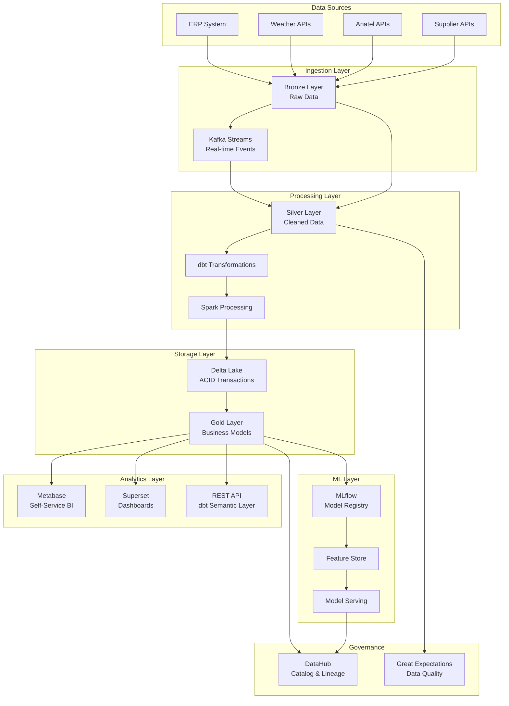

# 🚀 ROADMAP ANALYTICS ENGINEERING COMPLETO
## Nova Corrente - Previsibilidade de Demandas com IA

**Versão:** 1.0  
**Data:** Novembro 2025  
**Status:** ✅ Roadmap Completo para Implementação  
**Duração Estimada:** 16 semanas (4 meses)

---

## 📋 ÍNDICE

1. [Visão Geral de Analytics Engineering](#visao-geral)
2. [Arquitetura de Dados Moderna](#arquitetura-dados)
3. [Modelagem de Dados](#modelagem-dados)
4. [Pipeline de Engenharia de Dados](#pipeline-engenharia)
5. [ML Ops Pipeline](#ml-ops)
6. [Qualidade e Observabilidade](#qualidade-observabilidade)
7. [Infraestrutura como Código](#infraestrutura-codigo)
8. [Analytics e BI](#analytics-bi)
9. [Governança de Dados](#governanca-dados)
10. [Roadmap de Implementação](#roadmap-implementacao)
11. [Tecnologias e Ferramentas](#tecnologias-ferramentas)
12. [Métricas de Sucesso](#metricas-sucesso)

---

<a name="visao-geral"></a>

## 1. 📊 VISÃO GERAL DE ANALYTICS ENGINEERING

### 1.1 O que é Analytics Engineering?

**Definição:**
Analytics Engineering é a disciplina que transforma dados brutos em insights acionáveis através de:
- Transformação de dados com código (dbt, SQL)
- Versionamento e testes de dados
- Documentação automatizada
- CI/CD para analytics
- Self-service para usuários de negócio

**Princípios Fundamentais:**

1. **Código-First:** Transformações em código (não GUI)
2. **Versionamento:** Git para todas transformações
3. **Testes:** Validação automática de qualidade
4. **Documentação:** Gerada automaticamente
5. **Repetibilidade:** Pipelines idempotentes
6. **Colaboração:** Equipes trabalham juntas com código

### 1.2 Stack Moderno de Analytics Engineering

**Camada de Transformação:**
- **dbt (data build tool):** Framework SQL para transformações
- **SQL:** Linguagem padrão de transformação
- **Python:** Para transformações complexas (UDFs)

**Camada de Armazenamento:**
- **Data Lakehouse:** Delta Lake ou Iceberg
- **Medallion Architecture:** Bronze → Silver → Gold
- **Cloud Data Warehouses:** Snowflake, BigQuery, Redshift

**Camada de Orquestração:**
- **Airflow/Prefect:** Orquestração de pipelines
- **dbt Cloud:** CI/CD para dbt
- **GitHub Actions:** CI/CD para código

**Camada de BI:**
- **Metabase/Superset:** Self-service analytics
- **dbt Semantic Layer:** Métricas unificadas
- **Embed Analytics:** Integração em apps

### 1.3 Arquitetura Medallion (Bronze/Silver/Gold)

**Camada Bronze (Raw):**
```
- Dados brutos como chegam das fontes
- Sem transformações, apenas ingestão
- Schema evolução permitida
- Particionamento por data/hora
- Formato: Parquet/Delta/Iceberg
```

**Camada Silver (Cleaned):**
```
- Dados limpos e validados
- Schema aplicado
- Duplicatas removidas
- Tipos corrigidos
- Ready for analytics
```

**Camada Gold (Curated):**
```
- Modelos de negócio (star schema)
- Métricas pré-calculadas
- Agregações por dimensões
- Ready for BI tools
- Performance otimizado
```

### 1.4 Data Vault 2.0 para Escalabilidade

**Componentes:**

1. **Hubs (Entidades de Negócio):**
   - Item Hub, Torre Hub, Fornecedor Hub
   - Chaves de negócio únicas
   - Timestamp de criação

2. **Links (Relações):**
   - Item-Torre Link
   - Item-Fornecedor Link
   - Torre-Contrato Link

3. **Satellites (Atributos Históricos):**
   - Item Satellite (descrição, categoria)
   - Torre Satellite (localização, status)
   - Forecast Satellite (previsões históricas)

**Vantagens:**
- Escalabilidade horizontal
- Auditoria completa (tudo histórico)
- Flexibilidade (novas fontes fáceis)
- Performance (particionamento)

---

<a name="arquitetura-dados"></a>

## 2. 🏗️ ARQUITETURA DE DADOS MODERNA

### 2.1 Data Lakehouse

**Definição:**
Arquitetura que combina:
- **Data Lake:** Armazenamento barato e escalável
- **Data Warehouse:** Performance e ACID transactions
- **Benefícios:** Melhor dos dois mundos

**Implementação:**
- **Delta Lake:** ACID transactions sobre Parquet
- **Apache Iceberg:** Tabelas versionadas
- **Apache Hudi:** Upserts e deletes incrementais

**Para Nova Corrente:**
```
Data Lakehouse Stack:
├── Storage: S3/MinIO (objeto)
├── Format: Delta Lake (transações ACID)
├── Compute: Spark (processamento)
├── Catalog: Unity Catalog / Hive Metastore
└── Access: SQL (Spark SQL, Delta SQL)
```

### 2.2 Streaming e Batch

**Arquitetura Lambda:**
```
┌─────────────┐      ┌──────────────┐
│   Batch    │      │   Streaming  │
│   (ETL)    │      │   (Real-time)│
└─────┬───────┘      └──────┬───────┘
      │                     │
      └──────────┬──────────┘
                 │
         └───────▼───────┐
         │   Serving    │
         │    Layer     │
         └──────────────┘
```

**Batch Pipeline:**
- Execução diária/semanal
- Transformações complexas
- Dados históricos
- Ferramentas: Airflow, dbt

**Streaming Pipeline:**
- Tempo real (< 1 minuto latência)
- Eventos críticos (alertas)
- Kafka → Flink → Delta
- Ferramentas: Kafka, Flink, Kafka Connect

**Para Nova Corrente:**
- **Batch:** Previsões diárias, relatórios semanais
- **Streaming:** Alertas críticos, mudanças de estoque em tempo real

### 2.3 Data Mesh (Microserviços de Dados)

**Conceito:**
Arquitetura distribuída onde:
- Cada domínio é dono de seus dados
- Produtos de dados (não apenas datasets)
- Infraestrutura compartilhada self-serve
- Governança federada

**Para Nova Corrente:**

**Domínios:**
```
├── Forecasting Domain
│   ├── Forecast Data Products
│   └── Model Metrics Data Products
│
├── Inventory Domain
│   ├── Stock Levels Data Products
│   └── Reorder Points Data Products
│
├── Procurement Domain
│   ├── Purchase Orders Data Products
│   └── Supplier Performance Data Products
│
└── Operations Domain
    ├── Tower Status Data Products
    └── SLA Metrics Data Products
```

**Benefícios:**
- Escalabilidade horizontal
- Autonomia das equipes
- Reutilização de produtos
- Governança descentralizada

### 2.4 Diagrama Arquitetural Completo



---

<a name="modelagem-dados"></a>

## 3. 📐 MODELAGEM DE DADOS

### 3.1 Dimensional (Star Schema)

**Para Analytics de Negócio:**

```sql
-- Fact Table: Forecast Metrics
CREATE TABLE fact_forecast_metrics (
    forecast_id BIGINT,
    item_id STRING,
    date DATE,
    forecasted_demand DECIMAL(10,2),
    actual_demand DECIMAL(10,2),
    mape DECIMAL(5,2),
    created_at TIMESTAMP
);

-- Dimension: Items
CREATE TABLE dim_items (
    item_id STRING,
    item_name STRING,
    category STRING,
    supplier_id STRING,
    cost DECIMAL(10,2),
    valid_from DATE,
    valid_to DATE
);

-- Dimension: Towers
CREATE TABLE dim_towers (
    tower_id STRING,
    tower_name STRING,
    city STRING,
    state STRING,
    region STRING,
    sla_tier STRING,
    valid_from DATE,
    valid_to DATE
);

-- Dimension: Time
CREATE TABLE dim_time (
    date DATE,
    year INT,
    quarter INT,
    month INT,
    week INT,
    day_of_week INT,
    is_weekend BOOLEAN,
    is_holiday BOOLEAN,
    holiday_name STRING
);
```

**Vantagens:**
- Simples para BI tools
- Performance otimizado
- Fácil de entender

### 3.2 Data Vault 2.0 (Hubs, Links, Satellites)

**Estrutura para Escalabilidade:**

```sql
-- Hub: Item (Business Key)
CREATE TABLE hub_item (
    item_hk STRING,  -- Hash of item_id
    item_id STRING,  -- Business Key
    load_dt TIMESTAMP
);

-- Link: Item-Tower Relationship
CREATE TABLE link_item_tower (
    item_tower_hk STRING,  -- Hash of (item_id, tower_id)
    item_hk STRING,
    tower_hk STRING,
    load_dt TIMESTAMP
);

-- Satellite: Item Attributes
CREATE TABLE sat_item (
    item_hk STRING,
    item_name STRING,
    category STRING,
    supplier_id STRING,
    cost DECIMAL(10,2),
    load_dt TIMESTAMP,
    load_end_dt TIMESTAMP,
    hash_diff STRING
);

-- Satellite: Forecast History
CREATE TABLE sat_forecast (
    item_hk STRING,
    forecast_date DATE,
    forecasted_demand DECIMAL(10,2),
    model_type STRING,
    confidence_interval_lower DECIMAL(10,2),
    confidence_interval_upper DECIMAL(10,2),
    load_dt TIMESTAMP,
    hash_diff STRING
);
```

**Views de Negócio (Presentation Layer):**
```sql
-- View: Current Item Details
CREATE VIEW vw_items_current AS
SELECT 
    h.item_id,
    s.item_name,
    s.category,
    s.supplier_id,
    s.cost
FROM hub_item h
INNER JOIN sat_item s ON h.item_hk = s.item_hk
WHERE s.load_end_dt IS NULL;  -- Current version
```

### 3.3 dbt Models e Testes

**Model: stg_items (Staging):**

```sql
-- models/staging/stg_items.sql
{{ config(materialized='view') }}

WITH source AS (
    SELECT * FROM {{ source('bronze', 'raw_items') }}
),

cleaned AS (
    SELECT
        item_id,
        TRIM(item_name) AS item_name,
        LOWER(category) AS category,
        supplier_id,
        CAST(cost AS DECIMAL(10,2)) AS cost,
        created_at
    FROM source
    WHERE item_id IS NOT NULL
)

SELECT * FROM cleaned
```

**Model: dim_items (Dimension):**

```sql
-- models/marts/dim_items.sql
{{ config(materialized='table') }}

WITH staging AS (
    SELECT * FROM {{ ref('stg_items') }}
),

final AS (
    SELECT
        item_id,
        item_name,
        category,
        supplier_id,
        cost,
        CURRENT_TIMESTAMP AS valid_from,
        NULL AS valid_to
    FROM staging
)

SELECT * FROM final
```

**Testes:**

```yaml
# models/schema.yml
version: 2

models:
  - name: dim_items
    columns:
      - name: item_id
        tests:
          - unique
          - not_null
      - name: item_name
        tests:
          - not_null
      - name: cost
        tests:
          - not_null
          - dbt_utils.accepted_range:
              min_value: 0
              max_value: 1000000
```

### 3.4 Schema Evolution

**Estratégias:**

1. **Backward Compatible:**
   - Adicionar colunas opcionais
   - Não remover colunas (deprecated)
   - Sem mudanças de tipo

2. **Schema Registry:**
   - Kafka Schema Registry
   - Delta Lake schema evolution automático
   - Validação automática

3. **Migration Scripts:**
   - Alembic (SQLAlchemy)
   - dbt migrations
   - Versionamento de schemas

---

<a name="pipeline-engenharia"></a>

## 4. 🔄 PIPELINE DE ENGENHARIA DE DADOS

### 4.1 Extração (Fivetran, Airbyte)

**Fivetran:**
- Conectores prontos (ERP, APIs)
- Schema evolution automático
- Transformações básicas
- Custo: ~$500/mês por connector

**Airbyte (Open Source):**
- Self-hosted ou Cloud
- 200+ conectores
- Custom connectors (Python)
- Custo: Infraestrutura própria

**Para Nova Corrente:**
```
Extraction Sources:
├── ERP System → Airbyte (PostgreSQL)
├── Weather API → Custom Python (cron)
├── Anatel API → Custom Python (daily)
├── Supplier APIs → Airbyte (REST)
└── Kafka → Real-time ingestion
```

### 4.2 Transformação (dbt)

**dbt Project Structure:**
```
nova_corrente_dbt/
├── dbt_project.yml
├── profiles.yml
├── models/
│   ├── staging/
│   │   ├── stg_items.sql
│   │   ├── stg_towers.sql
│   │   └── stg_forecasts.sql
│   ├── intermediate/
│   │   ├── int_item_metrics.sql
│   │   └── int_forecast_accuracy.sql
│   └── marts/
│       ├── dim_items.sql
│       ├── dim_towers.sql
│       ├── fact_forecasts.sql
│       └── metrics/
│           └── forecast_accuracy.sql
├── tests/
│   ├── assertions/
│   └── custom_tests/
├── macros/
│   ├── reorder_point.sql
│   └── safety_stock.sql
└── snapshots/
    └── snp_items.sql
```

**Exemplo: Macro Reorder Point**

```sql
-- macros/reorder_point.sql

      -- 95% service level
    
    {{ avg_demand * lead_time + safety_stock }}

```

**Uso:**
```sql
SELECT
    item_id,
    {{ calculate_reorder_point(
        avg_daily_demand,
        lead_time,
        std_daily_demand,
        0.95
    ) }} AS reorder_point
FROM {{ ref('int_item_metrics') }}
```

### 4.3 Carregamento (ELT)

**Padrão ELT:**
1. **Extract:** Dados brutos → Bronze
2. **Load:** Bronze → Silver (apenas schema)
3. **Transform:** Silver → Gold (dbt transformations)

**Vantagens ELT vs ETL:**
- Flexibilidade (transformações podem mudar)
- Performance (processamento no warehouse)
- Escalabilidade (compute separado de storage)

**Pipeline Airflow:**

```python
# dags/nova_corrente_pipeline.py
from airflow import DAG
from airflow.providers.databricks.operators.databricks import DatabricksRunNowOperator
from airflow.operators.bash import BashOperator

dag = DAG(
    'nova_corrente_daily',
    schedule_interval='@daily',
    catchup=False
)

# Extract
extract_task = BashOperator(
    task_id='extract_data',
    bash_command='python scripts/extract_all_sources.py',
    dag=dag
)

# Load to Bronze
load_bronze = DatabricksRunNowOperator(
    task_id='load_bronze',
    job_id=12345,
    dag=dag
)

# Transform with dbt
run_dbt = BashOperator(
    task_id='run_dbt',
    bash_command='cd dbt && dbt run --profiles-dir .',
    dag=dag
)

# Run tests
test_dbt = BashOperator(
    task_id='test_dbt',
    bash_command='cd dbt && dbt test --profiles-dir .',
    dag=dag
)

extract_task >> load_bronze >> run_dbt >> test_dbt
```

### 4.4 Orquestração (Airflow, Prefect)

**Airflow:**
- Padrão da indústria
- UI robusta
- Muitos operators
- Escalável

**Prefect:**
- Moderno (Python-first)
- UI elegante
- Fácil de usar
- Boa documentação

**Para Nova Corrente:**
- **Recomendação:** Airflow (mais maduro, mais comunidade)
- **Alternativa:** Prefect (se time prefere Python)

---

<a name="ml-ops"></a>

## 5. 🤖 ML OPS PIPELINE

### 5.1 MLflow

**Componentes:**

1. **Tracking:**
   - Experimentos, métricas, parâmetros
   - Artifacts (modelos, plots)
   - UI web

2. **Projects:**
   - Código versionado
   - Dependências
   - Execução reproduzível

3. **Models:**
   - Registry de modelos
   - Versionamento
   - Staging (dev/staging/prod)

4. **Model Serving:**
   - REST API
   - Batch inference
   - Real-time serving

**Exemplo:**
```python
import mlflow
import mlflow.prophet

with mlflow.start_run():
    # Log parameters
    mlflow.log_param("model_type", "prophet")
    mlflow.log_param("forecast_steps", 30)
    
    # Train model
    model = train_prophet_model(data)
    
    # Log metrics
    mape = evaluate_model(model, test_data)
    mlflow.log_metric("MAPE", mape)
    
    # Log model
    mlflow.prophet.log_model(model, "model")
    
    # Register to registry
    mlflow.register_model(
        "runs:/{run_id}/model",
        "NovaCorrenteForecast"
    )
```

### 5.2 Kubeflow

**Componentes:**
- Pipelines (orquestração ML)
- Katib (hyperparameter tuning)
- KFServing (model serving)
- Notebooks (Jupyter no K8s)

**Para Produção:**
- Kubernetes-native
- Escalável
- Enterprise-grade

### 5.3 Versionamento de Modelos

**Estratégia:**
```
Model Registry:
├── nova_corrente_forecast
│   ├── v1 (Production)
│   ├── v2 (Staging)
│   └── v3 (Development)
│
├── nova_corrente_arima
│   └── v1 (Production)
│
└── nova_corrente_ensemble
    └── v1 (Production)
```

**Promoção:**
- Dev → Staging: CI/CD automático
- Staging → Prod: Aprovação manual
- Rollback: Um comando

### 5.4 Feature Stores

**Feast (Open Source):**
```python
# Define features
@feature_view(
    name="item_demand_features",
    entities=["item"],
    ttl=timedelta(days=90)
)
class ItemDemandFeatures:
    avg_daily_demand = Value(dtype=Float32)
    std_daily_demand = Value(dtype=Float32)
    lead_time = Value(dtype=Int32)
    created_at = Value(dtype=UnixTimestamp)
```

**Tecton (Managed):**
- Feature store gerenciado
- Transformações em tempo real
- Integração com MLflow

### 5.5 Model Serving

**Opções:**

1. **MLflow Serving:**
   - REST API simples
   - Bom para batch
   - Fácil deploy

2. **Seldon Core:**
   - Kubernetes-native
   - A/B testing
   - Canary deployments

3. **TorchServe:**
   - PyTorch otimizado
   - Batching automático
   - Performance

**Para Nova Corrente:**
- **Inicial:** MLflow Serving (simples)
- **Produção:** Seldon Core (K8s, A/B testing)

---

<a name="qualidade-observabilidade"></a>

## 6. ✅ QUALIDADE E OBSERVABILIDADE

### 6.1 Great Expectations

**Expectations (Validações):**

```python
import great_expectations as ge

# Create expectation suite
suite = ge.dataset.SparkDFDataset(df)

# Expect columns to exist
suite.expect_column_to_exist("item_id")
suite.expect_column_to_exist("forecasted_demand")

# Expect values
suite.expect_column_values_to_be_between(
    "forecasted_demand",
    min_value=0,
    max_value=10000
)

# Expect uniqueness
suite.expect_column_values_to_be_unique("item_id")

# Save suite
suite.save_expectation_suite("forecasts_expectations.json")
```

**Data Docs (HTML):**
- Relatórios automáticos
- Validação visual
- Histórico de resultados

### 6.2 dbt Tests

**Built-in Tests:**
```yaml
models:
  - name: fact_forecasts
    columns:
      - name: item_id
        tests:
          - unique
          - not_null
          - relationships:
              to: ref('dim_items')
              field: item_id
```

**Custom Tests:**
```sql
-- tests/custom/assert_mape_threshold.sql
SELECT item_id, mape
FROM {{ ref('fact_forecasts') }}
WHERE mape > 20  -- Threshold: 20%
```

### 6.3 Data Profiling

**dbt Profiling:**
```bash
dbt run-operation generate_model_profiles
```

**Pandas Profiling:**
```python
import pandas_profiling

profile = df.profile_report()
profile.to_file("forecasts_profile.html")
```

### 6.4 Data Lineage

**dbt Lineage:**
```bash
dbt docs generate
dbt docs serve
```

**DataHub:**
- Lineage automático
- Catalog de dados
- Metadata management

### 6.5 Alerts

**Integração:**
- Slack notifications
- Email alerts
- PagerDuty (critical)
- Custom webhooks

**Exemplo:**
```python
# Alert on data quality failure
if not validation_result.success:
    send_slack_alert(
        channel="#data-alerts",
        message=f"Data quality failed: {validation_result.summary}"
    )
```

---

<a name="infraestrutura-codigo"></a>

## 7. 🏗️ INFRAESTRUTURA COMO CÓDIGO

### 7.1 Terraform

**Infraestrutura Cloud:**
```hcl
# terraform/aws/data_warehouse.tf
resource "aws_s3_bucket" "data_lake" {
  bucket = "nova-corrente-data-lake"
  
  versioning {
    enabled = true
  }
  
  lifecycle_rule {
    enabled = true
    expiration {
      days = 90
    }
  }
}

resource "aws_databricks_workspace" "main" {
  account_id     = var.databricks_account_id
  workspace_name = "nova-corrente-workspace"
  deployment_name = "nova-corrente"
  
  tags = {
    Environment = "production"
    Project     = "forecasting"
  }
}
```

### 7.2 Docker e Kubernetes

**Docker Compose (Desenvolvimento):**
```yaml
version: '3.8'
services:
  postgres:
    image: postgres:15
    environment:
      POSTGRES_DB: nova_corrente
  
  airflow:
    image: apache/airflow:2.7.0
    depends_on:
      - postgres
  
  mlflow:
    image: ghcr.io/mlflow/mlflow:v2.7.0
    ports:
      - "5000:5000"
```

**Kubernetes (Produção):**
```yaml
# k8s/airflow-deployment.yaml
apiVersion: apps/v1
kind: Deployment
metadata:
  name: airflow-webserver
spec:
  replicas: 3
  selector:
    matchLabels:
      app: airflow-webserver
  template:
    metadata:
      labels:
        app: airflow-webserver
    spec:
      containers:
      - name: airflow
        image: apache/airflow:2.7.0
        resources:
          requests:
            memory: "2Gi"
            cpu: "1"
          limits:
            memory: "4Gi"
            cpu: "2"
```

### 7.3 CI/CD

**GitHub Actions:**
```yaml
# .github/workflows/dbt.yml
name: dbt CI
on: [push]
jobs:
  test:
    runs-on: ubuntu-latest
    steps:
      - uses: actions/checkout@v3
      - name: Run dbt tests
        run: |
          cd dbt
          dbt deps
          dbt run --models staging
          dbt test
```

**dbt Cloud:**
- CI/CD nativo
- Jobs agendados
- Slack/Email notifications

### 7.4 Environments

**Estrutura:**
```
environments/
├── dev/
│   ├── terraform/
│   ├── docker-compose.yml
│   └── config/
├── staging/
│   ├── terraform/
│   ├── k8s/
│   └── config/
└── prod/
    ├── terraform/
    ├── k8s/
    └── config/
```

---

<a name="analytics-bi"></a>

## 8. 📊 ANALYTICS E BI

### 8.1 dbt + BI Tools

**dbt Semantic Layer:**
```yaml
# models/metrics.yml
version: 2

metrics:
  - name: forecast_accuracy
    label: "Forecast Accuracy"
    model: ref('fact_forecasts')
    calculation_method: average
    expression: |
      CASE 
        WHEN actual_demand > 0 
        THEN ABS(forecasted_demand - actual_demand) / actual_demand
        ELSE NULL
      END
    
  - name: total_forecasted_demand
    label: "Total Forecasted Demand"
    model: ref('fact_forecasts')
    calculation_method: sum
    expression: forecasted_demand
```

**Access via API:**
```python
from dbt_semantic_interfaces import SemanticManifest

manifest = SemanticManifest.load("metrics.yml")
metrics = manifest.list_metrics()
```

### 8.2 Metabase/Superset

**Metabase:**
- Self-service BI
- Fácil de usar
- Query builder visual
- Embed analytics

**Superset:**
- Apache Superset (open source)
- Dashboard avançados
- SQL Lab
- Alerts

**Para Nova Corrente:**
- **Metabase:** Usuários de negócio (não técnicos)
- **Superset:** Analistas de dados (SQL)

### 8.3 Embed Analytics

**Metabase Embed:**
```javascript
<iframe
  src="https://metabase.novacorrente.com/embed/dashboard/123"
  frameBorder="0"
  width="800"
  height="600"
/>
```

### 8.4 Self-Service

**Capabilities:**
- Query builder (sem SQL)
- Saved queries
- Dashboards customizados
- Export Excel/PDF
- Scheduled reports

---

<a name="governanca-dados"></a>

## 9. 🛡️ GOVERNANÇA DE DADOS

### 9.1 Catalogação (DataHub)

**Metadata:**
- Schemas, tables, columns
- Lineage (upstream/downstream)
- Ownership (data stewards)
- Tags (PII, sensitive)

**Integração:**
```python
from datahub.ingestion.api.common import RecordEnvelope

# Ingest metadata
from datahub.ingestion.graph.client import DatahubGraph

graph = DatahubGraph(ConfigDatahub())
graph.emit(metadata)
```

### 9.2 Lineage

**Automatic:**
- dbt lineage (SQL parsing)
- Airflow lineage (task dependencies)
- Spark lineage (Spark UI)

**Manual:**
- DataHub annotations
- Documentation links

### 9.3 Security e Compliance

**Row-Level Security:**
```sql
-- dbt macro

  
  
  
    ALTER TABLE {{ model_name }} 
    ENABLE ROW LEVEL SECURITY;
    
    CREATE POLICY user_policy ON {{ model_name }}
      FOR SELECT
      USING (owner_email = '{{ user_email }}');
  

```

**Data Masking:**
```sql
-- PII columns masked
SELECT
    item_id,
    mask_pii(item_name) AS item_name,  -- Custom function
    cost
FROM dim_items
```

### 9.4 Documentação

**dbt Docs:**
- Auto-gerada de YAML
- Descriptions, tests, examples
- Acessível via web

**DataHub:**
- Rich text documentation
- Links, images
- Ownership, tags

---

<a name="roadmap-implementacao"></a>

## 10. 🗓️ ROADMAP DE IMPLEMENTAÇÃO

### Fase 0: Foundation (Semanas 1-2)

**Objetivos:**
- Setup infraestrutura básica
- Configurar dbt project
- Criar pipelines Bronze/Silver

**Entregas:**
- [ ] Terraform para AWS/GCP
- [ ] S3/Cloud Storage (Bronze layer)
- [ ] dbt project structure
- [ ] Airflow DAG básico
- [ ] Documentação inicial

**Checkpoint:**
- Dados raw sendo ingeridos diariamente
- dbt models básicos funcionando

### Fase 1: Data Foundation (Semanas 3-4)

**Objetivos:**
- Implementar Silver layer
- Criar modelos dbt staging
- Setup Data Quality (Great Expectations)

**Entregas:**
- [ ] Staging models (stg_items, stg_towers, stg_forecasts)
- [ ] Data quality tests
- [ ] Great Expectations suite
- [ ] Data profiling reports

**Checkpoint:**
- Dados limpos na Silver layer
- Data quality passando (95%+)

### Fase 2: Analytics Layer (Semanas 5-8)

**Objetivos:**
- Implementar Gold layer (star schema)
- Criar métricas de negócio
- Setup BI tools

**Entregas:**
- [ ] Dimension models (dim_items, dim_towers, dim_time)
- [ ] Fact models (fact_forecasts, fact_inventory)
- [ ] dbt metrics (MAPE, forecast accuracy)
- [ ] Metabase/Superset configurado
- [ ] Dashboards básicos

**Checkpoint:**
- Dashboards funcionando
- Usuários de negócio acessando dados

### Fase 3: ML Ops (Semanas 9-12)

**Objetivos:**
- Setup MLflow
- Feature store
- Model serving

**Entregas:**
- [ ] MLflow tracking
- [ ] Model registry
- [ ] Feature store (Feast ou Tecton)
- [ ] Model serving (MLflow ou Seldon)
- [ ] A/B testing setup

**Checkpoint:**
- Modelos versionados e servidos
- Predictions em produção

### Fase 4: Advanced Features (Semanas 13-16)

**Objetivos:**
- Governança completa
- Streaming pipeline
- Otimizações

**Entregas:**
- [ ] DataHub catalog
- [ ] Streaming pipeline (Kafka + Flink)
- [ ] Performance optimization
- [ ] Advanced dashboards
- [ ] Self-service analytics

**Checkpoint:**
- Sistema completo em produção
- Todas métricas sendo coletadas

---

<a name="tecnologias-ferramentas"></a>

## 11. 🛠️ TECNOLOGIAS E FERRAMENTAS

### 11.1 Stack Recomendado

**Camada de Armazenamento:**
- **Cloud:** AWS S3 / GCP Cloud Storage
- **Format:** Delta Lake
- **Compute:** Databricks / Spark on K8s

**Camada de Transformação:**
- **dbt:** Transformações SQL
- **Python:** UDFs complexas
- **Airflow:** Orquestração

**Camada de ML:**
- **MLflow:** Experiment tracking + Registry
- **Feast:** Feature store
- **Seldon Core:** Model serving

**Camada de BI:**
- **Metabase:** Self-service BI
- **Superset:** Advanced dashboards
- **dbt Semantic Layer:** Metrics API

**Camada de Governança:**
- **DataHub:** Catalog
- **Great Expectations:** Data quality
- **dbt Tests:** Validation

### 11.2 Alternativas

**Cloud Providers:**
- **AWS:** S3, Glue, Redshift, SageMaker
- **GCP:** Cloud Storage, BigQuery, Vertex AI
- **Azure:** ADLS, Synapse, Azure ML

**Compute:**
- **Databricks:** Managed Spark
- **Snowflake:** Data warehouse
- **BigQuery:** Serverless warehouse

**Orquestração:**
- **Airflow:** Padrão da indústria
- **Prefect:** Modern Python-first
- **Dagster:** Data-aware orchestration

### 11.3 Custos Estimados (Mensal)

**AWS Stack:**
```
S3 Storage (10TB):        $230
Databricks (Medium):      $1,500
Airflow (Managed):        $200
MLflow (Self-hosted):    $100
Metabase Cloud:           $85
DataHub (Self-hosted):   $150
---------------------------------
Total: ~$2,265/mês
```

**Open Source Stack (Self-hosted):**
```
Compute (K8s):           $500
Storage (S3):            $230
Monitoring:              $50
---------------------------------
Total: ~$780/mês
```

### 11.4 TCO (Total Cost of Ownership)

**Ano 1:**
- Infraestrutura: $27,000
- Ferramentas: $14,400
- Desenvolvimento: $120,000 (1 FTE)
- **Total: $161,400**

**Ano 2+ (Otimizado):**
- Infraestrutura: $15,000
- Ferramentas: $10,000
- Manutenção: $60,000 (0.5 FTE)
- **Total: $85,000/ano**

---

<a name="metricas-sucesso"></a>

## 12. 📈 MÉTRICAS DE SUCESSO

### 12.1 KPIs Técnicos

**Data Quality:**
- Test pass rate: >95%
- Data freshness: <1 hora
- Schema changes: <5%/mês

**Pipeline Performance:**
- Bronze ingestion: <30 min/dia
- Silver processing: <1 hora/dia
- Gold transformations: <30 min/dia
- **Total pipeline: <2 horas/dia**

**Model Performance:**
- MAPE: <15% (target)
- Inference latency: <100ms
- Model retraining: Semanal

### 12.2 KPIs de Negócio

**Previsibilidade:**
- Rupturas reduzidas: -60%
- Estoque otimizado: -20%
- Lead time accuracy: >85%

**Adoção:**
- Usuários ativos: 20+ usuários
- Dashboards utilizados: 10+ dashboards
- Queries self-service: 100+/dia

**ROI:**
- Payback: 6-12 meses
- ROI Ano 1: 80-180%
- Economia estoque: R$ 500K+/ano

### 12.3 Dashboards de Monitoramento

**Operational Dashboard:**
- Pipeline status (Airflow)
- Data quality scores (Great Expectations)
- Model performance (MLflow)
- System health (Grafana)

**Business Dashboard:**
- Forecast accuracy (MAPE por item)
- Inventory levels vs Reorder Points
- Alert trends
- ROI metrics

---

## 🎯 CONCLUSÃO

Este roadmap fornece uma base sólida para implementar Analytics Engineering moderno na Nova Corrente:

✅ **Arquitetura Medallion** (Bronze/Silver/Gold)  
✅ **dbt para transformações** (código versionado)  
✅ **ML Ops completo** (MLflow, feature store)  
✅ **Data Quality** (Great Expectations, dbt tests)  
✅ **Self-Service BI** (Metabase/Superset)  
✅ **Governança** (DataHub, lineage)  
✅ **Roadmap de 16 semanas** (implementação incremental)

**Próximos Passos:**
1. Revisar roadmap com stakeholders
2. Priorizar fases (start with Fase 0)
3. Alocar recursos (1-2 engenheiros)
4. Iniciar implementação

---

**Documento criado:** Novembro 2025  
**Versão:** 1.0  
**Autor:** Equipe Grand Prix SENAI  
**Status:** ✅ Roadmap Completo - Pronto para Implementação

**CENTRALIZED REPORTS & CHANGELOG SYSTEM COMPLETE!**

