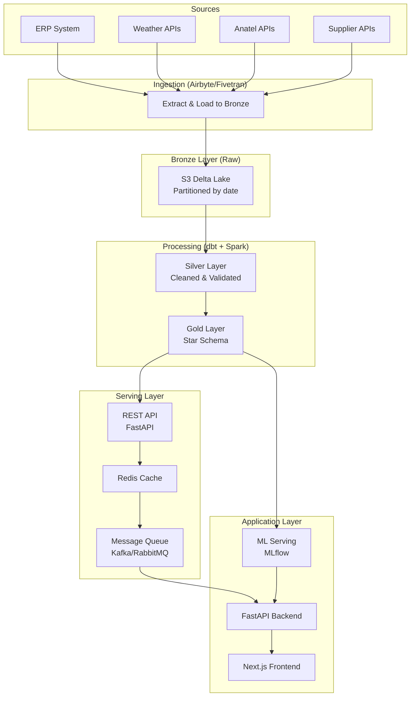

# 🔄 DATA PIPELINES - DESIGN DE PRODUÇÃO
## Nova Corrente - Data Engineering para Fullstack App

**Versão:** 1.0  
**Data:** Novembro 2025  
**Status:** ✅ Design Completo para Produção

---

## 📋 ÍNDICE

1. [Arquitetura de Pipelines](#arquitetura)
2. [Pipeline ETL/ELT Completo](#pipeline-completo)
3. [Padrões de Data Engineering](#padroes)
4. [Serving para Fullstack App](#serving)
5. [Real-time e Streaming](#realtime)
6. [Monitoramento e Observabilidade](#monitoramento)
7. [Casos de Uso Práticos](#casos-uso)

---

<a name="arquitetura"></a>

## 1. 🏗️ ARQUITETURA DE PIPELINES

### 1.1 Pipeline Layers



---

### 1.2 Pipeline Flow Detalhado

**Fluxo Completo:**
```
1. Extract (Airbyte) → Bronze (S3 Delta)
2. Transform (dbt) → Silver (Delta Tables)
3. Transform (dbt) → Gold (Star Schema)
4. Serve (FastAPI) → Backend/Frontend
5. Real-time (Kafka) → Streaming updates
```

---

<a name="pipeline-completo"></a>

## 2. 🔄 PIPELINE ETL/ELT COMPLETO

### 2.1 Extract Layer (Airbyte/Fivetran)

**Configuração Airbyte:**

```yaml
# airbyte/sources/erp_source.yaml
apiVersion: v1
kind: Source
metadata:
  name: erp-source
spec:
  sourceDefinitionId: postgres
  connectionConfiguration:
    host: erp.novacorrente.com
    port: 5432
    database: erp_db
    username: ${ERP_USERNAME}
    password: ${ERP_PASSWORD}
    replication_method: CDC  # Change Data Capture
    schemas:
      - public
    tables:
      - items
      - inventory
      - orders
      - towers
```

**Script Custom Extraction:**

```python
# backend/pipelines/data_ingestion/extract_erp.py
"""
Extract data from ERP system and load to Bronze layer
"""
import pandas as pd
import boto3
from datetime import datetime
import psycopg2
from pathlib import Path
import logging

logger = logging.getLogger(__name__)

class ERPExtractor:
    """Extract data from ERP PostgreSQL database"""
    
    def __init__(self, config):
        self.config = config
        self.s3_client = boto3.client('s3')
        self.bronze_bucket = config['bronze_bucket']
        self.db_conn = None
    
    def connect(self):
        """Connect to ERP database"""
        self.db_conn = psycopg2.connect(
            host=self.config['host'],
            port=self.config['port'],
            database=self.config['database'],
            user=self.config['user'],
            password=self.config['password']
        )
    
    def extract_items(self, date: datetime = None) -> pd.DataFrame:
        """
        Extract items data from ERP
        
        Args:
            date: Date to extract (defaults to yesterday)
        
        Returns:
            DataFrame with items data
        """
        if date is None:
            date = datetime.now().replace(hour=0, minute=0, second=0, microsecond=0)
        
        query = """
            SELECT 
                item_id,
                item_name,
                category,
                family,
                supplier_id,
                cost,
                quantity,
                current_stock,
                lead_time_days,
                date,
                created_at
            FROM items
            WHERE date = %s
        """
        
        df = pd.read_sql(query, self.db_conn, params=[date])
        logger.info(f"Extracted {len(df)} rows from ERP for {date}")
        return df
    
    def extract_inventory(self, date: datetime = None) -> pd.DataFrame:
        """Extract inventory data"""
        if date is None:
            date = datetime.now().replace(hour=0, minute=0, second=0, microsecond=0)
        
        query = """
            SELECT 
                item_id,
                tower_id,
                current_stock,
                min_stock,
                max_stock,
                reorder_point,
                date,
                last_updated
            FROM inventory
            WHERE date = %s
        """
        
        df = pd.read_sql(query, self.db_conn, params=[date])
        return df
    
    def load_to_bronze(self, df: pd.DataFrame, source: str, date: datetime):
        """
        Load extracted data to Bronze layer in S3
        
        Args:
            df: DataFrame to load
            source: Source name (e.g., 'erp', 'weather')
            date: Partition date
        """
        # Build S3 key with partitioning
        year = date.year
        month = f"{date.month:02d}"
        day = f"{date.day:02d}"
        
        s3_key = f"{source}/year={year}/month={month}/day={day}/data.parquet"
        
        # Convert to Parquet
        parquet_buffer = df.to_parquet(index=False, compression='snappy')
        
        # Upload to S3
        self.s3_client.put_object(
            Bucket=self.bronze_bucket,
            Key=s3_key,
            Body=parquet_buffer,
            ContentType='application/parquet',
            Metadata={
                'source': source,
                'extracted_at': datetime.now().isoformat(),
                'row_count': str(len(df))
            }
        )
        
        logger.info(f"✅ Loaded {len(df)} rows to s3://{self.bronze_bucket}/{s3_key}")
        return s3_key
    
    def extract_all_sources(self, date: datetime = None):
        """Extract all sources and load to Bronze"""
        if date is None:
            date = datetime.now().replace(hour=0, minute=0, second=0, microsecond=0)
        
        self.connect()
        
        try:
            # Extract items
            items_df = self.extract_items(date)
            self.load_to_bronze(items_df, 'erp/items', date)
            
            # Extract inventory
            inventory_df = self.extract_inventory(date)
            self.load_to_bronze(inventory_df, 'erp/inventory', date)
            
            logger.info("✅ All ERP sources extracted and loaded to Bronze")
            
        finally:
            if self.db_conn:
                self.db_conn.close()

# Usage
if __name__ == "__main__":
    config = {
        'host': 'erp.novacorrente.com',
        'port': 5432,
        'database': 'erp_db',
        'user': os.getenv('ERP_USER'),
        'password': os.getenv('ERP_PASSWORD'),
        'bronze_bucket': 'nova-corrente-data-lake-bronze'
    }
    
    extractor = ERPExtractor(config)
    extractor.extract_all_sources()
```

---

### 2.2 Transform Layer (dbt)

**Pipeline dbt Completo:**

```yaml
# dbt/dbt_project.yml
name: 'nova_corrente_dbt'
version: '1.0.0'
config-version: 2

profile: 'nova_corrente'

model-paths: ["models"]
analysis-paths: ["analyses"]
test-paths: ["tests"]
seed-paths: ["seeds"]
macro-paths: ["macros"]

vars:
  project_name: "Nova Corrente"
  environment: "{{ env_var('ENVIRONMENT', 'dev') }}"

models:
  nova_corrente_dbt:
    staging:
      +materialized: view
      +schema: staging
      +tags: ["staging"]
    
    intermediate:
      +materialized: view
      +schema: intermediate
      +tags: ["intermediate"]
    
    marts:
      +materialized: table
      +schema: marts
      +tags: ["marts"]
      dim_*:
        +materialized: table
        +tags: ["dimensions"]
        +cluster_by: ["category"]
      fact_*:
        +materialized: incremental
        +unique_key: ['forecast_id']
        +on_schema_change: append_new_columns
        +partition_by: {'field': 'date', 'data_type': 'date'}
        +tags: ["facts"]
        +cluster_by: ["item_id", "date"]
```

**Model: Bronze → Silver**

```sql
-- models/staging/stg_items.sql
{{ config(
    materialized='view',
    schema='staging',
    tags=['staging', 'items']
) }}

WITH source AS (
    SELECT * FROM {{ source('bronze', 'raw_items') }}
    WHERE _partition_date = CURRENT_DATE - 1
),

cleaned AS (
    SELECT
        -- Primary keys
        CAST(item_id AS STRING) AS item_id,
        CAST(family AS STRING) AS family,
        
        -- Attributes
        TRIM(item_name) AS item_name,
        LOWER(category) AS category,
        CAST(supplier_id AS STRING) AS supplier_id,
        
        -- Metrics
        CAST(cost AS DECIMAL(10, 2)) AS cost,
        CAST(quantity AS INTEGER) AS quantity,
        CAST(current_stock AS INTEGER) AS current_stock,
        CAST(lead_time_days AS INTEGER) AS lead_time_days,
        
        -- Timestamps
        CAST(date AS DATE) AS date,
        CAST(created_at AS TIMESTAMP) AS created_at,
        CURRENT_TIMESTAMP() AS loaded_at
        
    FROM source
    WHERE item_id IS NOT NULL
        AND item_name IS NOT NULL
        AND cost > 0
        AND date >= '2024-01-01'
),

deduplicated AS (
    SELECT *
    FROM cleaned
    QUALIFY ROW_NUMBER() OVER (
        PARTITION BY item_id, date
        ORDER BY loaded_at DESC
    ) = 1
)

SELECT * FROM deduplicated
```

**Model: Silver → Gold (Fact Table)**

```sql
-- models/marts/fact_forecasts.sql
{{ config(
    materialized='incremental',
    schema='marts',
    tags=['marts', 'facts', 'forecasts'],
    unique_key=['forecast_id'],
    on_schema_change='append_new_columns',
    partition_by={'field': 'date', 'data_type': 'date'},
    cluster_by=['item_id', 'date']
) }}

WITH staging AS (
    SELECT * FROM {{ ref('stg_forecasts') }}
    
        WHERE loaded_at > (SELECT MAX(loaded_at) FROM {{ this }})
    
),

dim_items AS (
    SELECT * FROM {{ ref('dim_items') }}
),

dim_towers AS (
    SELECT * FROM {{ ref('dim_towers') }}
),

dim_time AS (
    SELECT * FROM {{ ref('dim_time') }}
),

final AS (
    SELECT
        -- Keys
        f.forecast_id,
        f.item_id,
        f.tower_id,
        f.date,
        
        -- Measures
        f.forecasted_demand,
        f.actual_demand,
        f.ci_lower,
        f.ci_upper,
        
        -- Calculated measures
        f.forecasted_demand - f.actual_demand AS forecast_error,
        ABS(f.forecasted_demand - f.actual_demand) AS absolute_error,
        CASE 
            WHEN f.actual_demand > 0 
            THEN ABS(f.forecasted_demand - f.actual_demand) / f.actual_demand * 100
            ELSE NULL
        END AS mape,
        
        -- Dimensions
        i.category,
        i.cost_tier,
        t.region,
        t.sla_tier,
        dt.year,
        dt.quarter,
        dt.month,
        dt.is_holiday,
        
        -- Model info
        f.model_type,
        f.accuracy_level,
        
        -- Timestamps
        f.created_at,
        CURRENT_TIMESTAMP() AS loaded_at
        
    FROM staging f
    INNER JOIN dim_items i ON f.item_id = i.item_id
    LEFT JOIN dim_towers t ON f.tower_id = t.tower_id
    INNER JOIN dim_time dt ON f.date = dt.date
    WHERE f.date >= CURRENT_DATE - 365
)

SELECT * FROM final
```

---

### 2.3 Load Layer (Serving)

**FastAPI Service Layer:**

```python
# backend/app/api/v1/forecasts.py
"""
FastAPI endpoints for serving forecast data
"""
from fastapi import APIRouter, Depends, HTTPException, Query
from sqlalchemy.orm import Session
from typing import List, Optional
from datetime import datetime, date
import redis
import json

from app.core.database import get_db
from app.core.redis_client import get_redis
from app.schemas.forecast import ForecastResponse, ForecastQuery

router = APIRouter()

@router.get("/forecasts", response_model=List[ForecastResponse])
async def get_forecasts(
    item_id: Optional[str] = None,
    start_date: Optional[date] = None,
    end_date: Optional[date] = None,
    category: Optional[str] = None,
    limit: int = Query(100, le=1000),
    offset: int = Query(0, ge=0),
    db: Session = Depends(get_db),
    redis_client: redis.Redis = Depends(get_redis)
):
    """
    Get forecasts from Gold layer via FastAPI
    
    Uses Redis cache for performance
    """
    # Build cache key
    cache_key = f"forecasts:{item_id}:{start_date}:{end_date}:{category}:{limit}:{offset}"
    
    # Check cache
    cached_result = redis_client.get(cache_key)
    if cached_result:
        return json.loads(cached_result)
    
    # Query from Databricks (Gold layer)
    query = build_forecast_query(item_id, start_date, end_date, category, limit, offset)
    results = execute_databricks_query(query)
    
    # Cache result (1 hour TTL)
    redis_client.setex(cache_key, 3600, json.dumps(results))
    
    return results

def build_forecast_query(
    item_id: Optional[str],
    start_date: Optional[date],
    end_date: Optional[date],
    category: Optional[str],
    limit: int,
    offset: int
) -> str:
    """Build SQL query for forecasts"""
    query = """
        SELECT 
            forecast_id,
            item_id,
            item_name,
            category,
            date,
            forecasted_demand,
            actual_demand,
            mape,
            model_type,
            accuracy_level
        FROM nova_corrente.gold.marts.fact_forecasts
        WHERE 1=1
    """
    
    params = []
    if item_id:
        query += " AND item_id = %s"
        params.append(item_id)
    
    if start_date:
        query += " AND date >= %s"
        params.append(start_date)
    
    if end_date:
        query += " AND date <= %s"
        params.append(end_date)
    
    if category:
        query += " AND category = %s"
        params.append(category)
    
    query += f" ORDER BY date DESC LIMIT {limit} OFFSET {offset}"
    
    return query

@router.get("/forecasts/summary")
async def get_forecast_summary(
    item_id: Optional[str] = None,
    period: str = Query("30d", regex="^(7d|30d|90d|1y)$"),
    db: Session = Depends(get_db),
    redis_client: redis.Redis = Depends(get_redis)
):
    """Get forecast summary metrics"""
    cache_key = f"forecast_summary:{item_id}:{period}"
    
    # Check cache
    cached = redis_client.get(cache_key)
    if cached:
        return json.loads(cached)
    
    # Query summary
    query = f"""
        SELECT 
            AVG(mape) AS avg_mape,
            COUNT(*) AS forecast_count,
            AVG(forecasted_demand) AS avg_forecast,
            SUM(forecasted_demand) AS total_forecast
        FROM nova_corrente.gold.marts.fact_forecasts
        WHERE date >= CURRENT_DATE - {period}
    """
    
    if item_id:
        query += f" AND item_id = '{item_id}'"
    
    results = execute_databricks_query(query)
    
    # Cache (5 minutes)
    redis_client.setex(cache_key, 300, json.dumps(results))
    
    return results
```

---

<a name="padroes"></a>

## 3. 📐 PADRÕES DE DATA ENGINEERING

### 3.1 Incremental Loading Pattern

**Padrão: Incremental Load (only new/changed data)**

```python
# backend/pipelines/data_processing/incremental_loader.py
"""
Incremental loading pattern for efficiency
"""
from datetime import datetime
from delta.tables import DeltaTable

class IncrementalLoader:
    """Load only new or changed data"""
    
    def load_incremental(self, source_df, target_path, key_column='id'):
        """
        Load data incrementally using merge pattern
        
        Args:
            source_df: New data to load
            target_path: Delta table path
            key_column: Primary key column
        """
        # Read target Delta table
        target_delta = DeltaTable.forPath(spark, target_path)
        
        # Merge new data into target
        target_delta.alias("target").merge(
            source_df.alias("source"),
            f"target.{key_column} = source.{key_column}"
        ).whenMatchedUpdateAll().whenNotMatchedInsertAll().execute()
        
        print(f"✅ Incremental load complete: {len(source_df)} rows processed")
```

---

### 3.2 Change Data Capture (CDC) Pattern

**Padrão: CDC para updates em tempo real**

```python
# backend/pipelines/data_ingestion/cdc_handler.py
"""
Change Data Capture handler for real-time updates
"""
from kafka import KafkaConsumer
import json

class CDCHandler:
    """Handle CDC events from source systems"""
    
    def __init__(self, kafka_topic='erp-cdc'):
        self.consumer = KafkaConsumer(
            kafka_topic,
            bootstrap_servers='localhost:9092',
            value_deserializer=lambda m: json.loads(m.decode('utf-8'))
        )
    
    def process_cdc_events(self):
        """Process CDC events in real-time"""
        for message in self.consumer:
            event = message.value
            
            if event['op'] == 'c':  # Create
                self.handle_insert(event['after'])
            elif event['op'] == 'u':  # Update
                self.handle_update(event['before'], event['after'])
            elif event['op'] == 'd':  # Delete
                self.handle_delete(event['before'])
    
    def handle_insert(self, data):
        """Handle insert event"""
        # Load new record to Bronze
        load_to_bronze(pd.DataFrame([data]), 'erp', datetime.now())
    
    def handle_update(self, before, after):
        """Handle update event"""
        # Load updated record to Bronze
        load_to_bronze(pd.DataFrame([after]), 'erp', datetime.now())
    
    def handle_delete(self, data):
        """Handle delete event"""
        # Mark as deleted in Bronze
        mark_as_deleted(data['id'], 'erp')
```

---

### 3.3 Idempotent Pipeline Pattern

**Padrão: Pipelines idempotentes (re-executáveis)**

```python
# backend/pipelines/data_processing/idempotent_pipeline.py
"""
Idempotent pipeline pattern - can be re-run safely
"""
from datetime import datetime

class IdempotentPipeline:
    """Pipeline that can be safely re-run"""
    
    def run(self, execution_date: datetime):
        """Run pipeline idempotently"""
        # Check if already processed
        if self.is_already_processed(execution_date):
            print(f"✅ Already processed for {execution_date}, skipping")
            return
        
        # Process data
        self.extract(execution_date)
        self.transform(execution_date)
        self.load(execution_date)
        
        # Mark as processed
        self.mark_as_processed(execution_date)
    
    def is_already_processed(self, date: datetime) -> bool:
        """Check if date already processed"""
        # Query processing log
        query = f"""
            SELECT COUNT(*) as count
            FROM processing_log
            WHERE execution_date = '{date.date()}'
            AND status = 'SUCCESS'
        """
        result = execute_query(query)
        return result['count'] > 0
    
    def mark_as_processed(self, date: datetime):
        """Mark date as processed"""
        insert_query = f"""
            INSERT INTO processing_log (execution_date, status, processed_at)
            VALUES ('{date.date()}', 'SUCCESS', CURRENT_TIMESTAMP())
        """
        execute_query(insert_query)
```

---

<a name="serving"></a>

## 4. 🚀 SERVING PARA FULLSTACK APP

### 4.1 API Layer Architecture

**Arquitetura Completa:**

```
┌─────────────────────────────────────┐
│      Next.js Frontend               │
│  (Dashboard, Visualizations)        │
└──────────────┬──────────────────────┘
               │ HTTP/REST
┌──────────────▼──────────────────────┐
│      FastAPI Backend                │
│  /api/v1/forecasts                  │
│  /api/v1/inventory                  │
│  /api/v1/metrics                    │
└──────────────┬──────────────────────┘
               │
       ┌───────┴───────┐
       │               │
┌──────▼──────┐  ┌─────▼──────┐
│ Redis Cache │  │ Databricks  │
│ (Hot data)  │  │ (Gold Layer)│
└─────────────┘  └─────────────┘
```

**FastAPI Service:**

```python
# backend/app/main.py
"""
FastAPI application for serving analytics data
"""
from fastapi import FastAPI, Depends
from fastapi.middleware.cors import CORSMiddleware
from fastapi.middleware.trustedhost import TrustedHostMiddleware
import redis
from sqlalchemy import create_engine

from app.api.v1 import forecasts, inventory, metrics, items
from app.core.config import settings
from app.core.database import get_db

app = FastAPI(
    title="Nova Corrente Analytics API",
    description="API for serving forecast and inventory data",
    version="1.0.0"
)

# CORS middleware
app.add_middleware(
    CORSMiddleware,
    allow_origins=settings.CORS_ORIGINS,
    allow_credentials=True,
    allow_methods=["*"],
    allow_headers=["*"],
)

# Include routers
app.include_router(forecasts.router, prefix="/api/v1", tags=["forecasts"])
app.include_router(inventory.router, prefix="/api/v1", tags=["inventory"])
app.include_router(metrics.router, prefix="/api/v1", tags=["metrics"])
app.include_router(items.router, prefix="/api/v1", tags=["items"])

@app.get("/health")
async def health_check():
    """Health check endpoint"""
    return {
        "status": "healthy",
        "version": "1.0.0",
        "timestamp": datetime.now().isoformat()
    }

if __name__ == "__main__":
    import uvicorn
    uvicorn.run(
        "app.main:app",
        host=settings.API_HOST,
        port=settings.API_PORT,
        reload=settings.API_RELOAD
    )
```

---

### 4.2 Caching Strategy

**Redis Cache Layer:**

```python
# backend/app/core/cache.py
"""
Redis caching layer for API performance
"""
import redis
import json
from typing import Optional, Any
from functools import wraps
from datetime import timedelta

class CacheService:
    """Cache service using Redis"""
    
    def __init__(self, redis_client: redis.Redis):
        self.redis = redis_client
    
    def get(self, key: str) -> Optional[Any]:
        """Get value from cache"""
        value = self.redis.get(key)
        if value:
            return json.loads(value)
        return None
    
    def set(self, key: str, value: Any, ttl: int = 3600):
        """Set value in cache with TTL"""
        self.redis.setex(key, ttl, json.dumps(value, default=str))
    
    def delete(self, key: str):
        """Delete key from cache"""
        self.redis.delete(key)
    
    def invalidate_pattern(self, pattern: str):
        """Invalidate all keys matching pattern"""
        keys = self.redis.keys(pattern)
        if keys:
            self.redis.delete(*keys)

def cache_response(ttl: int = 3600, key_prefix: str = "api"):
    """Decorator to cache API responses"""
    def decorator(func):
        @wraps(func)
        async def wrapper(*args, **kwargs):
            # Build cache key from function args
            cache_key = f"{key_prefix}:{func.__name__}:{hash(str(args) + str(kwargs))}"
            
            # Check cache
            cache_service = CacheService(get_redis())
            cached = cache_service.get(cache_key)
            if cached:
                return cached
            
            # Execute function
            result = await func(*args, **kwargs)
            
            # Cache result
            cache_service.set(cache_key, result, ttl)
            
            return result
        return wrapper
    return decorator

# Usage
@cache_response(ttl=1800, key_prefix="forecasts")
async def get_forecasts(item_id: str):
    """Get forecasts (cached for 30 minutes)"""
    # Query logic here
    pass
```

---

### 4.3 Message Queue Pattern

**Kafka/RabbitMQ para eventos:**

```python
# backend/app/core/message_queue.py
"""
Message queue for real-time updates
"""
from kafka import KafkaProducer
import json

class MessageQueue:
    """Message queue service"""
    
    def __init__(self, broker='localhost:9092'):
        self.producer = KafkaProducer(
            bootstrap_servers=[broker],
            value_serializer=lambda v: json.dumps(v).encode('utf-8')
        )
    
    def publish_forecast_update(self, item_id: str, forecast: dict):
        """Publish forecast update event"""
        event = {
            'type': 'forecast_update',
            'item_id': item_id,
            'forecast': forecast,
            'timestamp': datetime.now().isoformat()
        }
        
        self.producer.send('forecast-updates', event)
        self.producer.flush()
    
    def publish_stock_alert(self, item_id: str, alert: dict):
        """Publish stock alert event"""
        event = {
            'type': 'stock_alert',
            'item_id': item_id,
            'alert': alert,
            'timestamp': datetime.now().isoformat()
        }
        
        self.producer.send('stock-alerts', event)
        self.producer.flush()
```

---

<a name="realtime"></a>

## 5. ⚡ REAL-TIME E STREAMING

### 5.1 Streaming Pipeline

**Kafka + Flink para real-time:**

```python
# backend/pipelines/streaming/realtime_processor.py
"""
Real-time streaming pipeline using Kafka + Flink
"""
from pyflink.datastream import StreamExecutionEnvironment
from pyflink.table import StreamTableEnvironment
from pyflink.datastream.connectors import FlinkKafkaConsumer

class RealTimeProcessor:
    """Process real-time data streams"""
    
    def setup_streaming_pipeline(self):
        """Setup Flink streaming pipeline"""
        env = StreamExecutionEnvironment.get_execution_environment()
        t_env = StreamTableEnvironment.create(env)
        
        # Create Kafka source
        kafka_source = FlinkKafkaConsumer(
            topics='inventory-updates',
            deserialization_schema=JsonRowDeserializationSchema()
        )
        
        stream = env.add_source(kafka_source)
        
        # Process stream
        processed_stream = stream.map(self.process_inventory_update)
        
        # Write to Delta table
        processed_stream.sink_to(DeltaSink())
        
        env.execute("Real-time Inventory Processing")
    
    def process_inventory_update(self, event):
        """Process inventory update event"""
        # Update inventory in real-time
        # Calculate new reorder point
        # Trigger alerts if needed
        pass
```

---

### 5.2 WebSocket para Real-time Updates

**WebSocket no FastAPI:**

```python
# backend/app/api/v1/websocket.py
"""
WebSocket endpoint for real-time updates
"""
from fastapi import WebSocket, WebSocketDisconnect
from typing import List
import json

class ConnectionManager:
    """Manage WebSocket connections"""
    
    def __init__(self):
        self.active_connections: List[WebSocket] = []
    
    async def connect(self, websocket: WebSocket):
        await websocket.accept()
        self.active_connections.append(websocket)
    
    def disconnect(self, websocket: WebSocket):
        self.active_connections.remove(websocket)
    
    async def broadcast(self, message: dict):
        """Broadcast message to all connected clients"""
        for connection in self.active_connections:
            await connection.send_json(message)

manager = ConnectionManager()

@app.websocket("/ws/forecasts")
async def websocket_forecasts(websocket: WebSocket):
    """WebSocket endpoint for real-time forecast updates"""
    await manager.connect(websocket)
    
    try:
        while True:
            # Subscribe to forecast updates
            # Send updates when new forecasts arrive
            await websocket.send_json({
                "type": "forecast_update",
                "data": get_latest_forecasts()
            })
            
            await asyncio.sleep(5)  # Update every 5 seconds
            
    except WebSocketDisconnect:
        manager.disconnect(websocket)
```

---

<a name="monitoramento"></a>

## 6. 📊 MONITORAMENTO E OBSERVABILIDADE

### 6.1 Pipeline Monitoring

**Airflow + Datadog/Prometheus:**

```python
# backend/pipelines/monitoring/pipeline_monitor.py
"""
Monitor pipeline execution and performance
"""
from datadog import initialize, statsd
import time
from functools import wraps

def monitor_pipeline(func):
    """Decorator to monitor pipeline execution"""
    @wraps(func)
    def wrapper(*args, **kwargs):
        start_time = time.time()
        
        try:
            result = func(*args, **kwargs)
            
            # Log success metrics
            duration = time.time() - start_time
            statsd.increment('pipeline.success', tags=[f'pipeline:{func.__name__}'])
            statsd.histogram('pipeline.duration', duration, tags=[f'pipeline:{func.__name__}'])
            
            return result
            
        except Exception as e:
            # Log error metrics
            statsd.increment('pipeline.error', tags=[f'pipeline:{func.__name__}', f'error:{type(e).__name__}'])
            raise
    
    return wrapper

# Usage
@monitor_pipeline
def extract_and_load():
    """Extract and load data (monitored)"""
    # Pipeline logic
    pass
```

---

### 6.2 Data Quality Monitoring

**Great Expectations + Alerts:**

```python
# backend/pipelines/monitoring/data_quality_monitor.py
"""
Monitor data quality and send alerts
"""
import great_expectations as ge
from app.core.notifications import send_alert

class DataQualityMonitor:
    """Monitor data quality continuously"""
    
    def validate_daily_data(self, date: datetime):
        """Validate daily data and send alerts"""
        # Run Great Expectations suite
        results = ge.checkpoint.run_checkpoint(
            checkpoint_name="daily_data_checkpoint",
            run_name=f"daily_check_{date.date()}"
        )
        
        if not results.success:
            # Send alert
            send_alert(
                channel="#data-alerts",
                message=f"❌ Data quality check failed for {date.date()}\n{results.summary}"
            )
        
        return results
```

---

<a name="casos-uso"></a>

## 7. 💼 CASOS DE USO PRÁTICOS

### 7.1 Use Case: Daily Forecast Pipeline

**Fluxo Completo:**

```python
# backend/pipelines/daily_forecast_pipeline.py
"""
Complete daily forecast pipeline
"""
from datetime import datetime
from airflow import DAG
from airflow.operators.python import PythonOperator

def daily_forecast_pipeline():
    """
    Complete daily pipeline:
    1. Extract from sources
    2. Load to Bronze
    3. Transform to Silver
    4. Transform to Gold
    5. Generate forecasts (ML)
    6. Update API cache
    7. Send notifications
    """
    date = datetime.now()
    
    # 1. Extract
    extractor = ERPExtractor(config)
    extractor.extract_all_sources(date)
    
    # 2. Load to Bronze (already done in extract)
    
    # 3. Transform: Bronze → Silver (dbt)
    run_dbt_models(['staging.*'])
    
    # 4. Transform: Silver → Gold (dbt)
    run_dbt_models(['marts.*'])
    
    # 5. Generate forecasts (ML)
    generate_forecasts(date)
    
    # 6. Update API cache
    invalidate_cache('forecasts:*')
    
    # 7. Send notifications
    send_daily_summary(date)

dag = DAG(
    'daily_forecast_pipeline',
    default_args=default_args,
    description='Complete daily forecast pipeline',
    schedule_interval='@daily',
    start_date=datetime(2025, 11, 1),
    catchup=False,
)

daily_task = PythonOperator(
    task_id='run_daily_pipeline',
    python_callable=daily_forecast_pipeline,
    dag=dag,
)
```

---

### 7.2 Use Case: Real-time Stock Alerts

**Fluxo Real-time:**

```python
# backend/app/core/realtime_alerts.py
"""
Real-time stock alerts via WebSocket
"""
from kafka import KafkaConsumer
from app.api.v1.websocket import manager

def monitor_stock_alerts():
    """Monitor stock alerts from Kafka and broadcast via WebSocket"""
    consumer = KafkaConsumer(
        'stock-alerts',
        bootstrap_servers='localhost:9092',
        value_deserializer=lambda m: json.loads(m.decode('utf-8'))
    )
    
    for message in consumer:
        alert = message.value
        
        # Broadcast to connected WebSocket clients
        manager.broadcast({
            "type": "stock_alert",
            "alert": alert
        })
        
        # Also send email/SMS if critical
        if alert['severity'] == 'CRITICAL':
            send_critical_alert(alert)
```

---

## ✅ CHECKLIST DE PRODUÇÃO

### Pipeline Production-Ready

- [ ] Idempotent pipelines (re-executáveis)
- [ ] Incremental loading (performance)
- [ ] Error handling robusto
- [ ] Retry logic implementado
- [ ] Monitoring e alertas
- [ ] Data quality validado
- [ ] Caching estrategicamente
- [ ] Real-time updates funcionando
- [ ] Documentação completa
- [ ] Testes automatizados

---

**Documento criado:** Novembro 2025  
**Versão:** 1.0  
**Status:** ✅ Design de Produção Completo

**CENTRALIZED REPORTS & CHANGELOG SYSTEM COMPLETE!**


