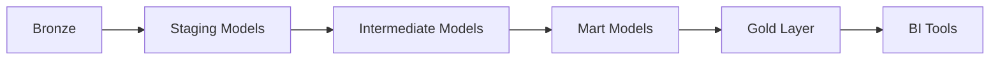
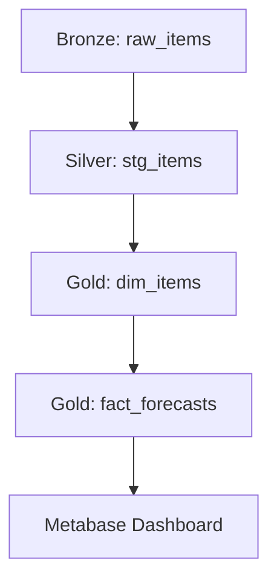

# 🏗️ ARQUITETURA TÉCNICA - DEEP DIVE
## Nova Corrente - Analytics Engineering

**Versão:** 1.0  
**Data:** Novembro 2025  
**Status:** ✅ Especificação Técnica Completa

---

## 📋 VISÃO GERAL ARQUITETURAL

### Stack Tecnológico Completo

```
┌─────────────────────────────────────────────────────────────┐
│                    PRESENTATION LAYER                        │
│  Metabase | Superset | dbt Semantic Layer API | Custom UI  │
└─────────────────────────────────────────────────────────────┘
                              │
┌─────────────────────────────────────────────────────────────┐
│                     ANALYTICS LAYER                         │
│          Gold Layer (Star Schema) | dbt Metrics             │
└─────────────────────────────────────────────────────────────┘
                              │
┌─────────────────────────────────────────────────────────────┐
│                     PROCESSING LAYER                        │
│  dbt Transformations | Spark Jobs | Python UDFs             │
└─────────────────────────────────────────────────────────────┘
                              │
┌─────────────────────────────────────────────────────────────┐
│                      STORAGE LAYER                          │
│  Delta Lake (S3) | Databricks Tables | Unity Catalog        │
│  Bronze (Raw) | Silver (Cleaned) | Gold (Curated)          │
└─────────────────────────────────────────────────────────────┘
                              │
┌─────────────────────────────────────────────────────────────┐
│                    ORCHESTRATION LAYER                      │
│              Airflow | Prefect | dbt Cloud                  │
└─────────────────────────────────────────────────────────────┘
                              │
┌─────────────────────────────────────────────────────────────┐
│                    INGESTION LAYER                          │
│  Airbyte | Fivetran | Custom Python | Kafka Streams        │
└─────────────────────────────────────────────────────────────┘
                              │
┌─────────────────────────────────────────────────────────────┐
│                       SOURCES                                │
│  ERP | Weather APIs | Anatel | BACEN | Supplier APIs        │
└─────────────────────────────────────────────────────────────┘
```

---

## 🗄️ CAMADA DE ARMAZENAMENTO

### 1. Medallion Architecture

**Bronze Layer (Raw):**
```
s3://nova-corrente-data-lake-bronze/
├── erp/
│   └── year=2025/month=11/day=01/
│       └── data.parquet
├── weather/
│   └── year=2025/month=11/day=01/
│       └── data.json
├── economic/
│   └── year=2025/month=11/day=01/
│       └── data.json
└── anatel/
    └── year=2025/month=11/day=01/
        └── data.json
```

**Características:**
- Formato: Parquet (eficiente, comprimido)
- Particionamento: year/month/day
- Schema: Evolutivo (adicionar colunas OK)
- Retenção: 90 dias (after → cold storage)
- Compressão: Snappy

**Silver Layer (Cleaned):**
```
databricks://nova_corrente.silver/
├── items (Delta Table)
├── towers (Delta Table)
├── forecasts (Delta Table)
├── inventory (Delta Table)
└── weather_enriched (Delta Table)
```

**Características:**
- Formato: Delta Lake (ACID transactions)
- Schema: Aplicado e validado
- Qualidade: Great Expectations validado
- Retenção: 2 anos
- Vacuum: 7 dias

**Gold Layer (Curated):**
```
databricks://nova_corrente.gold/
├── marts/
│   ├── dim_items (Delta Table, partitioned)
│   ├── dim_towers (Delta Table)
│   ├── dim_time (Delta Table)
│   ├── fact_forecasts (Delta Table, partitioned by date)
│   └── fact_inventory (Delta Table, partitioned by date)
└── metrics/
    └── forecast_metrics (pre-aggregated)
```

**Características:**
- Formato: Delta Lake
- Schema: Star schema otimizado
- Performance: Clustered e particionado
- Retenção: 3 anos
- Vacuum: 30 dias

---

### 2. Delta Lake Configuration

**Benefícios:**
- ACID transactions
- Time travel (audit)
- Schema evolution
- Upserts/deletes incrementais
- Performance otimizado

**Configuração:**
```python
# Delta Lake settings
spark.conf.set("spark.sql.extensions", "io.delta.sql.DeltaSparkSessionExtension")
spark.conf.set("spark.sql.catalog.spark_catalog", "org.apache.spark.sql.delta.catalog.DeltaCatalog")

# Optimize Delta tables
spark.sql("OPTIMIZE delta.`/path/to/table`")

# Z-order clustering
spark.sql("OPTIMIZE delta.`/path/to/table` ZORDER BY (item_id, date)")

# Vacuum old files
spark.sql("VACUUM delta.`/path/to/table` RETAIN 7 DAYS")
```

---

## 🔄 CAMADA DE PROCESSAMENTO

### 1. dbt Transformations

**Pipeline:**


**Performance:**
- Incremental models: Apenas novos dados
- Materializations: view/table/incremental
- Partitions: Por data automaticamente
- Clustering: Por chaves de negócio

**Configuração:**
```yaml
# dbt_project.yml
models:
  nova_corrente_dbt:
    staging:
      +materialized: view
      +schema: staging
    marts:
      +materialized: incremental
      +unique_key: ['forecast_id']
      +on_schema_change: append_new_columns
      +partition_by: {'field': 'date', 'data_type': 'date'}
      +cluster_by: ['item_id']
```

---

### 2. Spark Processing

**Use Cases:**
- Transformações complexas (UDFs)
- Agregações grandes (billions de rows)
- Joins complexos
- Feature engineering pesado

**Exemplo:**
```python
# Spark job for complex aggregation
from pyspark.sql import SparkSession
from pyspark.sql.functions import *

spark = SparkSession.builder \
    .appName("NovaCorrenteAggregation") \
    .getOrCreate()

df = spark.read.format("delta").load("s3://silver/items")

result = df \
    .groupBy("category", "month") \
    .agg(
        sum("quantity").alias("total_quantity"),
        avg("cost").alias("avg_cost"),
        countDistinct("item_id").alias("unique_items")
    ) \
    .write \
    .format("delta") \
    .mode("overwrite") \
    .save("s3://gold/aggregations")
```

---

## 🎛️ CAMADA DE ORQUESTRAÇÃO

### 1. Airflow DAGs

**Estrutura:**
```
dags/
├── nova_corrente/
│   ├── __init__.py
│   ├── extract_dag.py
│   ├── bronze_to_silver_dag.py
│   ├── dbt_dag.py
│   ├── ml_training_dag.py
│   └── gold_refresh_dag.py
└── utils/
    └── operators/
        ├── databricks_operator.py
        └── dbt_operator.py
```

**DAG Completo:**
```python
from airflow import DAG
from airflow.providers.databricks.operators.databricks import DatabricksRunNowOperator
from airflow.operators.bash import BashOperator
from airflow.sensors.filesystem import FileSensor
from datetime import datetime, timedelta

default_args = {
    'owner': 'nova-corrente',
    'depends_on_past': False,
    'retries': 3,
    'retry_delay': timedelta(minutes=5),
}

dag = DAG(
    'nova_corrente_daily_pipeline',
    default_args=default_args,
    description='Complete daily pipeline',
    schedule_interval='@daily',
    start_date=datetime(2025, 11, 1),
    catchup=False,
    max_active_runs=1,
)

# Extract from sources
extract_erp = BashOperator(
    task_id='extract_erp',
    bash_command='python scripts/extract_erp.py',
    dag=dag,
)

extract_weather = BashOperator(
    task_id='extract_weather',
    bash_command='python scripts/extract_weather.py',
    dag=dag,
)

# Load to Bronze
load_bronze = DatabricksRunNowOperator(
    task_id='load_to_bronze',
    job_id=12345,
    dag=dag,
)

# Transform: Bronze → Silver
silver_transformation = DatabricksRunNowOperator(
    task_id='bronze_to_silver',
    job_id=12346,
    dag=dag,
)

# Data Quality Check
quality_check = BashOperator(
    task_id='data_quality_check',
    bash_command='python scripts/great_expectations_check.py',
    dag=dag,
)

# dbt Transformations: Silver → Gold
run_dbt = BashOperator(
    task_id='run_dbt',
    bash_command='cd dbt && dbt run --profiles-dir .',
    dag=dag,
)

test_dbt = BashOperator(
    task_id='test_dbt',
    bash_command='cd dbt && dbt test --profiles-dir .',
    dag=dag,
)

# ML Training (weekly)
ml_training = DatabricksRunNowOperator(
    task_id='ml_training',
    job_id=12347,
    dag=dag,
)

# Dependencies
[extract_erp, extract_weather] >> load_bronze
load_bronze >> silver_transformation
silver_transformation >> quality_check
quality_check >> run_dbt
run_dbt >> test_dbt
test_dbt >> ml_training
```

---

## 🤖 CAMADA DE ML

### 1. MLflow Integration

**Estrutura:**
```
mlflow/
├── experiments/
│   ├── forecast_prophet/
│   ├── forecast_arima/
│   └── forecast_lstm/
├── models/
│   └── nova_corrente_forecast/
│       ├── v1 (Production)
│       ├── v2 (Staging)
│       └── v3 (Development)
└── tracking_uri: databricks
```

**Exemplo:**
```python
import mlflow
import mlflow.prophet

# Set tracking URI
mlflow.set_tracking_uri("databricks")

with mlflow.start_run(experiment_id=123):
    # Log parameters
    mlflow.log_param("model_type", "prophet")
    mlflow.log_param("forecast_steps", 30)
    
    # Train model
    model = train_prophet_model(data)
    
    # Evaluate
    mape = evaluate_model(model, test_data)
    mlflow.log_metric("MAPE", mape)
    
    # Log model
    mlflow.prophet.log_model(model, "model")
    
    # Register
    mlflow.register_model(
        "runs:/{run_id}/model",
        "NovaCorrenteForecast"
    )
```

---

## 📊 CAMADA DE APRESENTAÇÃO

### 1. Metabase Configuration

**Databases:**
- Databricks (primary)
- PostgreSQL (Metabase metadata)

**Dashboards:**
- Forecast Performance
- Inventory Management
- Business KPIs
- Data Quality

**Alerts:**
- MAPE > 15%
- Stock <= Reorder Point
- Data quality failures

---

### 2. dbt Semantic Layer API

**Query Example:**
```python
from dbt_semantic_interfaces import SemanticManifest

manifest = SemanticManifest.load("metrics.yml")

# Query metric
metric = manifest.get_metric("forecast_accuracy_mape")
result = metric.query(
    time_grain="month",
    dimensions=["category"],
    filters={"model_type": "prophet"}
)

print(result)
```

---

## 🔒 SEGURANÇA E GOVERNANÇA

### 1. Access Control

**Databricks:**
- Unity Catalog (table-level permissions)
- Row-level security (RLS)
- Column-level security

**Metabase:**
- Groups e permissions
- Row-level restrictions
- Data sandboxing

**dbt:**
- Environment-based profiles
- Role-based access

---

### 2. Data Lineage

**Tools:**
- dbt lineage (auto)
- DataHub (manual annotations)
- Airflow lineage (task dependencies)

**Visualization:**


---

## ⚡ PERFORMANCE OPTIMIZATION

### 1. Query Optimization

**Indexes:**
- Delta Lake: Z-order clustering
- Automatic indexing on join keys

**Caching:**
- Metabase: Query caching (1 hour)
- dbt: Model caching (incremental)

**Partitioning:**
- Por data (automatic)
- Por categoria (opcional)

---

### 2. Cost Optimization

**Strategies:**
- Incremental models (só novos dados)
- Vacuum Delta tables regularly
- Archive old data to cold storage
- Right-size Databricks clusters

---

**Documento criado:** Novembro 2025  
**Versão:** 1.0  
**Status:** ✅ Arquitetura Técnica Completa

**CENTRALIZED REPORTS & CHANGELOG SYSTEM COMPLETE!**

