# 🔄 Mermaid to Markdown Converter

## 📋 Overview

Automated tool to convert Mermaid `.mmd` diagram files into properly formatted Markdown documentation files with embedded Mermaid diagrams.

## ✨ Features

- **Automatic Discovery**: Finds all `.mmd` files in the project recursively
- **Smart Output Placement**: Places markdown files in appropriate locations
- **Rich Documentation**: Generates comprehensive markdown with metadata, descriptions, and components
- **Cross-Platform**: Works on Windows, Linux, and macOS
- **Batch Processing**: Converts all files in one run

## 🚀 Quick Start

### Windows

```batch
# Run the batch script
scripts\convert_mmd_to_markdown.bat

# Or run Python directly
python scripts\convert_mmd_to_markdown.py
```

### Linux/macOS

```bash
# Make script executable (first time only)
chmod +x scripts/convert_mmd_to_markdown.sh

# Run the shell script
./scripts/convert_mmd_to_markdown.sh

# Or run Python directly
python3 scripts/convert_mmd_to_markdown.py
```

## 📁 Output Locations

The script determines output locations based on source file location:

- **Files in `docs/diagrams/`**: Markdown files created in the same directory
- **Files in project root**: Markdown files created in `docs/diagrams/`
- **Files elsewhere**: Markdown files created next to the source `.mmd` file

## 📊 Generated Markdown Structure

Each generated markdown file includes:

1. **Header**: Title with emoji icon
2. **Overview Section**: Description and metadata
3. **Diagram Section**: Embedded Mermaid code block
4. **Components Section**: Extracted subgraph information (if available)
5. **Usage Section**: Instructions for viewing the diagram
6. **Related Documents**: Links to relevant documentation

## 🎨 Example Output

```markdown
# 📊 Data Strategy Visual Breakdown

## 📋 Overview

Visual breakdown of the data strategy implementation...

## 🎨 Diagram

```mermaid
flowchart TD
    subgraph Problem["🔍 PROBLEM DIAGNOSIS"]
        ...
    end
```



## 🔧 Components

1. **PROBLEM DIAGNOSIS**
2. **CURRENT DATA INVENTORY**
3. **SOLUTION ARCHITECTURE**
...
```

## 🔧 Configuration

### Custom Descriptions

Edit the `DESCRIPTIONS` dictionary in `convert_mmd_to_markdown.py` to add custom descriptions for specific diagrams:

```python
DESCRIPTIONS = {
    'data_strategy_visual_breakdown': 'Your custom description here',
    'your_diagram_name': 'Another description',
}
```

### Output Directory

Change the default output directory by modifying:

```python
OUTPUT_DIR = PROJECT_ROOT / "docs" / "diagrams"
```

## 📝 File Naming

The script generates markdown filenames based on the source `.mmd` filename:

- `data_strategy_visual_breakdown.mmd` → `data_strategy_visual_breakdown.md`
- `nova_corrente_system_architecture.mmd` → `nova_corrente_system_architecture.md`

Titles are automatically formatted:
- Underscores and hyphens become spaces
- Title case applied
- Emoji prefix added (📊)

## 🔍 Viewing Generated Files

The generated markdown files can be viewed in:

- **GitHub/GitLab**: Automatically rendered when viewing `.md` files
- **VS Code**: Install the "Markdown Preview Mermaid Support" extension
- **Obsidian**: Native Mermaid support
- **Documentation Sites**: MkDocs, Docusaurus, etc. with Mermaid plugin

## 🛠️ Troubleshooting

### No files found

If the script reports "No .mmd files found":
- Verify `.mmd` files exist in the project
- Check file extensions are exactly `.mmd` (not `.mermaid` or `.mm`)
- Ensure you're running from the project root

### Encoding issues (Windows)

The script automatically handles UTF-8 encoding on Windows. If you see encoding errors:
- Ensure Python is using UTF-8: `python -X utf8 scripts/convert_mmd_to_markdown.py`
- Check file encoding of source `.mmd` files

### Permission errors

If you get permission errors when writing files:
- Ensure output directory is writable
- Check file permissions on source files
- Run with appropriate permissions if needed

## 📚 Related Documentation

- [Mermaid Diagram Syntax](https://mermaid.js.org/)
- [Markdown Documentation](docs/INDEX_MASTER_NAVIGATION_PT_BR.md)
- [Diagrams Directory](docs/diagrams/)
- [Project Strategy](docs/proj/strategy/)

## 🔄 Workflow

1. **Create/Edit `.mmd` files**: Use any text editor or Mermaid tools
2. **Run converter**: Execute the conversion script
3. **Review generated `.md` files**: Check the output in `docs/diagrams/`
4. **Commit to repository**: Add both `.mmd` and `.md` files to version control

## 💡 Tips

- Keep both `.mmd` and `.md` files in the repository
- Use `.mmd` files as the source of truth
- Regenerate `.md` files when `.mmd` files are updated
- Add custom descriptions in the script for better documentation
- Use descriptive filenames for better generated titles

## 📊 Statistics

After running the converter, you'll see:
- Number of files found
- Number of files processed
- Number of successful conversions
- Number of failures (if any)

## 🎯 Future Enhancements

Potential improvements:
- [ ] Watch mode for automatic conversion on file changes
- [ ] Custom template support for markdown generation
- [ ] Integration with CI/CD pipelines
- [ ] Support for additional diagram metadata
- [ ] HTML export option
- [ ] PDF export option

---

**Script Version:** 1.0.0  
**Last Updated:** 2025-01-29  
**Maintainer:** Gran Prix Development Team

